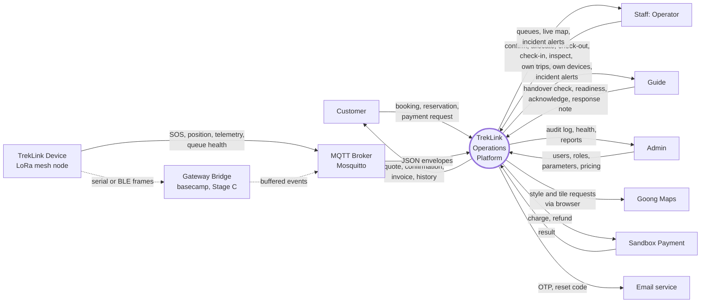
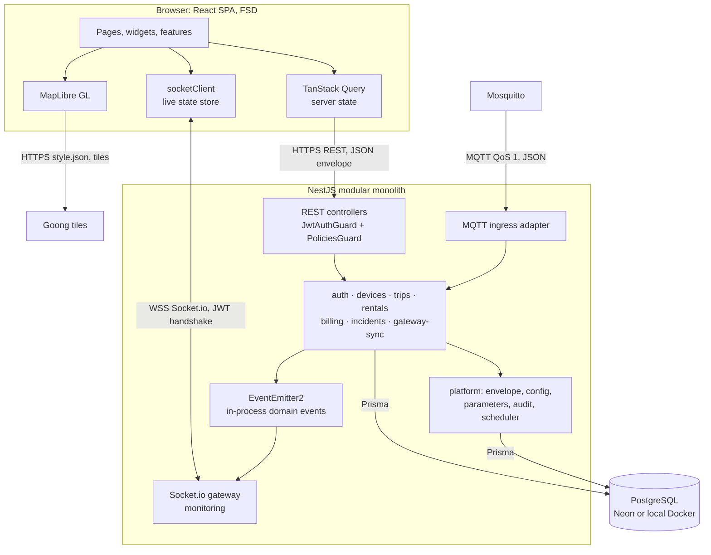
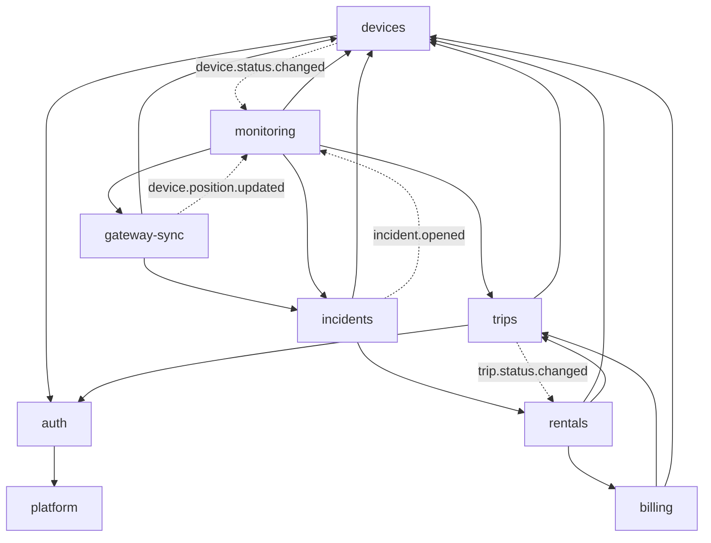
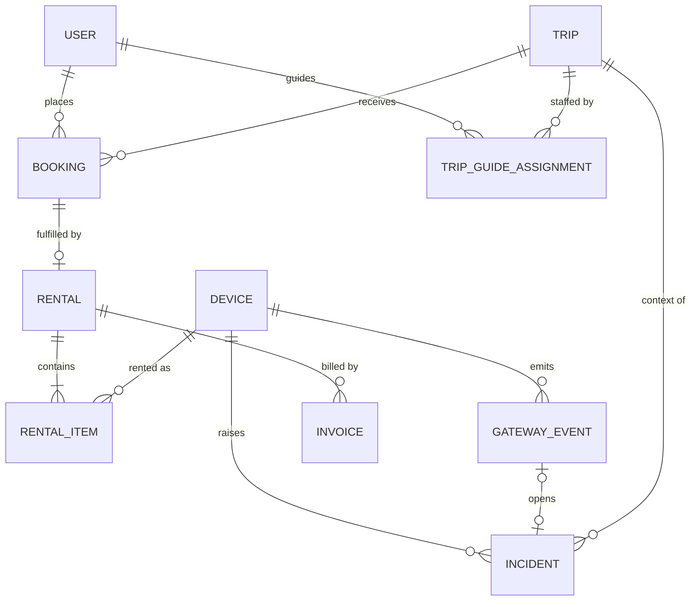
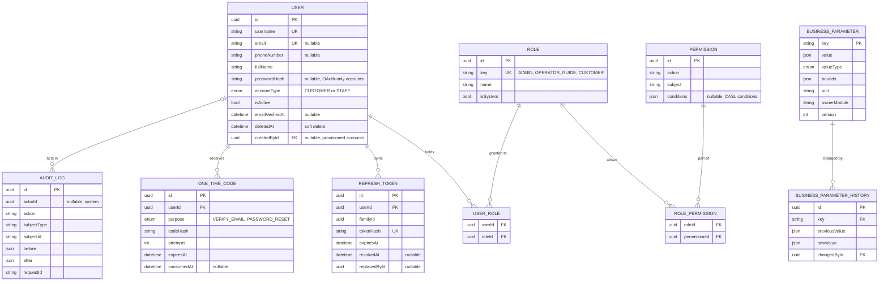
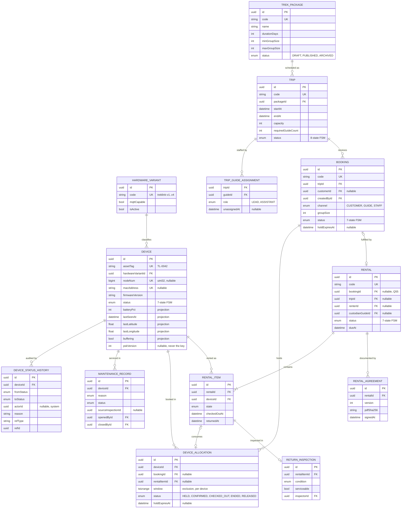
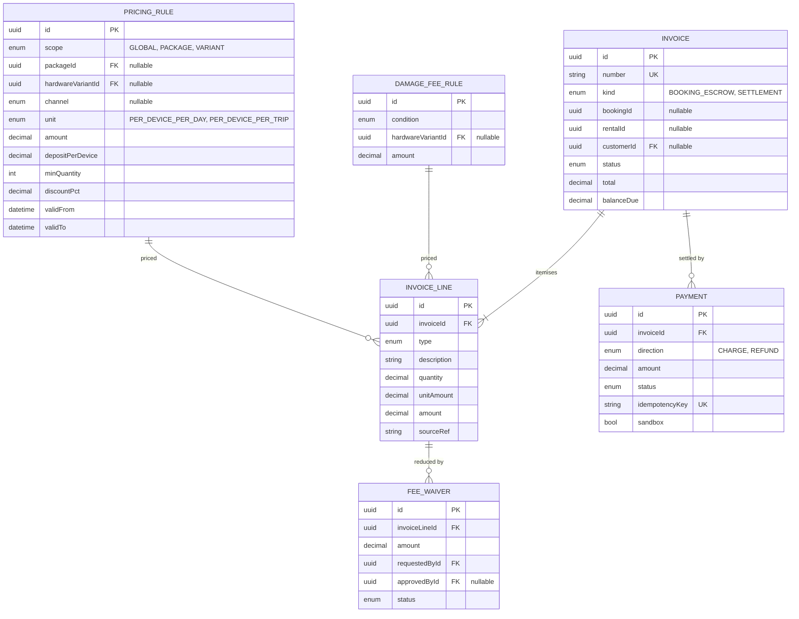
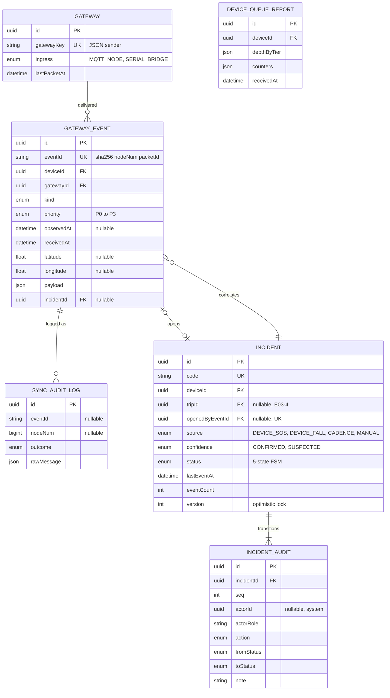
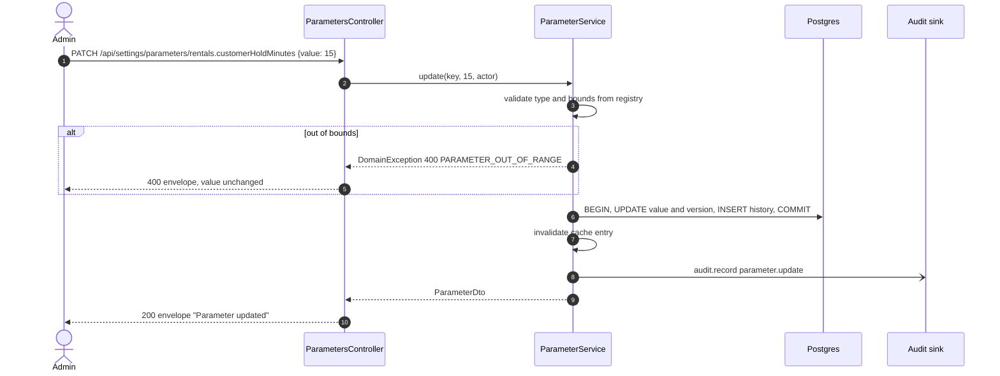

# Technical Design: platform (cross-cutting backend foundation)

> Fulfills `requirements.md` in this folder. Also the home of the **system-level design artefacts** for Review 2 and the SDD: the context diagram, the architecture diagram, the module dependency graph and the system-wide ERD. Module-level ERD slices, state machines and sequence diagrams live in each module's own `design.md`.

---

## 1. System context

See **Figure 1**. It is the Level-0 view the Review 2 template asks for: the platform as one process, every external actor and system around it, and the data each flow carries.



***Figure 1***: Context diagram. One process, four human actors, the field hardware, and four external systems. Dashed edges are the Stage C basecamp path (D-018, D-020), which is specified and deferred. Map traffic goes from the browser to Goong directly; the platform only supplies configuration.

Differences from `06-requirements-foundation.md` Figure 1, stated so the two are reconciled rather than left to drift: the MQTT broker is drawn as its own external system (it is operated infrastructure, not platform code), and "Notification channel" is narrowed to **Email service**, because email OTP is the only outbound channel the MF-01 answers require (Q31, Q35). Incident alerts travel over the platform's own WebSocket. A REQUEST entry proposes the same edit to the SSOT figure.

---

## 2. Architecture

See **Figure 2**. Every arrow is labelled with its protocol, per the Review 2 template tip.



***Figure 2***: Architecture. One deployable backend; modules talk through exported services or domain events, never through each other's tables.

### 2.1 Module dependency graph

See **Figure 3**. Solid edges are DI imports of an exported service; dashed edges are domain events. The graph is acyclic by construction, which `04-architecture-conventions.md` §1.1 requires.



***Figure 3***: Module dependencies. `billing` never imports `rentals`; `rentals` pushes the settlement facts into `billing`, which is what keeps the graph acyclic while honouring Q64 (payment lives in `billing` only, `rentals` calls outward).

### 2.2 Cross-module transactions

Several flows must be atomic across module boundaries: reserving a device (rentals plus devices), checking out (rentals plus devices), ingesting an SOS (gateway-sync plus devices plus incidents). The rule:

- A service method that may take part in a caller's transaction accepts an optional last parameter `tx?: Prisma.TransactionClient` and uses `tx ?? this.prisma`.
- Only the module that **starts** the business operation opens `prisma.$transaction`. Callees never open their own.
- A callee still queries **only its own tables**, even when handed a `tx`. The transaction client is a connection, not a licence to reach into another module's tables.
- Row locks a callee must take on its own rows (for example `devices` locking candidate device rows) are taken by the callee through an exported method such as `DevicesService.lockForAllocation(ids, tx)`.

Enforcement: a boundary check script (tasks 1.9) maps each Prisma model to its owning module and fails CI when `backend/src/modules/<a>/` references a model owned by `<b>`.

### 2.3 Domain events

| Event | Emitted by | Consumed by | Payload (ids only plus the changed fields) |
|---|---|---|---|
| `audit.record` | any module | platform | actor, action, subject, before, after |
| `device.status.changed` | devices | monitoring | deviceId, from, to, reason |
| `device.position.updated` | gateway-sync | monitoring | deviceId, lat, lon, receivedAt |
| `device.telemetry.updated` | gateway-sync | monitoring | deviceId, batteryPct, receivedAt |
| `device.queue.reported` | gateway-sync | monitoring | deviceId, depthByTier, buffering |
| `gateway.health.changed` | gateway-sync | monitoring | gatewayId, state, lastPacketAt |
| `trip.status.changed` | trips | rentals, monitoring | tripId, from, to |
| `incident.opened` | incidents | monitoring | incidentId, deviceId, tripId, confidence |
| `incident.updated` | incidents | monitoring | incidentId, from, to, actor |
| `incident.escalated` | incidents | monitoring | incidentId |

Events are emitted **after commit** (`@nestjs/event-emitter` listeners invoked from a post-commit hook), never inside a transaction that may still roll back. Delivery of an event never gates the business write (E03-7).

---

## 3. Domain Model & Data Schema

### 3.1 Core ERD for the Review 2 slide

The Review 2 template asks for the 5 to 8 entities central to the system. See **Figure 4**.



***Figure 4***: Core ERD, eight central entities. Full attribute lists follow in Figures 5 to 8.

### 3.2 System-wide ERD

Split into four figures so every label stays above the 7 pt floor (`13-diagram-and-figure-conventions.md` §7: lane and entity count drive width). Primary keys are UUID `id`; every entity also carries `createdAt` and, where mutable, `updatedAt`, omitted from the figures for legibility.

See **Figure 5**, identity and administration.



***Figure 5***: System ERD part 1 of 4, identity and administration. Roles and permissions are data (US-001), so a new Staff sub-role such as Manager is a row, not a code change (Q33).

See **Figure 6**, fleet, trips, bookings and rentals.



***Figure 6***: System ERD part 2 of 4, fleet, trips, bookings and rentals. `DEVICE_ALLOCATION.window` carries a Postgres exclusion constraint so no device is ever double-allocated for overlapping time, which is BR-01 enforced by the database rather than only by application code.

See **Figure 7**, billing.



***Figure 7***: System ERD part 3 of 4, billing. Every fee is its own `INVOICE_LINE`, so a late fee is never folded into an unexplained total (E05-1).

See **Figure 8**, field events and incidents.



***Figure 8***: System ERD part 4 of 4, field events and incidents. `GATEWAY_EVENT.eventId` is the D-006 packet key; episode membership is the separate `incidentId` link, which is the split that stops one beacon storm from minting one Incident per packet.

### 3.3 Corrections to the current `schema.prisma`

The first migration is written from Figures 5 to 8, not from the current schema, which has no migrations yet. Differences that are corrections, not additions:

| Current | Problem | Correction |
|---|---|---|
| `Device.nodeNum Int?` | Meshtastic `nodeNum` is an unsigned 32-bit value derived from MAC bytes 2 to 5 (`NodeDB.cpp:1127`). Postgres `integer` is signed 32-bit, so any node number above 2147483647 overflows on insert. | `BigInt?` |
| `User.role Role` single enum | Q33 requires Staff sub-roles, extensible, and a user may be both Operator and Guide | `USER_ROLE` join to data-driven `ROLE` |
| `User.email @unique` required | Q41: username is the primary identifier; email is optional and linkable later | `username @unique`, `email @unique` nullable |
| `IncidentAudit ... onDelete: Cascade` | A cascade is a delete path on an append-only trail (BR-11) | `onDelete: Restrict`, plus a trigger rejecting `UPDATE` and `DELETE` |
| `Incident.eventId @unique` | Pre-D-006 conflated key, already marked stale in-file | `openedByEventId` FK, `lastEventAt`, `confidence` |
| `RentalStatus` 4 values, `TripStatus` 4 values | Do not cover the MF-01 and MF-05 exception scenarios | 7-state rental, 8-state trip (see those modules) |
| `Rental.deviceId` single device | Q57: a Guide booking carries many devices | `RENTAL_ITEM` |

---

## 4. Service / Business Logic Design

### 4.1 Envelope

`ResponseInterceptor` already wraps success bodies. Two additions:

- `@ResponseMessage('Device registered')` decorator, read by the interceptor through `Reflector`, so each endpoint's `message` is the one its `api-design/*.md` declares rather than a blanket `Success`.
- A paged result is returned by services as `PagedResult<T>` and passed through unchanged; the interceptor never re-shapes `result`.

`GlobalExceptionFilter` already produces the failure envelope. Changes:

- Business exceptions extend `DomainException(httpStatus, errorCode, message)`. The filter sets `result = { errorCode }`.
- `ValidationPipe` gets an `exceptionFactory` that throws `DomainException(400, VALIDATION_FAILED, "<prop> <constraint>; ...")`.
- `Prisma.PrismaClientKnownRequestError` codes `P2002` and `P2025` map to REQ-ERR-03 and REQ-ERR-04.
- A `RequestIdMiddleware` sets `X-Request-Id` and puts it on an `AsyncLocalStorage` context read by the logger and the audit sink.

### 4.2 Error catalogue

One enum, `common/errors/error-code.enum.ts`, grouped by module prefix. Each module's `design.md` lists its own codes with HTTP status; the enum is the union. Cross-cutting codes:

| Code | HTTP | Meaning |
|---|---|---|
| `VALIDATION_FAILED` | 400 | DTO validation failed |
| `UNAUTHENTICATED` | 401 | missing, malformed or expired access token |
| `FORBIDDEN` | 403 | authenticated, policy denies |
| `NOT_FOUND` | 404 | resource does not exist or is outside the caller's scope |
| `CONFLICT_UNIQUE` | 409 | unique constraint |
| `INVALID_STATE_TRANSITION` | 409 | FSM guard rejected the transition |
| `STALE_VERSION` | 409 | optimistic-lock version mismatch |
| `PAYLOAD_TOO_LARGE` | 413 | body limit |
| `PARAMETER_OUT_OF_RANGE` | 400 | parameter value rejected |
| `INTERNAL_ERROR` | 500 | unhandled |

**Scoped 404 rule.** When a Guide requests a trip that is not theirs, the API answers 404 `NOT_FOUND`, not 403. A 403 confirms the resource exists, which leaks another guide's trip ids. This applies to every scoped read (E04-5, BR-13).

### 4.3 Configuration

`@nestjs/config` with a `validate` function built on `class-validator` over an `EnvironmentVariables` class (the backend already depends on `class-validator`; no new library). Each module contributes a typed config namespace (`registerAs('rentals', ...)`) holding its environment-level defaults.

### 4.4 Runtime business parameters

```prisma
model BusinessParameter {
  key         String    @id            // "rentals.customerHoldMinutes"
  value       Json
  valueType   ParameterType             // INT, DECIMAL, PERCENT, DURATION_SECONDS, BOOL, JSON
  bounds      Json?                      // { "min": 1, "max": 120 }
  unit        String?
  ownerModule String
  description String
  version     Int       @default(1)
  updatedById String?
  updatedAt   DateTime  @updatedAt
  history     BusinessParameterHistory[]
  @@map("business_parameters")
}
```

- `ParameterService.get<T>(key)` reads through an in-memory cache with TTL `PARAMETER_CACHE_TTL_SECONDS`; an update invalidates the local cache immediately.
- Keys are declared once, in `platform/parameters/parameter-registry.ts`, with type, bounds, default and owner module. A seed migration inserts every registered key with its default. A key missing from the registry cannot be read (compile-time union type).
- Each module lists its keys in its own `requirements.md` §4. The registry is the union and is what the Configuration Matrix is generated from.

### 4.5 Audit sink

```prisma
model AuditLog {
  id          String   @id @default(uuid())
  actorId     String?
  actorRoles  String[]
  action      String          // "booking.confirm", "user.roles.update"
  subjectType String
  subjectId   String?
  before      Json?
  after       Json?
  requestId   String?
  ip          String?
  createdAt   DateTime @default(now())
  @@index([subjectType, subjectId, createdAt])
  @@index([actorId, createdAt])
  @@map("audit_log")
}
```

The migration adds `CREATE TRIGGER audit_log_append_only BEFORE UPDATE OR DELETE ON audit_log FOR EACH ROW EXECUTE FUNCTION raise_append_only()`; the same function guards `incident_audits`, `device_status_history`, `gateway_events` and every other `*_status_history` table. A redaction list (`passwordHash`, `tokenHash`, `codeHash`, `psk`) is applied to `before` and `after` before insert.

### 4.6 Scheduler

`@nestjs/schedule` hosts every time-triggered rule. Jobs registered by modules:

| Job | Owner | Default cadence | Rule |
|---|---|---|---|
| `rentals.expireHolds` | rentals | 30 s | release allocations past `holdExpiresAt` (E01-1 cleanup, Q59) |
| `rentals.markOverdue` | rentals | 60 s | rental past due plus grace becomes `OVERDUE` (E05-1, E05-3) |
| `devices.markLost` | devices | 15 min | non-return grace exceeded, raise loss record (E05-3, FR-DEV-09) |
| `monitoring.staleSweep` | monitoring | 15 s | emit stale transitions (E04-1, E04-2) |
| `incidents.escalate` | incidents | 15 s | unacknowledged past timeout, escalate (MF-03 parameter) |

Single-instance execution uses a Postgres advisory lock per job name (`pg_try_advisory_lock`), so a second backend replica skips rather than double-runs.

---

## 5. API Endpoints in this module

| Method | Route | Permission | Spec |
|---|---|---|---|
| GET | `/api/health` | Public | [`api-design/01-get-health.md`](api-design/01-get-health.md) |
| GET | `/api/settings/parameters` | Admin, Operator (read) | [`api-design/02-get-parameters-list.md`](api-design/02-get-parameters-list.md) |
| PATCH | `/api/settings/parameters/:key` | Admin | [`api-design/03-patch-parameter-update.md`](api-design/03-patch-parameter-update.md) |
| GET | `/api/settings/parameters/:key/history` | Admin | [`api-design/04-get-parameter-history.md`](api-design/04-get-parameter-history.md) |
| GET | `/api/audit-logs` | Admin | [`api-design/05-get-audit-logs-list.md`](api-design/05-get-audit-logs-list.md) |

Testing walkthrough: [`api-design/00-api-testing-guide.md`](api-design/00-api-testing-guide.md).

---

## 6. Sequence Flow: an Admin changes a parameter

See **Figure 9**.



***Figure 9***: Parameter update. The history row and the value change commit together; the audit entry is emitted after commit.

---

## 7. Frontend impact

- `shared/api/apiClient.ts` unwraps the envelope once and throws `ApiError { statusCode, errorCode, message }` on failure (`06-frontend-conventions.md` §6.1).
- Admin pages: Parameters (list, inline edit with bounds shown, history drawer) and Audit Log (filterable table). Specified in `specs/frontend/`.
