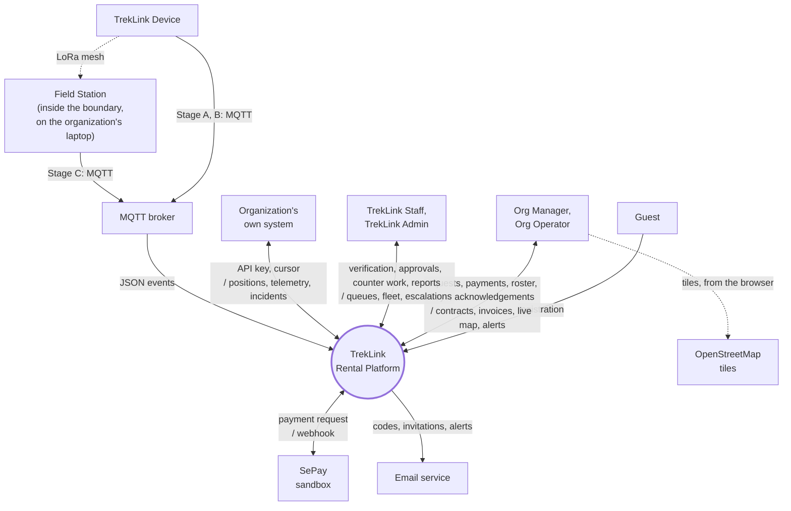
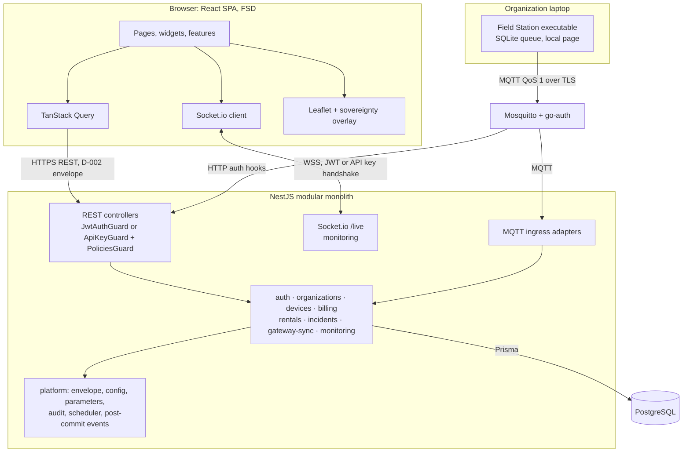
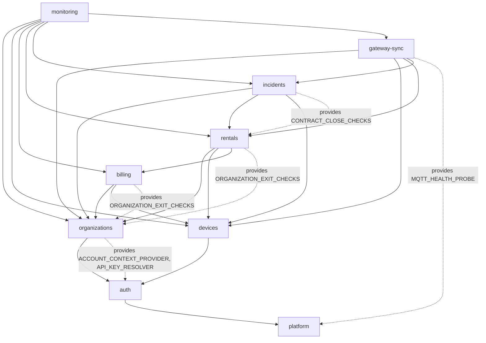
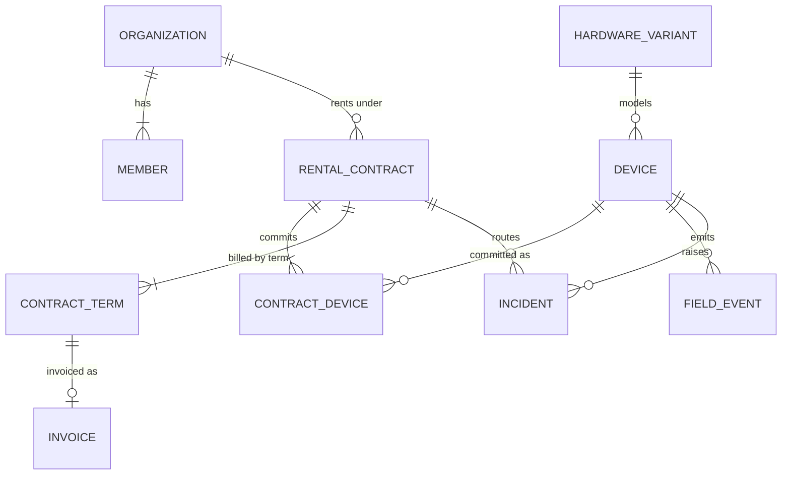
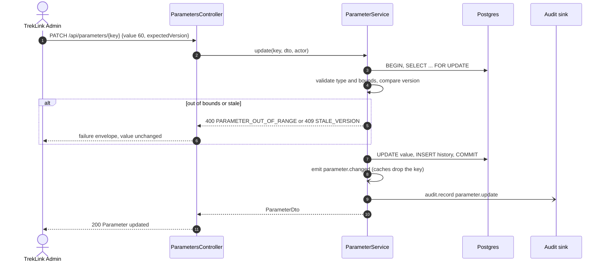

# Technical Design: platform (cross-cutting backend foundation)

> Fulfills `requirements.md` in this folder. Also the home of the **system-level design artefacts** for
> Review 2 and the SDD: the context diagram, the architecture diagram, the module dependency graph, the
> domain-event table and the system-wide ERD overview. Module ERD slices, state machines and sequence
> diagrams live in each module's own `design.md`. Rewritten 2026-10-04 for the enterprise rental platform
> (D-033 to D-038); section numbers are unchanged because code cites them.

---

## 1. System context

See **Figure 1**, the Level-0 view. It matches Report 3 SRS Figure 1 and Table 7.


```mermaid
flowchart TB
    GST["Guest"]
    ORGU["Org Manager,<br/>Org Operator"]
    STF["TrekLink Staff,<br/>TrekLink Admin"]
    OSYS["Organization's<br/>own system"]
    SYS(("TrekLink<br/>Rental Platform"))
    BRK["MQTT broker"]
    DEV["TrekLink Device"]
    FS["Field Station<br/>(inside the boundary,<br/>on the organization's laptop)"]
    PAY["SePay<br/>sandbox"]
    MAIL["Email service"]
    OSM["OpenStreetMap<br/>tiles"]
    GST -->|"registration"| SYS
    ORGU <-->|"requests, payments, roster, keys, acknowledgements<br/>/ contracts, invoices, live map, alerts"| SYS
    STF <-->|"verification, approvals, counter work, reports<br/>/ queues, fleet, escalations"| SYS
    OSYS <-->|"API key, cursor<br/>/ positions, telemetry, incidents"| SYS
    DEV -.->|"LoRa mesh"| FS
    DEV -->|"Stage A, B: MQTT"| BRK
    FS -->|"Stage C: MQTT"| BRK
    BRK -->|"JSON events"| SYS
    SYS <-->|"payment request<br/>/ webhook"| PAY
    SYS -->|"codes, invitations, alerts"| MAIL
    ORGU -.->|"tiles, from the browser"| OSM
    style SYS stroke-width:3px
```

***Figure 1***: Context diagram. On two-way edges the label reads *inbound / outbound*. The Field Station
is TrekLink software and part of the system, drawn apart because it runs on the organization's laptop.

---

## 2. Architecture

See **Figure 2**. Every arrow carries its protocol.


```mermaid
flowchart TB
    subgraph Client["Browser: React SPA, FSD"]
        UI["Pages, widgets, features"]
        QC["TanStack Query"]
        WS["Socket.io client"]
        LF["Leaflet + sovereignty overlay"]
    end
    subgraph Backend["NestJS modular monolith"]
        HTTP["REST controllers<br/>JwtAuthGuard or ApiKeyGuard + PoliciesGuard"]
        LIVE["Socket.io /live<br/>monitoring"]
        MODS["auth · organizations · devices · billing<br/>rentals · incidents · gateway-sync · monitoring"]
        PLT["platform: envelope, config, parameters,<br/>audit, scheduler, post-commit events"]
        ING["MQTT ingress adapters"]
    end
    subgraph Field["Organization laptop"]
        FSX["Field Station executable<br/>SQLite queue, local page"]
    end
    DB[("PostgreSQL")]
    BRK["Mosquitto + go-auth"]
    UI --> QC
    UI --> WS
    UI --> LF
    QC -->|"HTTPS REST, D-002 envelope"| HTTP
    WS <-->|"WSS, JWT or API key handshake"| LIVE
    HTTP --> MODS
    MODS --> PLT
    MODS -->|"Prisma"| DB
    FSX -->|"MQTT QoS 1 over TLS"| BRK
    BRK -->|"MQTT"| ING
    BRK -->|"HTTP auth hooks"| HTTP
    ING --> MODS
```

***Figure 2***: Architecture. One deployable backend; modules talk through exported services, ports or
post-commit domain events, never through each other's tables.

### 2.1 Module dependency graph

See **Figure 3**. Solid edges are DI imports of an exported service. Dotted edges are **ports**: the lower
module declares an injection token and an interface, and the higher module provides it, the pattern D-032
introduced for the health probe. Dashed edges are domain events. The DI graph is acyclic
(`04-architecture-conventions.md` §1.1).


```mermaid
flowchart TB
    PLT["platform"]
    AUTH["auth"]
    ORG["organizations"]
    DEVS["devices"]
    BILL["billing"]
    RENT["rentals"]
    INC["incidents"]
    GWS["gateway-sync"]
    MON["monitoring"]
    AUTH --> PLT
    ORG --> AUTH
    DEVS --> AUTH
    BILL --> ORG
    BILL --> DEVS
    RENT --> ORG
    RENT --> DEVS
    RENT --> BILL
    INC --> ORG
    INC --> RENT
    INC --> DEVS
    GWS --> ORG
    GWS --> DEVS
    GWS --> RENT
    GWS --> INC
    MON --> ORG
    MON --> DEVS
    MON --> BILL
    MON --> RENT
    MON --> INC
    MON --> GWS
    ORG -.->|"provides ACCOUNT_CONTEXT_PROVIDER, API_KEY_RESOLVER"| AUTH
    BILL -.->|"provides ORGANIZATION_EXIT_CHECKS"| ORG
    RENT -.->|"provides ORGANIZATION_EXIT_CHECKS"| ORG
    INC -.->|"provides CONTRACT_CLOSE_CHECKS"| RENT
    GWS -.->|"provides MQTT_HEALTH_PROBE"| PLT
```

***Figure 3***: Module dependencies. Every module also imports `platform`; those edges are omitted.

| Port | Declared by | Provided by | Why |
|---|---|---|---|
| `MQTT_HEALTH_PROBE` | platform | gateway-sync | Health reports MQTT state without importing a module (D-032) |
| `ACCOUNT_CONTEXT_PROVIDER` | auth | organizations | Sign-in puts `organizationId` and the member role into the token; membership is an organizations table |
| `API_KEY_RESOLVER` | auth | organizations | `ApiKeyGuard` authenticates an `X-Api-Key`; keys are an organizations table |
| `ORGANIZATION_EXIT_CHECKS` (multi) | organizations | billing, rentals | Reactivation needs no balance (billing); closing needs no open contract (rentals) |
| `CONTRACT_CLOSE_CHECKS` (multi) | rentals | incidents | Closing a contract needs no incident outside `CLOSED` on its devices (FR-CON-13) |

Placement consequences, so no module reaches upward:

- **Provisioning and inspection** run in `rentals`, which orchestrates `DevicesService` and
  `BillingService` in one transaction (`rentals` design §2).
- **Device history** (FR-DEV-11), **reports** (FR-BILL-10) and **system health** (FR-MON-10) are served by
  `monitoring`, the read model allowed to import every module.

### 2.2 Cross-module transactions

Several flows are atomic across modules: approving a contract (rentals, devices, billing), the handover,
check-in with late fees, inspection with damage charges, ingesting an SOS (gateway-sync, devices, rentals,
incidents). The rule:

- A service method that may take part in a caller's transaction accepts an optional last parameter
  `tx?: Prisma.TransactionClient` and uses `tx ?? this.prisma`.
- Only the module that **starts** the business operation opens `prisma.$transaction`. Callees never open
  their own.
- A callee still queries **only its own tables**, even when handed a `tx`. The transaction client is a
  connection, not a licence to reach into another module's tables.
- Row locks a callee needs on its own rows are taken by the callee through an exported method, for
  example `DevicesService.reserve(variantId, quantity, contractId, tx)`.

Enforcement: `backend/scripts/check-module-boundaries.js` maps each model to the module that owns it (the
`// @module` markers of `schema.prisma`) and fails `npm run lint` when `src/modules/<a>/` references a
model owned by `<b>`.

### 2.3 Domain events

Emitted **after commit** through `emitAfterCommit`, never inside a transaction that may still roll back.
Delivery never gates the business write. Alert delivery is not an event: it is the `incidents` outbox
(D-034 rule 3), because an alert must survive a restart.

| Event | Emitted by | Consumed by | Payload (ids plus the changed fields) |
|---|---|---|---|
| `audit.record` | any module | platform | actor, organizationId, action, subject, before, after |
| `parameter.changed` | platform | every cache of that key | key, version |
| `policy.changed` | auth | auth (CASL cache) | roleId |
| `member.deactivated` | organizations | incidents (re-route owned incidents, D-034) | organizationId, memberId, userId |
| `apiKey.revoked` | organizations | monitoring (close sockets) | organizationId, apiKeyId |
| `fieldStation.revoked` | organizations | gateway-sync (drop its topic) | organizationId, fieldStationId, mqttUsername |
| `organization.statusChanged` | organizations | monitoring | organizationId, from, to |
| `contract.statusChanged` | rentals | monitoring | contractId, organizationId, from, to |
| `device.handedOver` | rentals | monitoring | contractId, organizationId, deviceIds |
| `device.checkedIn` | rentals | monitoring (FR-MON-08) | contractId, organizationId, deviceId |
| `device.labelChanged` | rentals | monitoring | organizationId, deviceId, holderName |
| `payment.confirmed` | billing | monitoring | organizationId, invoiceId, amountVnd |
| `field.position` | gateway-sync | monitoring | deviceId, organizationId, lat, lon, at, plotted |
| `field.telemetry` | gateway-sync | monitoring | deviceId, organizationId, batteryPct, at |
| `fieldStation.synced` | gateway-sync | monitoring | fieldStationId, organizationId, queueDepth |
| `incident.changed` | incidents | monitoring | incidentId, organizationId, state, tier, ownerId |
| `incident.alert` | incidents (outbox dispatcher, WEBSOCKET channel) | monitoring (synchronous listener; publishes to `user:<id>`) | deliveryId, recipientId, incidentId, message |

---

## 3. Domain Model & Data Schema

`backend/prisma/schema.prisma` is the single source; each module's `design.md` §1 describes its own block
rather than copying it. The baseline migration is generated by `backend/scripts/rebuild-baseline.sh`
from the schema plus `backend/prisma/constraints.sql`; the seed by `scripts/specs/build_seed.py`.

### 3.1 Core ERD for the Review 2 slide

The template asks for the 5 to 8 central entities; this matches SRS Figure 21. See **Figure 4**.


```mermaid
erDiagram
    ORGANIZATION ||--|{ MEMBER : "has"
    ORGANIZATION ||--o{ RENTAL_CONTRACT : "rents under"
    HARDWARE_VARIANT ||--o{ DEVICE : "models"
    RENTAL_CONTRACT ||--|{ CONTRACT_DEVICE : "commits"
    DEVICE ||--o{ CONTRACT_DEVICE : "committed as"
    RENTAL_CONTRACT ||--|{ CONTRACT_TERM : "billed by term"
    CONTRACT_TERM ||--o| INVOICE : "invoiced as"
    DEVICE ||--o{ FIELD_EVENT : "emits"
    DEVICE ||--o{ INCIDENT : "raises"
    RENTAL_CONTRACT ||--o{ INCIDENT : "routes"
```

***Figure 4***: Core ERD.

### 3.2 System-wide ERD by module

| Module | Models (schema block) | Append-only |
|---|---|---|
| platform | `BusinessParameter`, `BusinessParameterHistory`, `AuditLog` | history, audit log |
| auth | `User`, `Role`, `Permission`, `UserRole`, `RolePermission`, `RefreshToken`, `OneTimeCode`, `AuthEvent` | auth events |
| organizations | `Organization`, `OrganizationMember`, `OrganizationTransition`, `RosterShift`, `ApiKey`, `FieldStation` | transitions |
| devices | `HardwareVariant`, `Device`, `DeviceTransition`, `IntakeCheck`, `DeviceProvisioning`, `DeviceReset`, `Inspection`, `MaintenanceRecord`, `StockTake` | transitions, intake checks, provisionings, resets, inspections |
| rentals | `RentalContract`, `ContractTerm`, `ContractDevice`, `ContractTransition` | transitions |
| billing | `PriceSchedule`, `DamageRate`, `Invoice`, `InvoiceLine`, `Payment`, `DamageCharge` | price schedules |
| incidents | `Incident`, `IncidentTransition`, `IncidentStatusUpdate`, `AlertDelivery`, `AuthorityReport` | transitions, status updates |
| gateway-sync | `FieldEvent`, `SyncAuditLog`, `DeviceQueueReport` | field events (one-way link), sync audit |
| monitoring | `StreamEvent` | pruned by retention, never updated |

The ERD slice of each module is Figure 1 of its `design.md`.

### 3.3 Tenant isolation in the schema

Every tenant-owned row carries `organizationId`: members, roster, API keys, Field Stations, contracts,
invoices, payments, incidents, field events and stream events. A device carries none, because it is
TrekLink's asset; which organization may see it is derived from its live `ContractDevice` row
(FR-AUTH-11). Every read on behalf of an organization member or API key filters by the caller's
`organizationId` from the token or key, never from the request (`auth` design §3).

### 3.4 Schema rules

| # | Rule | Consequence in the schema |
|---|---|---|
| 1 | `field_events` is append-only with one one-way exception: `incidentId` from `NULL` to a value, linking the event to the episode it opened or joined. Every other `UPDATE`, and every `DELETE`, is rejected. | Its own trigger function, `field_events_append_only()` (§4.5). |
| 3 | Columns keep the Prisma field names (camelCase); only table names are mapped with `@@map`. | Raw SQL quotes the real names, for example `"deviceId"`. |
| 4 | Every reference column is a foreign key, including every actor column (`*ById`, `actorId`) to `users`. No FK on polymorphic references (`AuditLog.subjectId`, `DeviceTransition.refId`, `ContractTransition.refId`) or on `SyncAuditLog.eventId`. `onDelete` stays Prisma's default except `IncidentTransition` (`Restrict`). | Checked by `prisma validate` and the migration test. |
| 7 | Every `DateTime` is `@db.Timestamptz(3)`, except `RentalContract.requestedStartDate` (`@db.Date`, a calendar day). | Required by the `tstzrange` exclusion constraint on `roster_shifts`. |
| 8 | Money is integer VND in `BigInt`; ratios are `Decimal`. | No floating-point money anywhere. |
| 12 | Every foreign-key column leads an index. | An FK column that already leads a composite index, unique constraint or primary key gets no second index. |
| 15 | Constraints Prisma cannot express live in `backend/prisma/constraints.sql`: roster exclusion, one live `ContractDevice` per device (BR-03), one open incident per device (FR-INC-01), CHECKs on plans, amounts and authority reports, and the append-only triggers. | Appended to the baseline by `rebuild-baseline.sh`. |

---

## 4. Service / Business Logic Design

### 4.1 Envelope

`ResponseInterceptor` wraps success bodies; `@ResponseMessage('...')` sets each endpoint's `message`
to the one its `api-design/*.md` declares. A paged result is returned as `PagedResult<T>` and passed
through unchanged.

`GlobalExceptionFilter` produces the failure envelope:

- Business exceptions extend `DomainException(httpStatus, errorCode, message)`; the filter sets
  `result = { errorCode }`.
- Every failure carries an error code (D-026). A Nest `HttpException` that is not a `DomainException`
  maps by status: 400 `VALIDATION_FAILED`, 401 `UNAUTHENTICATED`, 403 `FORBIDDEN`, 404 `NOT_FOUND`,
  413 `PAYLOAD_TOO_LARGE`, 429 `RATE_LIMITED`, 503 `SERVICE_UNAVAILABLE`. Any other 4xx keeps its status
  with `CLIENT_ERROR`. Any other 5xx, and every non-`HttpException`, is `INTERNAL_ERROR`; its stack is logged.
- `ValidationPipe` has an `exceptionFactory` that throws `DomainException(400, VALIDATION_FAILED, "<prop> <constraint>; ...")`.
- `Prisma.PrismaClientKnownRequestError` codes `P2002` and `P2025` map to REQ-ERR-03 and REQ-ERR-04.
- `RequestIdMiddleware` sets `X-Request-Id` and puts it on an `AsyncLocalStorage` context read by the
  logger and the audit sink.
- **The one exception (D-038)**: `SepayWebhookController` is marked `@RawResponse()`, which the
  interceptor honours by passing the body through unwrapped; it returns `{ "success": true }`.

**Implemented by TK-90**: the `@ResponseMessage` decorator and the error-code rule. The
`ValidationPipe.exceptionFactory`, the Prisma mapping, `RequestIdMiddleware`, `RATE_LIMITED` and
`@RawResponse()` remain open (tasks 2.1 to 2.3, 2.9).

### 4.2 Error catalogue

One enum, `common/errors/error-code.enum.ts`; each module's `design.md` lists its own codes with their
HTTP status and the enum is the union. Cross-cutting codes:

| Code | HTTP | Meaning |
|---|---|---|
| `VALIDATION_FAILED` | 400 | DTO validation failed |
| `UNAUTHENTICATED` | 401 | missing, malformed or expired access token or API key |
| `FORBIDDEN` | 403 | authenticated, policy denies |
| `NOT_FOUND` | 404 | resource does not exist or is outside the caller's organization |
| `CONFLICT_UNIQUE` | 409 | unique constraint |
| `INVALID_STATE_TRANSITION` | 409 | a lifecycle guard rejected the transition |
| `STALE_VERSION` | 409 | optimistic-lock version mismatch |
| `PAYLOAD_TOO_LARGE` | 413 | body limit |
| `RATE_LIMITED` | 429 | organization API key over its limit |
| `PARAMETER_OUT_OF_RANGE` | 400 | parameter value rejected |
| `CLIENT_ERROR` | the original 4xx | a client error with no code of its own; never 5xx |
| `SERVICE_UNAVAILABLE` | 503 | a dependency the request needs is unreachable |
| `INTERNAL_ERROR` | 500 | unhandled; 5xx only |

**Scoped 404 rule.** When an organization member or API key asks for a record of another organization,
the API answers 404 `NOT_FOUND`, never 403: a 403 would confirm the record exists (E04-4, BR-19). 403 is
for a role that may not perform the action at all.

### 4.3 Configuration

`@nestjs/config` with a `validate` function built on `class-validator` over an `EnvironmentVariables`
class. Each module contributes a typed namespace (`registerAs('billing', ...)`) for its environment-level
values, for example `SEPAY_WEBHOOK_API_KEY`.

### 4.4 Runtime business parameters

- `ParameterService.get<K>(key)` reads through an in-memory cache with TTL `PARAMETER_CACHE_TTL_SECONDS`;
  an update invalidates the local cache at once and emits `parameter.changed`.
- Keys, types, bounds and defaults are declared once, in `scripts/specs/catalog.py`, which generates the
  seed migration and the [Configuration Matrix](configuration-matrix.md). The backend's
  `platform/parameters/parameter-registry.ts` mirrors the keys as a TypeScript union so a key missing from
  the registry cannot be read; a unit test compares the registry with the seeded rows.
- Contracts snapshot the price inputs they depend on at request time (FR-CFG-02), so a later change to
  `billing.holdingFeeRatio` or `billing.dayPremium` never reprices a contract.

### 4.5 Audit sink

`AuditSinkListener` persists `audit.record` into `audit_log` with the organization id (REQ-UBI-10). A
redaction list (`passwordHash`, `tokenHash`, `codeHash`, `keyHash`, `secretHash`, `signaturePng`,
`password`, `key`, `mqttSecret`) is applied to `before` and `after` before insert. The baseline installs
`raise_append_only()` on `audit_log`, `business_parameter_history`, `auth_events`,
`organization_transitions`, `device_transitions`, `intake_checks`, `device_provisionings`,
`device_resets`, `inspections`, `contract_transitions`, `price_schedules`, `incident_transitions`,
`incident_status_updates` and `sync_audit_log`; `field_events` has `field_events_append_only()` (§3.4
rule 1).

### 4.6 Scheduler

`@nestjs/schedule` hosts every time-triggered rule. Each job reads its deadlines from the database, so a
restart resumes them (REQ-EVT-06, NFR-AVL-02), and runs under a Postgres advisory lock per job name
(`pg_try_advisory_lock`), so a second replica skips rather than double-runs (REQ-EVT-05).

| Job | Owner | Cadence | Rule |
|---|---|---|---|
| `incidents.tierTimeouts` | incidents | 5 s | `NOTIFY_*` past `tierDeadlineAt` moves to the next tier or `ESCALATED` (FR-INC-05) |
| `incidents.staleResponses` | incidents | 30 s | `ACKNOWLEDGED` or `RESPONDING` past `statusDueAt` moves to `ESCALATED` (FR-INC-07) |
| `incidents.closeAfterReopenWindow` | incidents | 60 s | `RESOLVED` or `FALSE_ALARM` past the window moves to `CLOSED` (FR-INC-11) |
| `incidents.deliverAlerts` | incidents | 2 s | outbox rows due for delivery (FR-INC-12) |
| `monitoring.staleSweep` | monitoring | `monitoring.staleSweepSeconds` | stale devices and Field Stations (FR-MON-03); flags incidents stale through `IncidentsService` (FR-INC-13) |
| `monitoring.pruneStream` | monitoring | hourly | delete stream entries past retention |
| `rentals.termRollover` | rentals | daily at `rentals.termRolloverHourLocal`, and hourly catch-up | close ended terms, open the next with its invoice, end day plans, move ended `ENDING` contracts to `RETURN_DUE` (FR-CON-08, FR-CON-10) |
| `rentals.overdueAndDefault` | rentals | hourly | `RETURN_DUE` past grace to `OVERDUE`; `OVERDUE` past the threshold to `DEFAULTED`, suspending the organization (FR-CON-12) |
| `rentals.reservationReminders` | rentals | hourly | approved contracts past the reservation expiry (FR-CON-04) |
| `billing.expirePayments` | billing | 60 s | `PENDING` SePay payments past expiry become `EXPIRED` |

### 4.7 Health and the optional MQTT probe

`HealthService` backs `GET /api/health` (`api-design/01-get-health.md`). It races `SELECT 1` against
`HEALTH_DB_TIMEOUT_MS` and throws `DomainException(503, SERVICE_UNAVAILABLE, "Database unreachable.")`
on an error or a timeout. The MQTT state comes from a port that `platform` owns and `gateway-sync`
implements (D-032):

```typescript
export const MQTT_HEALTH_PROBE = Symbol('MQTT_HEALTH_PROBE');

export interface MqttHealthProbe {
  isConnected(): boolean;
}
```

The service injects the token as `@Optional()`. With no provider registered, `components.mqtt` is
`unknown` and `status` stays `ok`; a probe returning `false`, or throwing, gives `mqtt: "down"` and
`status: "degraded"`.

---

## 5. API Endpoints in this module

See [`api-design/README.md`](api-design/README.md). Testing walkthrough:
[`api-design/00-api-testing-guide.md`](api-design/00-api-testing-guide.md).

---

## 6. Sequence Flow: an Admin changes a parameter

See **Figure 5**.


```mermaid
sequenceDiagram
    autonumber
    actor Admin as TrekLink Admin
    participant C as ParametersController
    participant S as ParameterService
    participant DB as Postgres
    participant A as Audit sink
    Admin->>C: PATCH /api/parameters/{key} {value 60, expectedVersion}
    C->>S: update(key, dto, actor)
    S->>DB: BEGIN, SELECT ... FOR UPDATE
    S->>S: validate type and bounds, compare version
    alt out of bounds or stale
        S-->>C: 400 PARAMETER_OUT_OF_RANGE or 409 STALE_VERSION
        C-->>Admin: failure envelope, value unchanged
    end
    S->>DB: UPDATE value, INSERT history, COMMIT
    S-)S: emit parameter.changed (caches drop the key)
    S-)A: audit.record parameter.update
    S-->>C: ParameterDto
    C-->>Admin: 200 Parameter updated
```

***Figure 5***: Parameter update. The history row and the value change commit together; events follow the commit.

---

## 7. Frontend impact

- `shared/api/apiClient.ts` unwraps the envelope once and throws `ApiError { statusCode, errorCode, message }`.
- Admin pages: Parameters (list grouped by module, inline edit with bounds, history drawer) and Audit Log
  (filters including organization). Specified in `specs/frontend/`.
