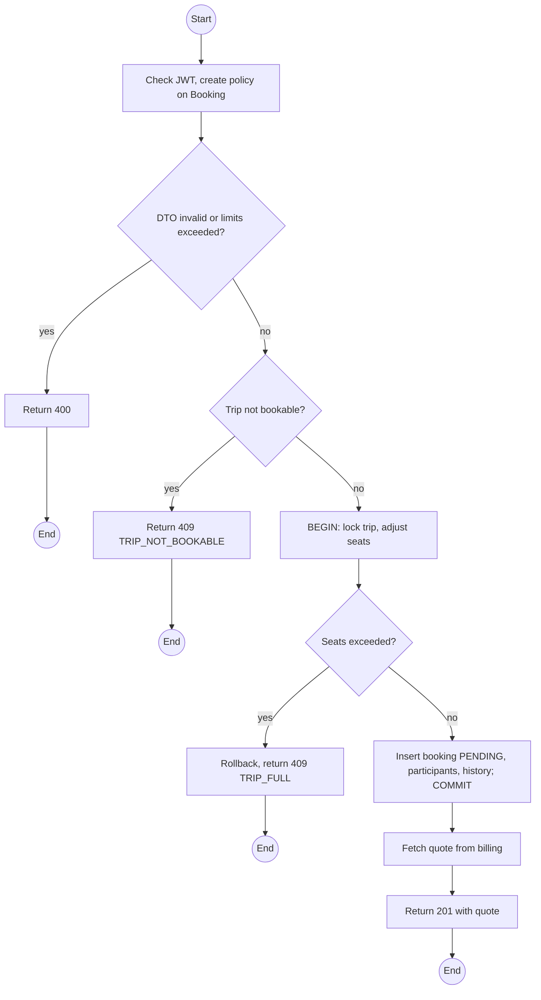
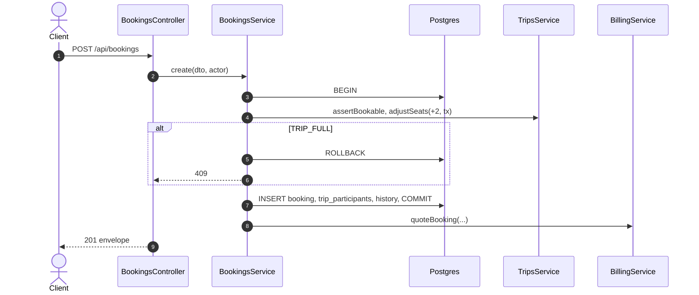

# POST /api/bookings: Submit a booking

> Module `rentals`. Format: `02-templates/04-api-endpoint-template.md`, with Mermaid in place of PlantUML (D-017). Envelope: D-002.

[TOC]

---
## Overview

Creates a `PENDING` booking for a `BOOKING_OPEN` trip and takes the group's seats on the trip in the same transaction. Devices are reserved by the next call (endpoint 02), so a lost race for the last device leaves a valid `PENDING` booking with no device (E01-1). Customers book for themselves with at most `rentals.maxDevicesPerCustomerBooking` devices; Guides and Staff book for a group and may name an unauthenticated renter.

## API Specification

| API        | URL             |
| ---------- | --------------- |
| POST | /api/bookings |
| Permission | Customer; Guide (own trips); Operator |
| Traces | UC-02, FR-BOOK-01 (new), US-025, REQ-EVT-01, REQ-EVT-02, E01-5, Q55, Q57 |

## Request sample

```json
{
  "tripId": "a1c3...",
  "groupSize": 2,
  "requestedDevices": 1,
  "travellers": [
    {
      "displayName": "Nguyen Van A",
      "phoneNumber": "0901234567"
    },
    {
      "displayName": "Nguyen Thi C"
    }
  ],
  "termsAccepted": true
}
```

| Field | Description | Data Type | Required | Examples |
| --- | --- | --- | --- | --- |
| tripId | Trip in BOOKING_OPEN | uuid | yes | `a1c3...` |
| groupSize | Within package min and max | int | yes | `2` |
| requestedDevices | 1 to channel maximum | int | yes | `1` |
| travellers | One per person, at least the renter; become trip participants | object[] | yes | n/a |
| renter | Guide and Staff only: `{ customerId }` or `{ name, phoneNumber }` | object | no | n/a |
| termsAccepted | Must be true | bool | yes | `true` |

## Response sample

```json
{
  "result": {
    "id": "7f1e2d3c-4b5a-4968-8776-655443322110",
    "code": "BK-2026-000123",
    "trip": {
      "id": "a1c3...",
      "code": "TRP-2026-1010-TNPD",
      "startAt": "2026-10-10T00:00:00Z"
    },
    "channel": "CUSTOMER",
    "customer": {
      "id": "5b7e...",
      "username": "name123"
    },
    "renterName": "Nguyen Van A",
    "groupSize": 2,
    "requestedDevices": 1,
    "status": "PENDING",
    "allocations": [],
    "escrowPaidAt": null,
    "createdAt": "2026-10-01T02:10:00Z",
    "quote": {
      "total": 3450000,
      "currency": "VND",
      "lines": [
        {
          "type": "TRIP_FEE",
          "amount": 3000000
        },
        {
          "type": "RENTAL_FEE",
          "amount": 150000
        },
        {
          "type": "DEPOSIT",
          "amount": 300000
        }
      ]
    }
  },
  "isSuccess": true,
  "statusCode": 201,
  "message": "Booking submitted"
}
```

| Field | Description | Data Type | Examples |
| --- | --- | --- | --- |
| quote | Itemised quote from `billing`; payable into escrow after reservation | object | n/a |

## Validation

<table>
    <th>Status code</th>
    <th>Description</th>
    <th>Examples</th>
    <tbody>
        <tr>
            <td>400</td>
            <td>Validation, terms not accepted, travellers fewer than 1 (<code>VALIDATION_FAILED</code>)</td>
<td>

```json
{
  "result": {
    "errorCode": "VALIDATION_FAILED"
  },
  "isSuccess": false,
  "statusCode": 400,
  "message": "termsAccepted must be true."
}
```
</td>
        </tr>
        <tr>
            <td>400</td>
            <td>Group outside package bounds (<code>GROUP_SIZE_OUT_OF_RANGE</code>)</td>
<td>

```json
{
  "result": {
    "errorCode": "GROUP_SIZE_OUT_OF_RANGE"
  },
  "isSuccess": false,
  "statusCode": 400,
  "message": "Group size must be between 4 and 12 for this package."
}
```
</td>
        </tr>
        <tr>
            <td>400</td>
            <td>Too many devices for the channel (<code>TOO_MANY_DEVICES</code>)</td>
<td>

```json
{
  "result": {
    "errorCode": "TOO_MANY_DEVICES"
  },
  "isSuccess": false,
  "statusCode": 400,
  "message": "A customer booking can reserve at most 1 device."
}
```
</td>
        </tr>
        <tr>
            <td>401</td>
            <td>Missing, malformed or expired access token (<code>UNAUTHENTICATED</code>)</td>
<td>

```json
{
  "result": {
    "errorCode": "UNAUTHENTICATED"
  },
  "isSuccess": false,
  "statusCode": 401,
  "message": "Authentication required."
}
```
</td>
        </tr>
        <tr>
            <td>403</td>
            <td>Authenticated, but the caller's role or policy does not allow this action (<code>FORBIDDEN</code>)</td>
<td>

```json
{
  "result": {
    "errorCode": "FORBIDDEN"
  },
  "isSuccess": false,
  "statusCode": 403,
  "message": "You do not have permission to perform this action."
}
```
</td>
        </tr>
        <tr>
            <td>404</td>
            <td>Trip not visible to the caller (<code>NOT_FOUND</code>)</td>
<td>

```json
{
  "result": {
    "errorCode": "NOT_FOUND"
  },
  "isSuccess": false,
  "statusCode": 404,
  "message": "Trip not found."
}
```
</td>
        </tr>
        <tr>
            <td>409</td>
            <td>Trip not BOOKING_OPEN (<code>TRIP_NOT_BOOKABLE</code>)</td>
<td>

```json
{
  "result": {
    "errorCode": "TRIP_NOT_BOOKABLE"
  },
  "isSuccess": false,
  "statusCode": 409,
  "message": "This trip is not open for booking."
}
```
</td>
        </tr>
        <tr>
            <td>409</td>
            <td>Not enough seats (<code>TRIP_FULL</code>)</td>
<td>

```json
{
  "result": {
    "errorCode": "TRIP_FULL"
  },
  "isSuccess": false,
  "statusCode": 409,
  "message": "Only 1 seat is left on this trip."
}
```
</td>
        </tr>
    </tbody>
</table>

## Activity Diagram



## Sequence Diagram


