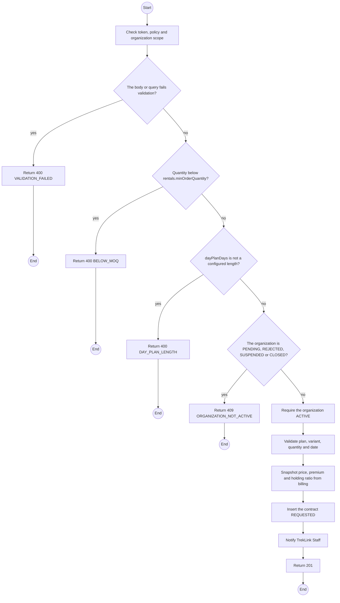
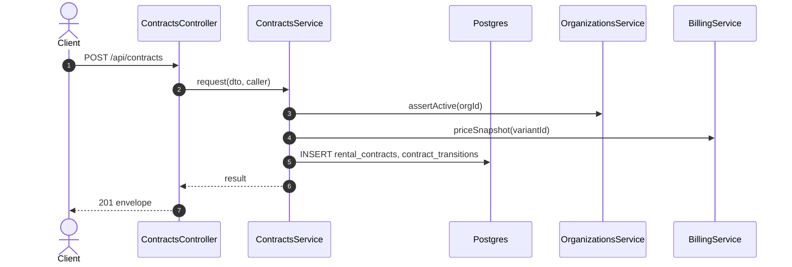

# POST /api/contracts: Request a rental contract

> Module `rentals`. Generated from `scripts/specs/endpoints/rentals.py` by `scripts/specs/build_api_design.py`; edit the catalog, not this file. Format: `02-templates/04-api-endpoint-template.md` with Mermaid (D-017). Envelope: D-002.

[TOC]

---
## Overview

Requests a plan: monthly, or a day plan of a configured length; one hardware variant; a quantity at or above the minimum order quantity; a start date. Prices are snapshotted now, so a later price change does not affect this contract (FR-CFG-02). The organization must be `ACTIVE`.

## API Specification

| API | URL |
| --- | --- |
| POST | /api/contracts |
| Permission | Org Manager: own |
| Traces | UC-15, FR-CON-01, FR-CON-02, FR-CON-07, FR-BILL-01, FR-BILL-02, BR-01, BR-02, E01-2, E01-3, MSG13, MSG14 |

## Request sample

```json
{
  "planType": "MONTHLY",
  "hardwareVariantId": "a1b2c3d4-e5f6-4a7b-8c9d-0e1f2a3b4c5d",
  "quantity": 10,
  "requestedStartDate": "2026-10-25"
}
```

| Field | Description | Data Type | Required | Examples |
| --- | --- | --- | --- | --- |
| planType | `MONTHLY` or `DAY` | enum | yes | `MONTHLY` |
| dayPlanDays | One of rentals.dayPlanLengths; DAY only | int | cond. | `4` |
| hardwareVariantId | Active variant | uuid | yes | `a1b2c3d4-e5f6-4a7b-8c9d-0e1f2a3b4c5d` |
| quantity | At least rentals.minOrderQuantity | int | yes | `10` |
| requestedStartDate | Handover day, not in the past | date | yes | `2026-10-25` |

## Response sample

```json
{
  "result": {
    "id": "c0ffee00-1234-4abc-9def-001122334455",
    "code": "RC-2026-0042",
    "organization": {
      "id": "5b1d2c0e-7f3a-4e21-9c8d-1a2b3c4d5e6f",
      "code": "ORG-0007",
      "legalName": "ACME Trek Co., Ltd."
    },
    "planType": "MONTHLY",
    "dayPlanDays": null,
    "hardwareVariant": {
      "id": "a1b2c3d4-e5f6-4a7b-8c9d-0e1f2a3b4c5d",
      "code": "treklink-v3"
    },
    "quantity": 10,
    "requestedStartDate": "2026-10-25",
    "monthlyUnitPriceVnd": 450000,
    "dayPremium": null,
    "holdingFeeRatio": 0.5,
    "status": "REQUESTED",
    "statusChangedAt": "2026-10-20T03:15:00.000Z",
    "handedOverAt": null,
    "currentTerm": null,
    "endsAt": null,
    "noticeGivenAt": null,
    "returnDueAt": null,
    "version": 0,
    "quote": {
      "firstPaymentVnd": 2250000,
      "termFeeVnd": 4500000
    }
  },
  "isSuccess": true,
  "statusCode": 201,
  "message": "Request sent. TrekLink will confirm availability and your handover appointment."
}
```

## Validation

<table>
    <th>Status code</th>
    <th>Description</th>
    <th>Examples</th>
    <tbody>
        <tr>
            <td>400</td>
            <td>The body or query fails validation (<code>VALIDATION_FAILED</code>)</td>
<td>

```json
{
  "result": {
    "errorCode": "VALIDATION_FAILED"
  },
  "isSuccess": false,
  "statusCode": 400,
  "message": "{field} is required."
}
```
</td>
        </tr>
        <tr>
            <td>401</td>
            <td>Missing, malformed or expired access token or API key (<code>UNAUTHENTICATED</code>)</td>
<td>

```json
{
  "result": {
    "errorCode": "UNAUTHENTICATED"
  },
  "isSuccess": false,
  "statusCode": 401,
  "message": "Authentication required."
}
```
</td>
        </tr>
        <tr>
            <td>403</td>
            <td>The caller's role, policy or organization does not allow this action (<code>FORBIDDEN</code>)</td>
<td>

```json
{
  "result": {
    "errorCode": "FORBIDDEN"
  },
  "isSuccess": false,
  "statusCode": 403,
  "message": "You do not have access to this."
}
```
</td>
        </tr>
        <tr>
            <td>400</td>
            <td>Quantity below rentals.minOrderQuantity (<code>BELOW_MOQ</code>)</td>
<td>

```json
{
  "result": {
    "errorCode": "BELOW_MOQ"
  },
  "isSuccess": false,
  "statusCode": 400,
  "message": "The minimum order is 5 devices."
}
```
</td>
        </tr>
        <tr>
            <td>400</td>
            <td>dayPlanDays is not a configured length (<code>DAY_PLAN_LENGTH</code>)</td>
<td>

```json
{
  "result": {
    "errorCode": "DAY_PLAN_LENGTH"
  },
  "isSuccess": false,
  "statusCode": 400,
  "message": "Choose a plan of 3, 4 or 7 days."
}
```
</td>
        </tr>
        <tr>
            <td>409</td>
            <td>The organization is PENDING, REJECTED, SUSPENDED or CLOSED (<code>ORGANIZATION_NOT_ACTIVE</code>)</td>
<td>

```json
{
  "result": {
    "errorCode": "ORGANIZATION_NOT_ACTIVE"
  },
  "isSuccess": false,
  "statusCode": 409,
  "message": "Your organization cannot request devices while it is SUSPENDED."
}
```
</td>
        </tr>
    </tbody>
</table>

## Activity Diagram



## Sequence Diagram


