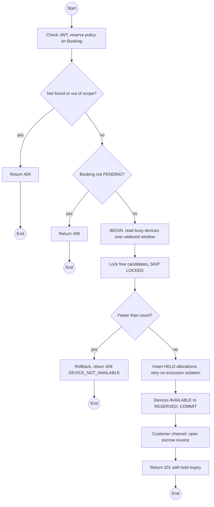
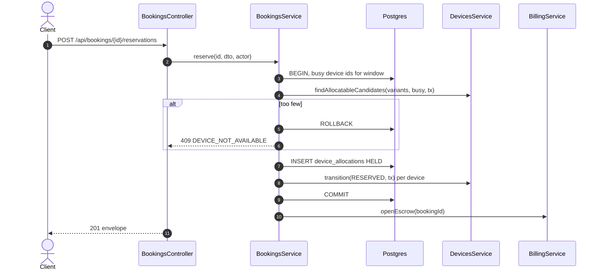

# POST /api/bookings/:id/reservations: Reserve devices for a booking

> Module `rentals`. Format: `02-templates/04-api-endpoint-template.md`, with Mermaid in place of PlantUML (D-017). Envelope: D-002.

[TOC]

---
## Overview

Holds devices for a `PENDING` booking: locks free candidates of accepted variants, creates `HELD` allocations over the trip window (widened by lead and trail hours), moves each warehouse unit to `RESERVED`, and, on the Customer channel, starts the hold timer and opens the escrow invoice. If fewer devices are free than requested, nothing is held and the booking stays `PENDING` with no device (E01-1).

## API Specification

| API        | URL             |
| ---------- | --------------- |
| POST | /api/bookings/:id/reservations |
| Permission | Booking owner (Customer); Guide (own trips); Operator |
| Concurrency | `FOR UPDATE SKIP LOCKED` on candidate devices; exclusion constraint on allocations; retry on constraint violation |
| Traces | UC-03, UC-22, FR-BOOK-02, BR-01, E01-1, E01-5, US-026, REQ-EVT-03, REQ-ERR-01, REQ-ERR-02, Q53, Q58, Q59 |

### Path parameters

| Field | Description | Data Type | Examples |
| --- | --- | --- | --- |
| id | Booking id | uuid | `7f1e2d3c-4b5a-4968-8776-655443322110` |

## Request sample

```json
{
  "count": 1,
  "deviceIds": null
}
```

| Field | Description | Data Type | Required | Examples |
| --- | --- | --- | --- | --- |
| count | Devices to hold; up to requestedDevices | int | yes | `1` |
| deviceIds | Operator only: specific devices instead of automatic choice | uuid[] | no | `0d3f...` |

## Response sample

```json
{
  "result": {
    "bookingId": "7f1e2d3c-4b5a-4968-8776-655443322110",
    "allocations": [
      {
        "id": "al-7...",
        "device": {
          "id": "0d3f...",
          "assetTag": "TL-0042",
          "variant": "treklink-v3"
        },
        "windowStart": "2026-10-09T12:00:00Z",
        "windowEnd": "2026-10-13T11:00:00Z",
        "status": "HELD",
        "holdExpiresAt": "2026-10-01T02:25:00Z"
      }
    ],
    "holdExpiresAt": "2026-10-01T02:25:00Z",
    "escrowInvoiceId": "inv-31...",
    "amountDue": 3450000
  },
  "isSuccess": true,
  "statusCode": 201,
  "message": "Devices reserved"
}
```

## Validation

<table>
    <th>Status code</th>
    <th>Description</th>
    <th>Examples</th>
    <tbody>
        <tr>
            <td>400</td>
            <td>Count above requestedDevices (<code>VALIDATION_FAILED</code>)</td>
<td>

```json
{
  "result": {
    "errorCode": "VALIDATION_FAILED"
  },
  "isSuccess": false,
  "statusCode": 400,
  "message": "count cannot exceed the 1 device requested."
}
```
</td>
        </tr>
        <tr>
            <td>401</td>
            <td>Missing, malformed or expired access token (<code>UNAUTHENTICATED</code>)</td>
<td>

```json
{
  "result": {
    "errorCode": "UNAUTHENTICATED"
  },
  "isSuccess": false,
  "statusCode": 401,
  "message": "Authentication required."
}
```
</td>
        </tr>
        <tr>
            <td>403</td>
            <td>Authenticated, but the caller's role or policy does not allow this action (<code>FORBIDDEN</code>)</td>
<td>

```json
{
  "result": {
    "errorCode": "FORBIDDEN"
  },
  "isSuccess": false,
  "statusCode": 403,
  "message": "You do not have permission to perform this action."
}
```
</td>
        </tr>
        <tr>
            <td>404</td>
            <td>No such booking, or outside the caller's scope (<code>NOT_FOUND</code>)</td>
<td>

```json
{
  "result": {
    "errorCode": "NOT_FOUND"
  },
  "isSuccess": false,
  "statusCode": 404,
  "message": "Booking not found."
}
```
</td>
        </tr>
        <tr>
            <td>409</td>
            <td>Booking not PENDING (<code>INVALID_STATE_TRANSITION</code>)</td>
<td>

```json
{
  "result": {
    "errorCode": "INVALID_STATE_TRANSITION"
  },
  "isSuccess": false,
  "statusCode": 409,
  "message": "Devices can only be reserved for a pending booking."
}
```
</td>
        </tr>
        <tr>
            <td>409</td>
            <td>Not enough free devices, including a lost race for the last one (<code>DEVICE_NOT_AVAILABLE</code>)</td>
<td>

```json
{
  "result": {
    "errorCode": "DEVICE_NOT_AVAILABLE"
  },
  "isSuccess": false,
  "statusCode": 409,
  "message": "This device is no longer available. 0 devices are free for these dates."
}
```
</td>
        </tr>
        <tr>
            <td>409</td>
            <td>A specifically requested device overlaps another allocation (<code>ALLOCATION_CONFLICT</code>)</td>
<td>

```json
{
  "result": {
    "errorCode": "ALLOCATION_CONFLICT"
  },
  "isSuccess": false,
  "statusCode": 409,
  "message": "TL-0042 is already allocated to BK-2026-000119 for overlapping dates."
}
```
</td>
        </tr>
        <tr>
            <td>409</td>
            <td>A requested device's variant is not accepted on this trip (<code>VARIANT_NOT_ACCEPTED</code>)</td>
<td>

```json
{
  "result": {
    "errorCode": "VARIANT_NOT_ACCEPTED"
  },
  "isSuccess": false,
  "statusCode": 409,
  "message": "treklink-v1 devices are not accepted on this trip."
}
```
</td>
        </tr>
    </tbody>
</table>

## Activity Diagram



## Sequence Diagram


