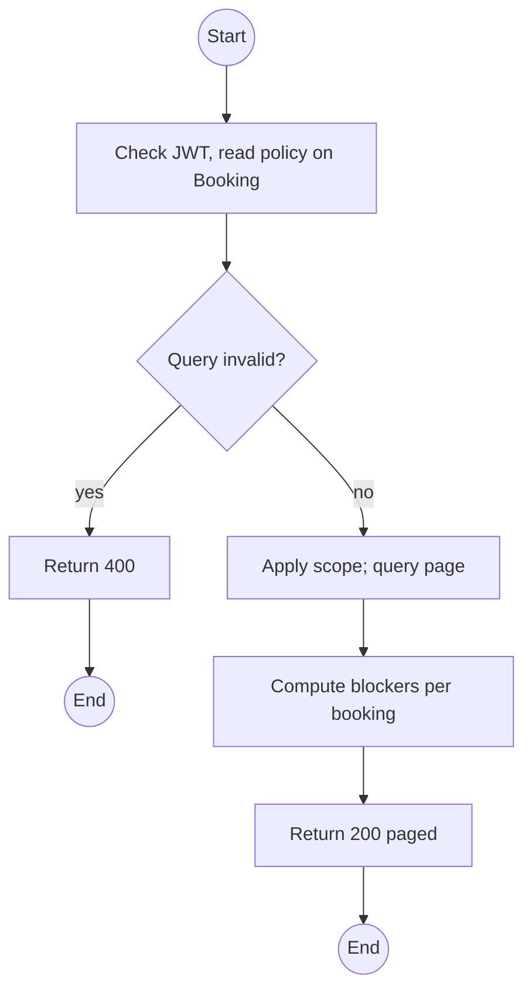
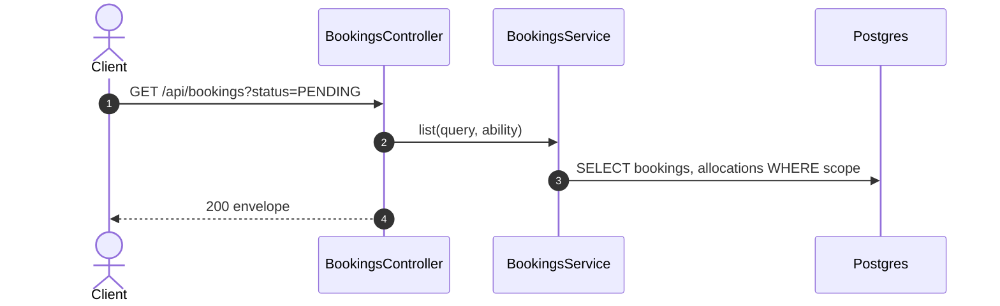

# GET /api/bookings: List bookings

> Module `rentals`. Format: `02-templates/04-api-endpoint-template.md`, with Mermaid in place of PlantUML (D-017). Envelope: D-002.

[TOC]

---
## Overview

Paged bookings. The Operator queue view sorts `PENDING` first and includes a `blockers` list per booking (missing Guide, reservation incomplete, unpaid hold) so conflicts are visible before confirming (E01-4). Customers see their own; Guides see bookings on their trips.

## API Specification

| API        | URL             |
| ---------- | --------------- |
| GET | /api/bookings |
| Permission | Operator, Admin (all); Guide (own trips); Customer (own) |
| Traces | UC-04, US-027, US-039, US-040 |

### Query parameters

| Field | Description | Data Type | Required | Examples |
| --- | --- | --- | --- | --- |
| status | Booking statuses | enum[] | no | `PENDING` |
| tripId | Trip filter | uuid | no | `a1c3...` |
| channel | CUSTOMER, GUIDE, STAFF | enum | no | `CUSTOMER` |
| search | Code, renter name or phone | string | no | `Nguyen` |
| pageNumber | 1-based | int | no | `1` |
| pageSize | Default 20 | int | no | `20` |
| sort | `createdAt`, `status`, `trip.startAt` | string | no | `status` |

## Request sample

No request body. Query string example:

```
GET /api/bookings?status=PENDING&sort=trip.startAt
```

## Response sample

```json
{
  "result": {
    "items": [
      {
        "id": "7f1e2d3c-4b5a-4968-8776-655443322110",
        "code": "BK-2026-000123",
        "trip": {
          "id": "a1c3...",
          "code": "TRP-2026-1010-TNPD",
          "startAt": "2026-10-10T00:00:00Z"
        },
        "channel": "CUSTOMER",
        "customer": {
          "id": "5b7e...",
          "username": "name123"
        },
        "renterName": "Nguyen Van A",
        "groupSize": 2,
        "requestedDevices": 1,
        "status": "PENDING",
        "allocations": [
          {
            "id": "al-7...",
            "device": {
              "id": "0d3f...",
              "assetTag": "TL-0042",
              "variant": "treklink-v3"
            },
            "windowStart": "2026-10-09T12:00:00Z",
            "windowEnd": "2026-10-13T11:00:00Z",
            "status": "HELD",
            "holdExpiresAt": "2026-10-01T02:25:00Z"
          }
        ],
        "escrowPaidAt": null,
        "createdAt": "2026-10-01T02:10:00Z",
        "blockers": [
          "GUIDES_NOT_SATISFIED"
        ]
      }
    ],
    "pageNumber": 1,
    "pageSize": 20,
    "totalCount": 1,
    "totalPages": 1
  },
  "isSuccess": true,
  "statusCode": 200,
  "message": "Bookings retrieved"
}
```

## Validation

<table>
    <th>Status code</th>
    <th>Description</th>
    <th>Examples</th>
    <tbody>
        <tr>
            <td>400</td>
            <td>Bad filter (<code>VALIDATION_FAILED</code>)</td>
<td>

```json
{
  "result": {
    "errorCode": "VALIDATION_FAILED"
  },
  "isSuccess": false,
  "statusCode": 400,
  "message": "status must be a valid booking status."
}
```
</td>
        </tr>
        <tr>
            <td>401</td>
            <td>Missing, malformed or expired access token (<code>UNAUTHENTICATED</code>)</td>
<td>

```json
{
  "result": {
    "errorCode": "UNAUTHENTICATED"
  },
  "isSuccess": false,
  "statusCode": 401,
  "message": "Authentication required."
}
```
</td>
        </tr>
        <tr>
            <td>403</td>
            <td>Authenticated, but the caller's role or policy does not allow this action (<code>FORBIDDEN</code>)</td>
<td>

```json
{
  "result": {
    "errorCode": "FORBIDDEN"
  },
  "isSuccess": false,
  "statusCode": 403,
  "message": "You do not have permission to perform this action."
}
```
</td>
        </tr>
    </tbody>
</table>

## Activity Diagram



## Sequence Diagram


