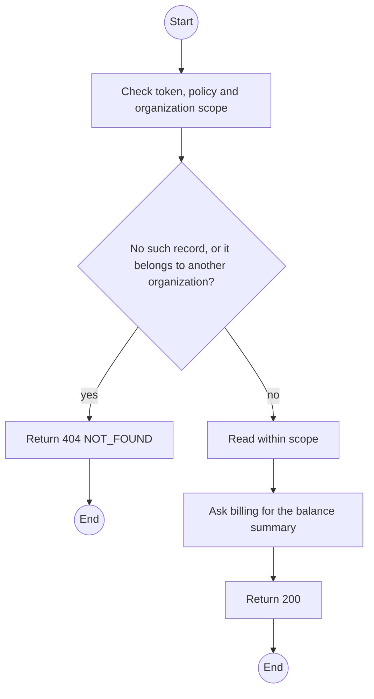
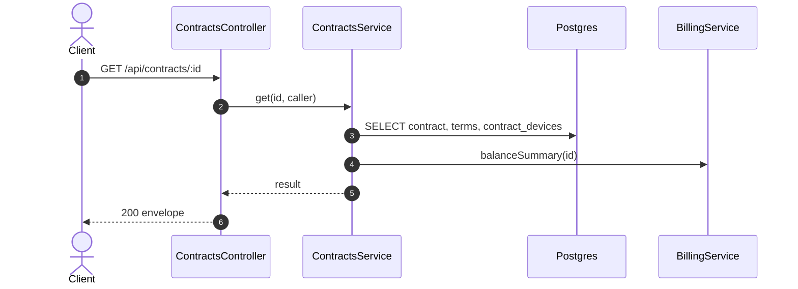

# GET /api/contracts/:id: Contract detail

> Module `rentals`. Generated from `scripts/specs/endpoints/rentals.py` by `scripts/specs/build_api_design.py`; edit the catalog, not this file. Format: `02-templates/04-api-endpoint-template.md` with Mermaid (D-017). Envelope: D-002.

[TOC]

---
## Overview

Returns the contract with its terms, committed devices (with holder labels) and balance summary.

## API Specification

| API | URL |
| --- | --- |
| GET | /api/contracts/:id |
| Permission | Org Manager, Org Operator: own; TrekLink Staff, TrekLink Admin |
| Traces | UC-55, FR-AUTH-11, FR-CON-07 |

### Path parameters

| Field | Description | Data Type | Examples |
| --- | --- | --- | --- |
| id | Contract id; members may use only their own organization's | uuid | `c0ffee00-1234-4abc-9def-001122334455` |

## Request sample

No body.

## Response sample

```json
{
  "result": {
    "id": "c0ffee00-1234-4abc-9def-001122334455",
    "code": "RC-2026-0042",
    "organization": {
      "id": "5b1d2c0e-7f3a-4e21-9c8d-1a2b3c4d5e6f",
      "code": "ORG-0007",
      "legalName": "ACME Trek Co., Ltd."
    },
    "planType": "MONTHLY",
    "dayPlanDays": null,
    "hardwareVariant": {
      "id": "a1b2c3d4-e5f6-4a7b-8c9d-0e1f2a3b4c5d",
      "code": "treklink-v3"
    },
    "quantity": 10,
    "requestedStartDate": "2026-10-25",
    "monthlyUnitPriceVnd": 450000,
    "dayPremium": null,
    "holdingFeeRatio": 0.5,
    "status": "ACTIVE",
    "statusChangedAt": "2026-10-20T03:15:00.000Z",
    "handedOverAt": "2026-10-20T03:15:00.000Z",
    "currentTerm": {
      "seq": 1,
      "startsAt": "2026-10-25T02:00:00Z",
      "endsAt": "2026-11-25T02:00:00Z"
    },
    "endsAt": null,
    "noticeGivenAt": null,
    "returnDueAt": null,
    "version": 4,
    "terms": [
      {
        "seq": 1,
        "startsAt": "2026-10-25T02:00:00Z",
        "endsAt": "2026-11-25T02:00:00Z",
        "status": "OPEN"
      }
    ],
    "devices": [
      {
        "deviceId": "0d3f6a2b-7e11-4c55-8f0a-2b1c9e7d4a10",
        "assetTag": "TL-0042",
        "handedOverAt": "2026-10-20T03:15:00.000Z",
        "checkedInAt": null,
        "lostAt": null,
        "holder": {
          "name": "Le Thi E",
          "phone": "0912345678",
          "emergencyContact": "Le Van F, 0987654321"
        }
      }
    ],
    "balance": {
      "dueNowVnd": 0,
      "dueLaterVnd": 2250000
    }
  },
  "isSuccess": true,
  "statusCode": 200,
  "message": "OK"
}
```

## Validation

<table>
    <th>Status code</th>
    <th>Description</th>
    <th>Examples</th>
    <tbody>
        <tr>
            <td>401</td>
            <td>Missing, malformed or expired access token or API key (<code>UNAUTHENTICATED</code>)</td>
<td>

```json
{
  "result": {
    "errorCode": "UNAUTHENTICATED"
  },
  "isSuccess": false,
  "statusCode": 401,
  "message": "Authentication required."
}
```
</td>
        </tr>
        <tr>
            <td>403</td>
            <td>The caller's role, policy or organization does not allow this action (<code>FORBIDDEN</code>)</td>
<td>

```json
{
  "result": {
    "errorCode": "FORBIDDEN"
  },
  "isSuccess": false,
  "statusCode": 403,
  "message": "You do not have access to this."
}
```
</td>
        </tr>
        <tr>
            <td>404</td>
            <td>No such record, or it belongs to another organization (<code>NOT_FOUND</code>)</td>
<td>

```json
{
  "result": {
    "errorCode": "NOT_FOUND"
  },
  "isSuccess": false,
  "statusCode": 404,
  "message": "Contract not found."
}
```
</td>
        </tr>
    </tbody>
</table>

## Activity Diagram



## Sequence Diagram


