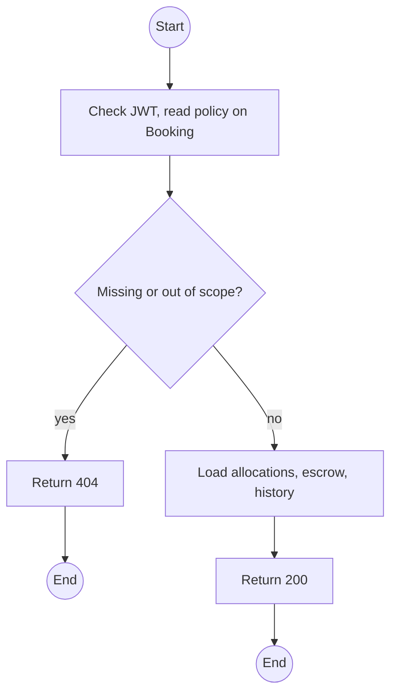
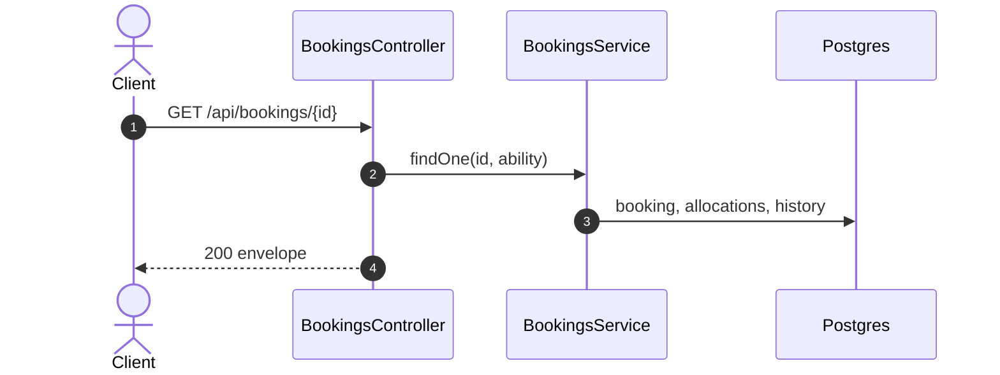

# GET /api/bookings/:id: Booking detail

> Module `rentals`. Format: `02-templates/04-api-endpoint-template.md`, with Mermaid in place of PlantUML (D-017). Envelope: D-002.

[TOC]

---
## Overview

One booking with allocations and their hold expiry, participants, quote and escrow state from `billing`, blockers, the linked rental, and status history.

## API Specification

| API        | URL             |
| ---------- | --------------- |
| GET | /api/bookings/:id |
| Permission | Operator, Admin; Guide (own trips); Customer (own) |
| Traces | US-039, UC-04 |

### Path parameters

| Field | Description | Data Type | Examples |
| --- | --- | --- | --- |
| id | Booking id | uuid | `7f1e2d3c-4b5a-4968-8776-655443322110` |

## Request sample

No request body.

## Response sample

```json
{
  "result": {
    "id": "7f1e2d3c-4b5a-4968-8776-655443322110",
    "code": "BK-2026-000123",
    "trip": {
      "id": "a1c3...",
      "code": "TRP-2026-1010-TNPD",
      "startAt": "2026-10-10T00:00:00Z"
    },
    "channel": "CUSTOMER",
    "customer": {
      "id": "5b7e...",
      "username": "name123"
    },
    "renterName": "Nguyen Van A",
    "groupSize": 2,
    "requestedDevices": 1,
    "status": "PENDING",
    "allocations": [
      {
        "id": "al-7...",
        "device": {
          "id": "0d3f...",
          "assetTag": "TL-0042",
          "variant": "treklink-v3"
        },
        "windowStart": "2026-10-09T12:00:00Z",
        "windowEnd": "2026-10-13T11:00:00Z",
        "status": "HELD",
        "holdExpiresAt": "2026-10-01T02:25:00Z"
      }
    ],
    "escrowPaidAt": null,
    "createdAt": "2026-10-01T02:10:00Z",
    "escrow": {
      "invoiceId": "inv-31...",
      "status": "ISSUED",
      "amountDue": 3450000
    },
    "blockers": [],
    "rentalId": null,
    "history": [
      {
        "from": null,
        "to": "PENDING",
        "actor": "name123",
        "at": "2026-10-01T02:10:00Z"
      }
    ]
  },
  "isSuccess": true,
  "statusCode": 200,
  "message": "Booking retrieved"
}
```

## Validation

<table>
    <th>Status code</th>
    <th>Description</th>
    <th>Examples</th>
    <tbody>
        <tr>
            <td>401</td>
            <td>Missing, malformed or expired access token (<code>UNAUTHENTICATED</code>)</td>
<td>

```json
{
  "result": {
    "errorCode": "UNAUTHENTICATED"
  },
  "isSuccess": false,
  "statusCode": 401,
  "message": "Authentication required."
}
```
</td>
        </tr>
        <tr>
            <td>403</td>
            <td>Authenticated, but the caller's role or policy does not allow this action (<code>FORBIDDEN</code>)</td>
<td>

```json
{
  "result": {
    "errorCode": "FORBIDDEN"
  },
  "isSuccess": false,
  "statusCode": 403,
  "message": "You do not have permission to perform this action."
}
```
</td>
        </tr>
        <tr>
            <td>404</td>
            <td>No such booking, or outside the caller's scope (<code>NOT_FOUND</code>)</td>
<td>

```json
{
  "result": {
    "errorCode": "NOT_FOUND"
  },
  "isSuccess": false,
  "statusCode": 404,
  "message": "Booking not found."
}
```
</td>
        </tr>
    </tbody>
</table>

## Activity Diagram



## Sequence Diagram


