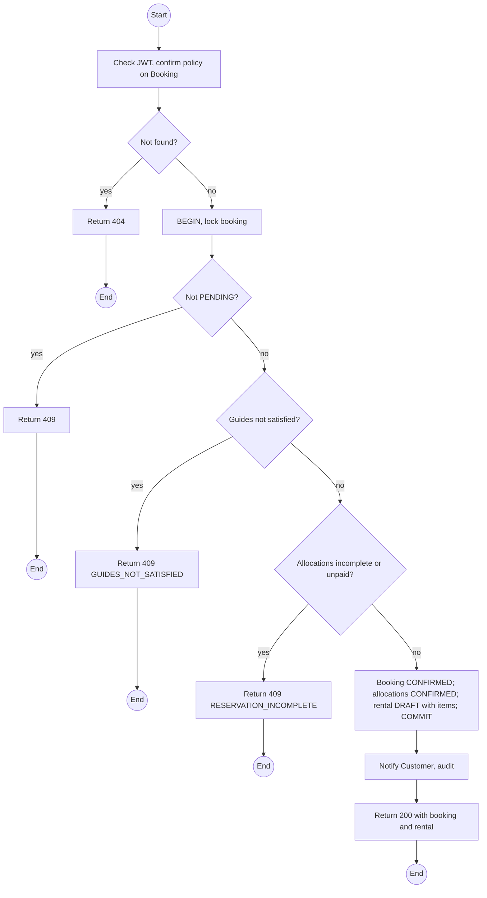
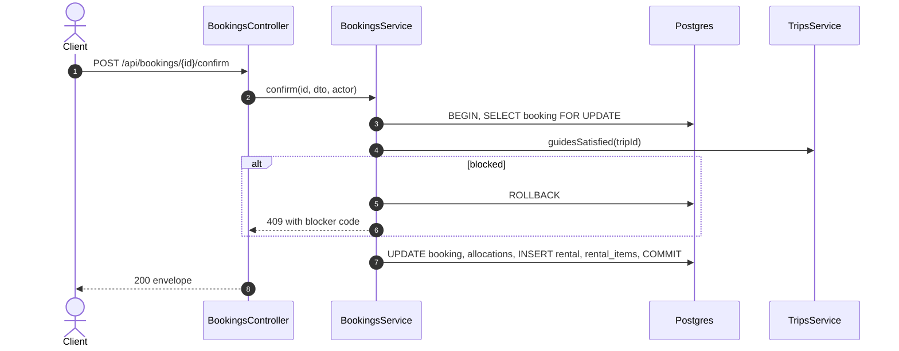

# POST /api/bookings/:id/confirm: Confirm a booking

> Module `rentals`. Format: `02-templates/04-api-endpoint-template.md`, with Mermaid in place of PlantUML (D-017). Envelope: D-002.

[TOC]

---
## Overview

Confirms a `PENDING` booking once its allocations cover the requested devices (paid holds on the Customer channel, or holds with the hold disabled on Staff and Guide channels) and the trip has its required Guides. Creates the rental in `DRAFT` with one item per allocation, and notifies the Customer. Every guard is checked before any write.

## API Specification

| API        | URL             |
| ---------- | --------------- |
| POST | /api/bookings/:id/confirm |
| Permission | Operator |
| Traces | UC-04, FR-BOOK-04, BR-02, E01-4, US-027, REQ-EVT-06, REQ-ERR-04, REQ-ERR-05 |

### Path parameters

| Field | Description | Data Type | Examples |
| --- | --- | --- | --- |
| id | Booking id | uuid | `7f1e2d3c-4b5a-4968-8776-655443322110` |

## Request sample

```json
{
  "custodianGuideId": "g-1...",
  "note": "Checked ID by phone"
}
```

| Field | Description | Data Type | Required | Examples |
| --- | --- | --- | --- | --- |
| custodianGuideId | Guide of this trip who receives the devices; defaults to the Lead | uuid | no | `g-1...` |
| note | Stored in history | string | no | `Checked ID` |

## Response sample

```json
{
  "result": {
    "booking": {
      "id": "7f1e2d3c-4b5a-4968-8776-655443322110",
      "code": "BK-2026-000123",
      "trip": {
        "id": "a1c3...",
        "code": "TRP-2026-1010-TNPD",
        "startAt": "2026-10-10T00:00:00Z"
      },
      "channel": "CUSTOMER",
      "customer": {
        "id": "5b7e...",
        "username": "name123"
      },
      "renterName": "Nguyen Van A",
      "groupSize": 2,
      "requestedDevices": 1,
      "status": "CONFIRMED",
      "allocations": [],
      "escrowPaidAt": null,
      "createdAt": "2026-10-01T02:10:00Z",
      "confirmedAt": "2026-10-01T03:00:00Z"
    },
    "rental": {
      "id": "c9b8a7f6-5e4d-4c3b-2a19-0817f6e5d4c3",
      "code": "RN-2026-000077",
      "status": "DRAFT"
    }
  },
  "isSuccess": true,
  "statusCode": 200,
  "message": "Booking confirmed"
}
```

## Validation

<table>
    <th>Status code</th>
    <th>Description</th>
    <th>Examples</th>
    <tbody>
        <tr>
            <td>401</td>
            <td>Missing, malformed or expired access token (<code>UNAUTHENTICATED</code>)</td>
<td>

```json
{
  "result": {
    "errorCode": "UNAUTHENTICATED"
  },
  "isSuccess": false,
  "statusCode": 401,
  "message": "Authentication required."
}
```
</td>
        </tr>
        <tr>
            <td>403</td>
            <td>Authenticated, but the caller's role or policy does not allow this action (<code>FORBIDDEN</code>)</td>
<td>

```json
{
  "result": {
    "errorCode": "FORBIDDEN"
  },
  "isSuccess": false,
  "statusCode": 403,
  "message": "You do not have permission to perform this action."
}
```
</td>
        </tr>
        <tr>
            <td>404</td>
            <td>No such booking, or outside the caller's scope (<code>NOT_FOUND</code>)</td>
<td>

```json
{
  "result": {
    "errorCode": "NOT_FOUND"
  },
  "isSuccess": false,
  "statusCode": 404,
  "message": "Booking not found."
}
```
</td>
        </tr>
        <tr>
            <td>409</td>
            <td>Booking not PENDING (<code>INVALID_STATE_TRANSITION</code>)</td>
<td>

```json
{
  "result": {
    "errorCode": "INVALID_STATE_TRANSITION"
  },
  "isSuccess": false,
  "statusCode": 409,
  "message": "Only a pending booking can be confirmed."
}
```
</td>
        </tr>
        <tr>
            <td>409</td>
            <td>Trip lacks required Guides (<code>GUIDES_NOT_SATISFIED</code>)</td>
<td>

```json
{
  "result": {
    "errorCode": "GUIDES_NOT_SATISFIED"
  },
  "isSuccess": false,
  "statusCode": 409,
  "message": "This trip needs 2 Guides and has 1. Assign a Guide before confirming."
}
```
</td>
        </tr>
        <tr>
            <td>409</td>
            <td>Allocations incomplete or unpaid (<code>RESERVATION_INCOMPLETE</code>)</td>
<td>

```json
{
  "result": {
    "errorCode": "RESERVATION_INCOMPLETE"
  },
  "isSuccess": false,
  "statusCode": 409,
  "message": "1 of 1 device reserved, escrow not paid."
}
```
</td>
        </tr>
        <tr>
            <td>409</td>
            <td>Custodian not a Guide on this trip (<code>VALIDATION_FAILED</code>)</td>
<td>

```json
{
  "result": {
    "errorCode": "VALIDATION_FAILED"
  },
  "isSuccess": false,
  "statusCode": 409,
  "message": "custodianGuideId must be a Guide assigned to this trip."
}
```
</td>
        </tr>
    </tbody>
</table>

## Activity Diagram



## Sequence Diagram


