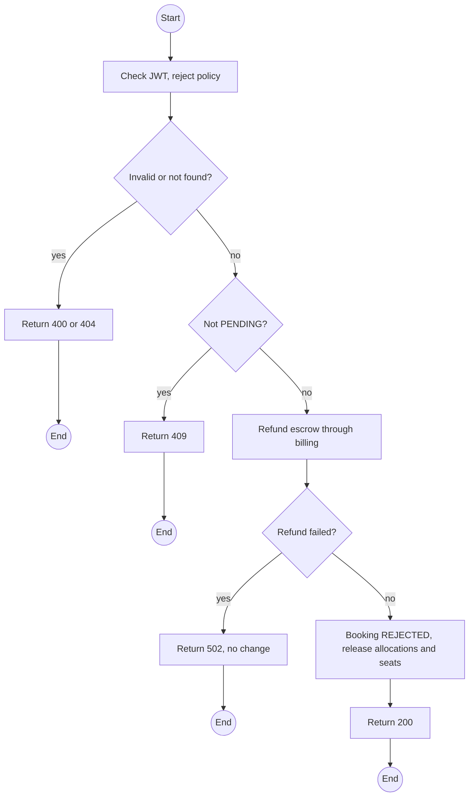
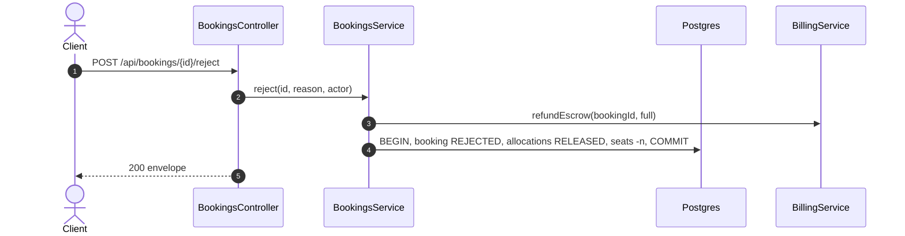

# POST /api/bookings/:id/reject: Reject a booking

> Module `rentals`. Format: `02-templates/04-api-endpoint-template.md`, with Mermaid in place of PlantUML (D-017). Envelope: D-002.

[TOC]

---
## Overview

Rejects a `PENDING` booking with a reason, releases its allocations and seats, and asks `billing` to refund any escrow in full.

## API Specification

| API        | URL             |
| ---------- | --------------- |
| POST | /api/bookings/:id/reject |
| Permission | Operator |
| Traces | UC-04, US-027, REQ-EVT-07 |

### Path parameters

| Field | Description | Data Type | Examples |
| --- | --- | --- | --- |
| id | Booking id | uuid | `7f1e2d3c-4b5a-4968-8776-655443322110` |

## Request sample

```json
{
  "reason": "Group size cannot be verified; customer unreachable"
}
```

| Field | Description | Data Type | Required | Examples |
| --- | --- | --- | --- | --- |
| reason | Required, shown to the customer | string | yes | `Customer unreachable` |

## Response sample

```json
{
  "result": {
    "id": "7f1e2d3c-4b5a-4968-8776-655443322110",
    "code": "BK-2026-000123",
    "trip": {
      "id": "a1c3...",
      "code": "TRP-2026-1010-TNPD",
      "startAt": "2026-10-10T00:00:00Z"
    },
    "channel": "CUSTOMER",
    "customer": {
      "id": "5b7e...",
      "username": "name123"
    },
    "renterName": "Nguyen Van A",
    "groupSize": 2,
    "requestedDevices": 1,
    "status": "REJECTED",
    "allocations": [],
    "escrowPaidAt": null,
    "createdAt": "2026-10-01T02:10:00Z",
    "decisionReason": "Group size cannot be verified; customer unreachable",
    "refund": {
      "amount": 3450000,
      "status": "SUCCEEDED"
    }
  },
  "isSuccess": true,
  "statusCode": 200,
  "message": "Booking rejected"
}
```

## Validation

<table>
    <th>Status code</th>
    <th>Description</th>
    <th>Examples</th>
    <tbody>
        <tr>
            <td>400</td>
            <td>Reason missing (<code>VALIDATION_FAILED</code>)</td>
<td>

```json
{
  "result": {
    "errorCode": "VALIDATION_FAILED"
  },
  "isSuccess": false,
  "statusCode": 400,
  "message": "reason is required."
}
```
</td>
        </tr>
        <tr>
            <td>401</td>
            <td>Missing, malformed or expired access token (<code>UNAUTHENTICATED</code>)</td>
<td>

```json
{
  "result": {
    "errorCode": "UNAUTHENTICATED"
  },
  "isSuccess": false,
  "statusCode": 401,
  "message": "Authentication required."
}
```
</td>
        </tr>
        <tr>
            <td>403</td>
            <td>Authenticated, but the caller's role or policy does not allow this action (<code>FORBIDDEN</code>)</td>
<td>

```json
{
  "result": {
    "errorCode": "FORBIDDEN"
  },
  "isSuccess": false,
  "statusCode": 403,
  "message": "You do not have permission to perform this action."
}
```
</td>
        </tr>
        <tr>
            <td>404</td>
            <td>No such booking, or outside the caller's scope (<code>NOT_FOUND</code>)</td>
<td>

```json
{
  "result": {
    "errorCode": "NOT_FOUND"
  },
  "isSuccess": false,
  "statusCode": 404,
  "message": "Booking not found."
}
```
</td>
        </tr>
        <tr>
            <td>409</td>
            <td>Not PENDING (<code>INVALID_STATE_TRANSITION</code>)</td>
<td>

```json
{
  "result": {
    "errorCode": "INVALID_STATE_TRANSITION"
  },
  "isSuccess": false,
  "statusCode": 409,
  "message": "Only a pending booking can be rejected."
}
```
</td>
        </tr>
        <tr>
            <td>502</td>
            <td>Refund failed in billing; booking unchanged (<code>PAYMENT_PROVIDER_ERROR</code>)</td>
<td>

```json
{
  "result": {
    "errorCode": "PAYMENT_PROVIDER_ERROR"
  },
  "isSuccess": false,
  "statusCode": 502,
  "message": "Refund failed. The booking was not changed."
}
```
</td>
        </tr>
    </tbody>
</table>

## Activity Diagram



## Sequence Diagram


