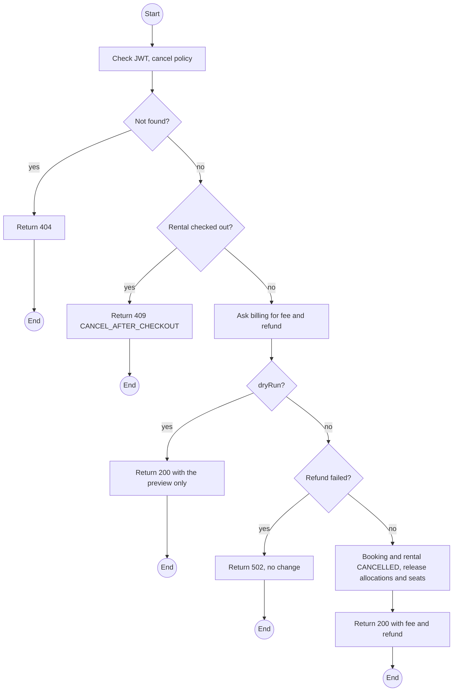
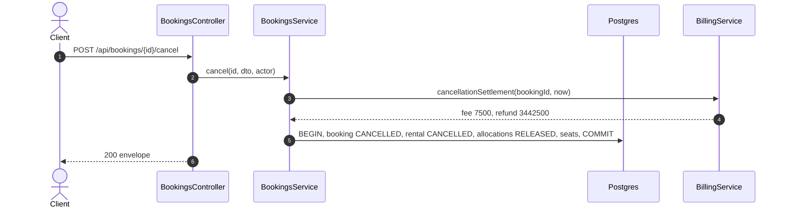

# POST /api/bookings/:id/cancel: Cancel a booking

> Module `rentals`. Format: `02-templates/04-api-endpoint-template.md`, with Mermaid in place of PlantUML (D-017). Envelope: D-002.

[TOC]

---
## Overview

Cancels a booking before check-out. `billing` computes the fee: free within `billing.freeCancellationMinutes` of the escrow payment, otherwise `billing.cancellationFeePct` of the rental fee only (not the trip fee). `dryRun=true` returns the fee without cancelling, so the Customer sees it before deciding. Devices are released and seats returned.

## API Specification

| API        | URL             |
| ---------- | --------------- |
| POST | /api/bookings/:id/cancel |
| Permission | Customer (own); Operator |
| Traces | UC-29 (new), FR-BOOK-07, BR-03, E01-2, REQ-EVT-08, REQ-ERR-07, Q60 |

### Path parameters

| Field | Description | Data Type | Examples |
| --- | --- | --- | --- |
| id | Booking id | uuid | `7f1e2d3c-4b5a-4968-8776-655443322110` |

### Query parameters

| Field | Description | Data Type | Required | Examples |
| --- | --- | --- | --- | --- |
| dryRun | Preview the fee only | bool | no | `false` |

## Request sample

```json
{
  "reason": "Change of plans"
}
```

| Field | Description | Data Type | Required | Examples |
| --- | --- | --- | --- | --- |
| reason | Optional for Customers, required for Staff | string | no | `Change of plans` |

## Response sample

```json
{
  "result": {
    "id": "7f1e2d3c-4b5a-4968-8776-655443322110",
    "code": "BK-2026-000123",
    "trip": {
      "id": "a1c3...",
      "code": "TRP-2026-1010-TNPD",
      "startAt": "2026-10-10T00:00:00Z"
    },
    "channel": "CUSTOMER",
    "customer": {
      "id": "5b7e...",
      "username": "name123"
    },
    "renterName": "Nguyen Van A",
    "groupSize": 2,
    "requestedDevices": 1,
    "status": "CANCELLED",
    "allocations": [],
    "escrowPaidAt": null,
    "createdAt": "2026-10-01T02:10:00Z",
    "cancellation": {
      "feeAmount": 7500,
      "refundAmount": 3442500,
      "feeBasis": "RENTAL_FEE",
      "freeWindowEndedAt": "2026-10-01T02:30:00Z"
    }
  },
  "isSuccess": true,
  "statusCode": 200,
  "message": "Booking cancelled"
}
```

## Validation

<table>
    <th>Status code</th>
    <th>Description</th>
    <th>Examples</th>
    <tbody>
        <tr>
            <td>401</td>
            <td>Missing, malformed or expired access token (<code>UNAUTHENTICATED</code>)</td>
<td>

```json
{
  "result": {
    "errorCode": "UNAUTHENTICATED"
  },
  "isSuccess": false,
  "statusCode": 401,
  "message": "Authentication required."
}
```
</td>
        </tr>
        <tr>
            <td>403</td>
            <td>Authenticated, but the caller's role or policy does not allow this action (<code>FORBIDDEN</code>)</td>
<td>

```json
{
  "result": {
    "errorCode": "FORBIDDEN"
  },
  "isSuccess": false,
  "statusCode": 403,
  "message": "You do not have permission to perform this action."
}
```
</td>
        </tr>
        <tr>
            <td>404</td>
            <td>No such booking, or outside the caller's scope (<code>NOT_FOUND</code>)</td>
<td>

```json
{
  "result": {
    "errorCode": "NOT_FOUND"
  },
  "isSuccess": false,
  "statusCode": 404,
  "message": "Booking not found."
}
```
</td>
        </tr>
        <tr>
            <td>409</td>
            <td>Devices already checked out (<code>CANCEL_AFTER_CHECKOUT</code>)</td>
<td>

```json
{
  "result": {
    "errorCode": "CANCEL_AFTER_CHECKOUT"
  },
  "isSuccess": false,
  "statusCode": 409,
  "message": "Devices are already checked out. Return them to end the rental."
}
```
</td>
        </tr>
        <tr>
            <td>409</td>
            <td>Already terminal (<code>INVALID_STATE_TRANSITION</code>)</td>
<td>

```json
{
  "result": {
    "errorCode": "INVALID_STATE_TRANSITION"
  },
  "isSuccess": false,
  "statusCode": 409,
  "message": "This booking is already cancelled."
}
```
</td>
        </tr>
        <tr>
            <td>502</td>
            <td>Refund failed; booking unchanged (<code>PAYMENT_PROVIDER_ERROR</code>)</td>
<td>

```json
{
  "result": {
    "errorCode": "PAYMENT_PROVIDER_ERROR"
  },
  "isSuccess": false,
  "statusCode": 502,
  "message": "Refund failed. The booking was not changed."
}
```
</td>
        </tr>
    </tbody>
</table>

## Activity Diagram



## Sequence Diagram


