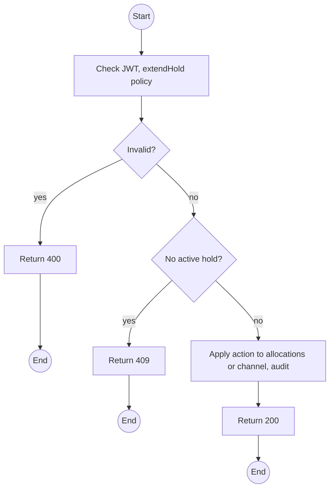
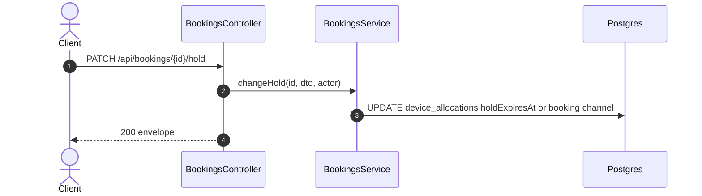

# PATCH /api/bookings/:id/hold: Extend, disable or transfer a hold

> Module `rentals`. Format: `02-templates/04-api-endpoint-template.md`, with Mermaid in place of PlantUML (D-017). Envelope: D-002.

[TOC]

---
## Overview

Staff extend a Customer hold, disable the hold (Staff and Guide bookings, or a Customer booking Staff vouch for), or transfer a Customer booking to a Guide's provisioning when the Customer breaches terms or is delegated (Q59). Every change is audited with its reason.

## API Specification

| API        | URL             |
| ---------- | --------------- |
| PATCH | /api/bookings/:id/hold |
| Permission | Operator |
| Traces | REQ-EVT-09, Q59 |

### Path parameters

| Field | Description | Data Type | Examples |
| --- | --- | --- | --- |
| id | Booking id | uuid | `7f1e2d3c-4b5a-4968-8776-655443322110` |

## Request sample

```json
{
  "action": "EXTEND",
  "minutes": 30,
  "reason": "Customer paying by bank transfer"
}
```

| Field | Description | Data Type | Required | Examples |
| --- | --- | --- | --- | --- |
| action | EXTEND, DISABLE or TRANSFER_TO_GUIDE | enum | yes | `EXTEND` |
| minutes | EXTEND only, 1 to 1440 | int | no | `30` |
| guideId | TRANSFER_TO_GUIDE only, a Guide of the trip | uuid | no | `g-1...` |
| reason | Required | string | yes | `Paying by transfer` |

## Response sample

```json
{
  "result": {
    "bookingId": "7f1e2d3c-4b5a-4968-8776-655443322110",
    "channel": "CUSTOMER",
    "holdDisabled": false,
    "holdExpiresAt": "2026-10-01T02:55:00Z"
  },
  "isSuccess": true,
  "statusCode": 200,
  "message": "Hold updated"
}
```

## Validation

<table>
    <th>Status code</th>
    <th>Description</th>
    <th>Examples</th>
    <tbody>
        <tr>
            <td>400</td>
            <td>Action parameters missing (<code>VALIDATION_FAILED</code>)</td>
<td>

```json
{
  "result": {
    "errorCode": "VALIDATION_FAILED"
  },
  "isSuccess": false,
  "statusCode": 400,
  "message": "minutes is required for EXTEND."
}
```
</td>
        </tr>
        <tr>
            <td>401</td>
            <td>Missing, malformed or expired access token (<code>UNAUTHENTICATED</code>)</td>
<td>

```json
{
  "result": {
    "errorCode": "UNAUTHENTICATED"
  },
  "isSuccess": false,
  "statusCode": 401,
  "message": "Authentication required."
}
```
</td>
        </tr>
        <tr>
            <td>403</td>
            <td>Authenticated, but the caller's role or policy does not allow this action (<code>FORBIDDEN</code>)</td>
<td>

```json
{
  "result": {
    "errorCode": "FORBIDDEN"
  },
  "isSuccess": false,
  "statusCode": 403,
  "message": "You do not have permission to perform this action."
}
```
</td>
        </tr>
        <tr>
            <td>404</td>
            <td>No such booking, or outside the caller's scope (<code>NOT_FOUND</code>)</td>
<td>

```json
{
  "result": {
    "errorCode": "NOT_FOUND"
  },
  "isSuccess": false,
  "statusCode": 404,
  "message": "Booking not found."
}
```
</td>
        </tr>
        <tr>
            <td>409</td>
            <td>No active hold or booking not PENDING (<code>INVALID_STATE_TRANSITION</code>)</td>
<td>

```json
{
  "result": {
    "errorCode": "INVALID_STATE_TRANSITION"
  },
  "isSuccess": false,
  "statusCode": 409,
  "message": "This booking has no active hold."
}
```
</td>
        </tr>
        <tr>
            <td>409</td>
            <td>Hold already expired (<code>HOLD_EXPIRED</code>)</td>
<td>

```json
{
  "result": {
    "errorCode": "HOLD_EXPIRED"
  },
  "isSuccess": false,
  "statusCode": 409,
  "message": "The hold has expired; reserve again."
}
```
</td>
        </tr>
    </tbody>
</table>

## Activity Diagram



## Sequence Diagram


