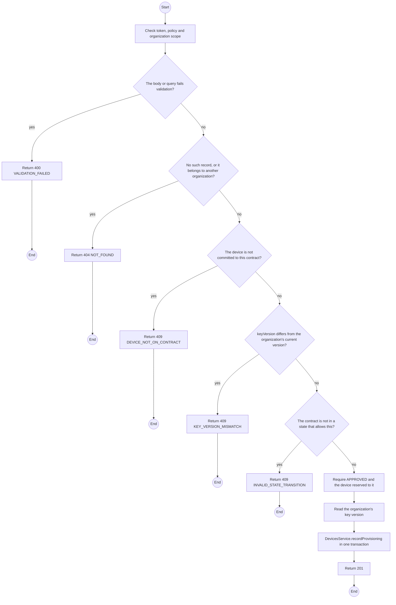
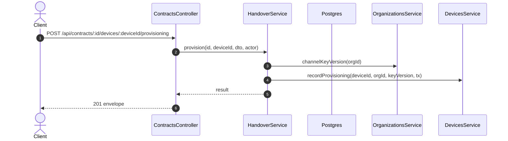

# POST /api/contracts/:id/devices/:deviceId/provisioning: Record provisioning

> Module `rentals`. Generated from `scripts/specs/endpoints/rentals.py` by `scripts/specs/build_api_design.py`; edit the catalog, not this file. Format: `02-templates/04-api-endpoint-template.md` with Mermaid (D-017). Envelope: D-002.

[TOC]

---
## Overview

Records that the organization's channel key, at its current version, was written to a device reserved to this contract, at the counter. Only the version and the organization are stored; the key is never stored, shown, returned or logged (FR-DEV-05, NFR-SEC-06, NFR-IF-03).

## API Specification

| API | URL |
| --- | --- |
| POST | /api/contracts/:id/devices/:deviceId/provisioning |
| Permission | TrekLink Staff |
| Traces | UC-14, FR-DEV-05, BR-09, NFR-IF-03 |

### Path parameters

| Field | Description | Data Type | Examples |
| --- | --- | --- | --- |
| id | Contract id; members may use only their own organization's | uuid | `c0ffee00-1234-4abc-9def-001122334455` |
| deviceId | Device committed to the contract | uuid | `0d3f6a2b-7e11-4c55-8f0a-2b1c9e7d4a10` |

## Request sample

```json
{
  "keyVersion": 1
}
```

| Field | Description | Data Type | Required | Examples |
| --- | --- | --- | --- | --- |
| keyVersion | Must equal the organization's channelKeyVersion | int | yes | `1` |

## Response sample

```json
{
  "result": {
    "deviceId": "0d3f6a2b-7e11-4c55-8f0a-2b1c9e7d4a10",
    "assetTag": "TL-0042",
    "status": "RESERVED",
    "keyVersion": 1,
    "keyOrganizationId": "5b1d2c0e-7f3a-4e21-9c8d-1a2b3c4d5e6f",
    "provisionedAt": "2026-10-20T03:15:00.000Z"
  },
  "isSuccess": true,
  "statusCode": 201,
  "message": "Provisioning recorded"
}
```

## Validation

<table>
    <th>Status code</th>
    <th>Description</th>
    <th>Examples</th>
    <tbody>
        <tr>
            <td>400</td>
            <td>The body or query fails validation (<code>VALIDATION_FAILED</code>)</td>
<td>

```json
{
  "result": {
    "errorCode": "VALIDATION_FAILED"
  },
  "isSuccess": false,
  "statusCode": 400,
  "message": "{field} is required."
}
```
</td>
        </tr>
        <tr>
            <td>401</td>
            <td>Missing, malformed or expired access token or API key (<code>UNAUTHENTICATED</code>)</td>
<td>

```json
{
  "result": {
    "errorCode": "UNAUTHENTICATED"
  },
  "isSuccess": false,
  "statusCode": 401,
  "message": "Authentication required."
}
```
</td>
        </tr>
        <tr>
            <td>403</td>
            <td>The caller's role, policy or organization does not allow this action (<code>FORBIDDEN</code>)</td>
<td>

```json
{
  "result": {
    "errorCode": "FORBIDDEN"
  },
  "isSuccess": false,
  "statusCode": 403,
  "message": "You do not have access to this."
}
```
</td>
        </tr>
        <tr>
            <td>404</td>
            <td>No such record, or it belongs to another organization (<code>NOT_FOUND</code>)</td>
<td>

```json
{
  "result": {
    "errorCode": "NOT_FOUND"
  },
  "isSuccess": false,
  "statusCode": 404,
  "message": "Contract not found."
}
```
</td>
        </tr>
        <tr>
            <td>409</td>
            <td>The device is not committed to this contract (<code>DEVICE_NOT_ON_CONTRACT</code>)</td>
<td>

```json
{
  "result": {
    "errorCode": "DEVICE_NOT_ON_CONTRACT"
  },
  "isSuccess": false,
  "statusCode": 409,
  "message": "TL-0042 does not belong to contract RC-2026-0042."
}
```
</td>
        </tr>
        <tr>
            <td>409</td>
            <td>keyVersion differs from the organization's current version (<code>KEY_VERSION_MISMATCH</code>)</td>
<td>

```json
{
  "result": {
    "errorCode": "KEY_VERSION_MISMATCH"
  },
  "isSuccess": false,
  "statusCode": 409,
  "message": "Provision this device with the organization's key before handover."
}
```
</td>
        </tr>
        <tr>
            <td>409</td>
            <td>The contract is not in a state that allows this (<code>INVALID_STATE_TRANSITION</code>)</td>
<td>

```json
{
  "result": {
    "errorCode": "INVALID_STATE_TRANSITION"
  },
  "isSuccess": false,
  "statusCode": 409,
  "message": "This cannot be done while it is REQUESTED."
}
```
</td>
        </tr>
    </tbody>
</table>

## Activity Diagram



## Sequence Diagram


