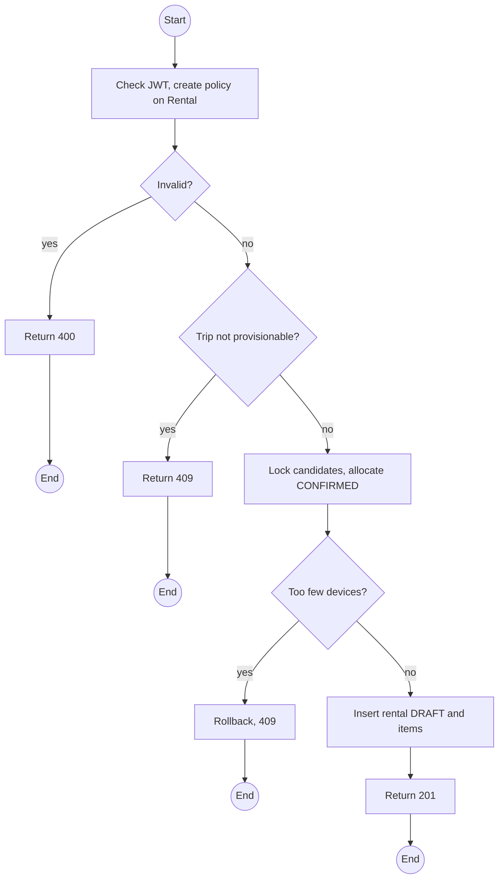
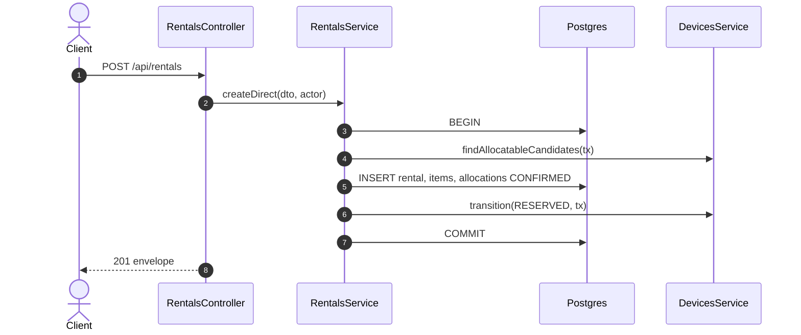

# POST /api/rentals: Create a rental directly

> Module `rentals`. Format: `02-templates/04-api-endpoint-template.md`, with Mermaid in place of PlantUML (D-017). Envelope: D-002.

[TOC]

---
## Overview

Creates a rental with no booking, for Staff or Guide provisioning of a person without an account (Q55). Devices are allocated under the same locking as a reservation, without a hold expiry. Rentals from bookings are created by confirmation (endpoint 05), not here.

## API Specification

| API        | URL             |
| ---------- | --------------- |
| POST | /api/rentals |
| Permission | Operator; Guide (own trips) |
| Traces | Q55, REQ-EVT-10, UC-05 |

## Request sample

```json
{
  "tripId": "a1c3...",
  "renter": {
    "name": "Pham Van D",
    "phoneNumber": "0977000111"
  },
  "custodianGuideId": "g-1...",
  "deviceCount": 3
}
```

| Field | Description | Data Type | Required | Examples |
| --- | --- | --- | --- | --- |
| tripId | Trip in PREPARING, BOOKING_OPEN or READY | uuid | yes | `a1c3...` |
| renter | `{ customerId }` or `{ name, phoneNumber }` | object | yes | n/a |
| custodianGuideId | Guide on the trip | uuid | yes | `g-1...` |
| deviceCount | 1 to `rentals.maxDevicesPerStaffBooking` | int | yes | `3` |
| deviceIds | Operator only: specific devices | uuid[] | no | n/a |

## Response sample

```json
{
  "result": {
    "id": "c9b8a7f6-5e4d-4c3b-2a19-0817f6e5d4c3",
    "code": "RN-2026-000077",
    "bookingId": null,
    "trip": {
      "id": "a1c3...",
      "code": "TRP-2026-1010-TNPD"
    },
    "renterName": "Pham Van D",
    "custodianGuide": {
      "id": "g-1...",
      "fullName": "Tran Minh"
    },
    "status": "DRAFT",
    "dueAt": "2026-10-12T11:00:00Z",
    "items": [
      {
        "id": "e1d2c3b4-a5f6-4789-9a0b-1c2d3e4f5a6b",
        "device": {
          "id": "0d3f...",
          "assetTag": "TL-0042"
        },
        "state": "ALLOCATED",
        "participantId": "tp-1..."
      }
    ],
    "agreement": null
  },
  "isSuccess": true,
  "statusCode": 201,
  "message": "Rental created"
}
```

## Validation

<table>
    <th>Status code</th>
    <th>Description</th>
    <th>Examples</th>
    <tbody>
        <tr>
            <td>400</td>
            <td>Validation (<code>VALIDATION_FAILED</code>)</td>
<td>

```json
{
  "result": {
    "errorCode": "VALIDATION_FAILED"
  },
  "isSuccess": false,
  "statusCode": 400,
  "message": "renter.name or renter.customerId is required."
}
```
</td>
        </tr>
        <tr>
            <td>401</td>
            <td>Missing, malformed or expired access token (<code>UNAUTHENTICATED</code>)</td>
<td>

```json
{
  "result": {
    "errorCode": "UNAUTHENTICATED"
  },
  "isSuccess": false,
  "statusCode": 401,
  "message": "Authentication required."
}
```
</td>
        </tr>
        <tr>
            <td>403</td>
            <td>Authenticated, but the caller's role or policy does not allow this action (<code>FORBIDDEN</code>)</td>
<td>

```json
{
  "result": {
    "errorCode": "FORBIDDEN"
  },
  "isSuccess": false,
  "statusCode": 403,
  "message": "You do not have permission to perform this action."
}
```
</td>
        </tr>
        <tr>
            <td>409</td>
            <td>Not enough devices (<code>DEVICE_NOT_AVAILABLE</code>)</td>
<td>

```json
{
  "result": {
    "errorCode": "DEVICE_NOT_AVAILABLE"
  },
  "isSuccess": false,
  "statusCode": 409,
  "message": "Only 2 devices are free for these dates."
}
```
</td>
        </tr>
        <tr>
            <td>409</td>
            <td>Trip in a state that does not allow provisioning (<code>TRIP_NOT_BOOKABLE</code>)</td>
<td>

```json
{
  "result": {
    "errorCode": "TRIP_NOT_BOOKABLE"
  },
  "isSuccess": false,
  "statusCode": 409,
  "message": "Devices cannot be provisioned for a finished trip."
}
```
</td>
        </tr>
    </tbody>
</table>

## Activity Diagram



## Sequence Diagram


