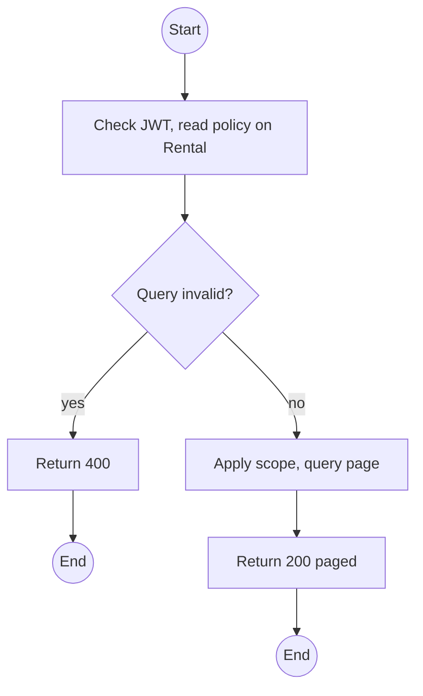
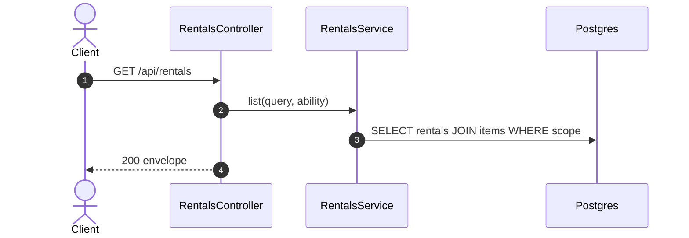

# GET /api/rentals: List rentals

> Module `rentals`. Format: `02-templates/04-api-endpoint-template.md`, with Mermaid in place of PlantUML (D-017). Envelope: D-002.

[TOC]

---
## Overview

Paged rentals with filters used by the check-in desk (`status=CHECKED_OUT,OVERDUE`), the device history view (`deviceId`) and the Customer history page.

## API Specification

| API        | URL             |
| ---------- | --------------- |
| GET | /api/rentals |
| Permission | Operator, Admin; Guide (custody); Customer (own) |
| Traces | US-022 (device history), US-039, MF-05 |

### Query parameters

| Field | Description | Data Type | Required | Examples |
| --- | --- | --- | --- | --- |
| status | Rental statuses | enum[] | no | `CHECKED_OUT,OVERDUE` |
| tripId | Trip | uuid | no | `a1c3...` |
| deviceId | Rentals that included this device | uuid | no | `0d3f...` |
| renterId | Operator only | uuid | no | `5b7e...` |
| pageNumber | 1-based | int | no | `1` |
| pageSize | Default 20 | int | no | `20` |

## Request sample

No request body. Query string example:

```
GET /api/rentals?status=OVERDUE
```

## Response sample

```json
{
  "result": {
    "items": [
      {
        "id": "c9b8a7f6-5e4d-4c3b-2a19-0817f6e5d4c3",
        "code": "RN-2026-000077",
        "bookingId": "7f1e2d3c-4b5a-4968-8776-655443322110",
        "trip": {
          "id": "a1c3...",
          "code": "TRP-2026-1010-TNPD"
        },
        "renterName": "Nguyen Van A",
        "custodianGuide": {
          "id": "g-1...",
          "fullName": "Tran Minh"
        },
        "status": "OVERDUE",
        "dueAt": "2026-10-12T11:00:00Z",
        "items": [
          {
            "id": "e1d2c3b4-a5f6-4789-9a0b-1c2d3e4f5a6b",
            "device": {
              "id": "0d3f...",
              "assetTag": "TL-0042"
            },
            "state": "ALLOCATED",
            "participantId": "tp-1..."
          }
        ],
        "agreement": null,
        "overdueSince": "2026-10-13T11:00:00Z"
      }
    ],
    "pageNumber": 1,
    "pageSize": 20,
    "totalCount": 1,
    "totalPages": 1
  },
  "isSuccess": true,
  "statusCode": 200,
  "message": "Rentals retrieved"
}
```

## Validation

<table>
    <th>Status code</th>
    <th>Description</th>
    <th>Examples</th>
    <tbody>
        <tr>
            <td>400</td>
            <td>Bad filter (<code>VALIDATION_FAILED</code>)</td>
<td>

```json
{
  "result": {
    "errorCode": "VALIDATION_FAILED"
  },
  "isSuccess": false,
  "statusCode": 400,
  "message": "status must be a valid rental status."
}
```
</td>
        </tr>
        <tr>
            <td>401</td>
            <td>Missing, malformed or expired access token (<code>UNAUTHENTICATED</code>)</td>
<td>

```json
{
  "result": {
    "errorCode": "UNAUTHENTICATED"
  },
  "isSuccess": false,
  "statusCode": 401,
  "message": "Authentication required."
}
```
</td>
        </tr>
        <tr>
            <td>403</td>
            <td>Authenticated, but the caller's role or policy does not allow this action (<code>FORBIDDEN</code>)</td>
<td>

```json
{
  "result": {
    "errorCode": "FORBIDDEN"
  },
  "isSuccess": false,
  "statusCode": 403,
  "message": "You do not have permission to perform this action."
}
```
</td>
        </tr>
    </tbody>
</table>

## Activity Diagram



## Sequence Diagram


