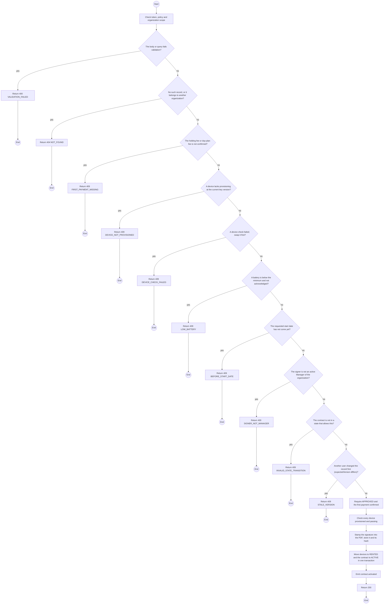
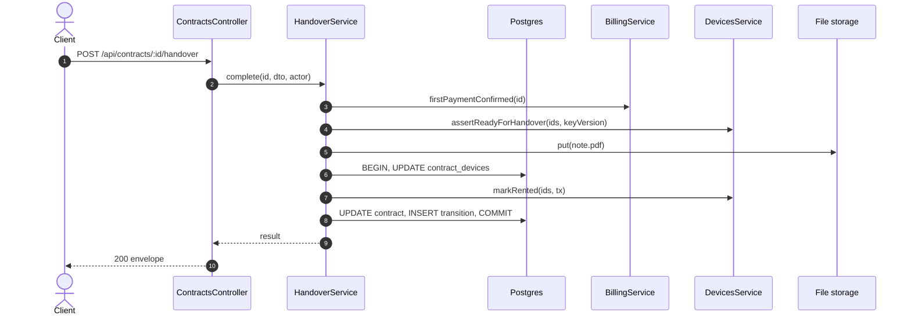

# POST /api/contracts/:id/handover: Complete the handover

> Module `rentals`. Generated from `scripts/specs/endpoints/rentals.py` by `scripts/specs/build_api_design.py`; edit the catalog, not this file. Format: `02-templates/04-api-endpoint-template.md` with Mermaid (D-017). Envelope: D-002.

[TOC]

---
## Overview

Completes the handover at the counter. Requires the first payment confirmed, the Manager's identity checked, every reserved device provisioned with the organization's current key and its handover check passed, and the drawn signature. Stamps the signature into the note, stores the PDF and its SHA-256, then moves the contract to `ACTIVE` and its devices to `RENTED` in one transaction (FR-CON-05, FR-CON-06, BR-09, D-037).

## API Specification

| API | URL |
| --- | --- |
| POST | /api/contracts/:id/handover |
| Permission | TrekLink Staff |
| Traces | UC-20, UC-21, FR-CON-05, FR-CON-06, FR-DEV-01, FR-DEV-05, BR-09, E01-4, MSG06, MSG19, MSG23, MSG24 |

### Path parameters

| Field | Description | Data Type | Examples |
| --- | --- | --- | --- |
| id | Contract id; members may use only their own organization's | uuid | `c0ffee00-1234-4abc-9def-001122334455` |

## Request sample

```json
{
  "signedByMemberId": "3f2e1d0c-9b8a-4c7d-8e6f-5a4b3c2d1e0f",
  "identityChecked": "CCCD ...4821",
  "signaturePng": "iVBORw0KGgo...",
  "deviceChecks": [
    {
      "deviceId": "0d3f6a2b-7e11-4c55-8f0a-2b1c9e7d4a10",
      "batteryPct": 96,
      "gpsFixOk": true
    }
  ],
  "expectedVersion": 2
}
```

| Field | Description | Data Type | Required | Examples |
| --- | --- | --- | --- | --- |
| signedByMemberId | Org Manager signing | uuid | yes | `3f2e1d0c-9b8a-4c7d-8e6f-5a4b3c2d1e0f` |
| identityChecked | Document type and last digits seen | string | yes | `CCCD ...4821` |
| signaturePng | Drawn signature, base64 PNG | string | yes | `iVBORw0KGgo...` |
| deviceChecks | Per device: batteryPct and gpsFixOk at the counter | object[] | yes | see sample |
| acknowledgeLowBattery | Proceed although a battery is below devices.handoverMinBatteryPct | bool | no | `false` |
| expectedVersion | Contract version the caller saw | int | yes | `4` |

## Response sample

```json
{
  "result": {
    "id": "c0ffee00-1234-4abc-9def-001122334455",
    "code": "RC-2026-0042",
    "organization": {
      "id": "5b1d2c0e-7f3a-4e21-9c8d-1a2b3c4d5e6f",
      "code": "ORG-0007",
      "legalName": "ACME Trek Co., Ltd."
    },
    "planType": "MONTHLY",
    "dayPlanDays": null,
    "hardwareVariant": {
      "id": "a1b2c3d4-e5f6-4a7b-8c9d-0e1f2a3b4c5d",
      "code": "treklink-v3"
    },
    "quantity": 10,
    "requestedStartDate": "2026-10-25",
    "monthlyUnitPriceVnd": 450000,
    "dayPremium": null,
    "holdingFeeRatio": 0.5,
    "status": "ACTIVE",
    "statusChangedAt": "2026-10-20T03:15:00.000Z",
    "handedOverAt": "2026-10-20T03:15:00.000Z",
    "currentTerm": {
      "seq": 1,
      "startsAt": "2026-10-25T02:00:00Z",
      "endsAt": "2026-11-25T02:00:00Z"
    },
    "endsAt": null,
    "noticeGivenAt": null,
    "returnDueAt": null,
    "version": 4,
    "handoverNoteSha256": "9f2c...e1",
    "devices": [
      {
        "deviceId": "0d3f6a2b-7e11-4c55-8f0a-2b1c9e7d4a10",
        "assetTag": "TL-0042",
        "handedOverAt": "2026-10-20T03:15:00.000Z",
        "checkedInAt": null,
        "lostAt": null,
        "holder": {
          "name": "Le Thi E",
          "phone": "0912345678",
          "emergencyContact": "Le Van F, 0987654321"
        }
      }
    ]
  },
  "isSuccess": true,
  "statusCode": 200,
  "message": "Handover complete. 10 devices issued under contract RC-2026-0042."
}
```

## Validation

<table>
    <th>Status code</th>
    <th>Description</th>
    <th>Examples</th>
    <tbody>
        <tr>
            <td>400</td>
            <td>The body or query fails validation (<code>VALIDATION_FAILED</code>)</td>
<td>

```json
{
  "result": {
    "errorCode": "VALIDATION_FAILED"
  },
  "isSuccess": false,
  "statusCode": 400,
  "message": "{field} is required."
}
```
</td>
        </tr>
        <tr>
            <td>401</td>
            <td>Missing, malformed or expired access token or API key (<code>UNAUTHENTICATED</code>)</td>
<td>

```json
{
  "result": {
    "errorCode": "UNAUTHENTICATED"
  },
  "isSuccess": false,
  "statusCode": 401,
  "message": "Authentication required."
}
```
</td>
        </tr>
        <tr>
            <td>403</td>
            <td>The caller's role, policy or organization does not allow this action (<code>FORBIDDEN</code>)</td>
<td>

```json
{
  "result": {
    "errorCode": "FORBIDDEN"
  },
  "isSuccess": false,
  "statusCode": 403,
  "message": "You do not have access to this."
}
```
</td>
        </tr>
        <tr>
            <td>404</td>
            <td>No such record, or it belongs to another organization (<code>NOT_FOUND</code>)</td>
<td>

```json
{
  "result": {
    "errorCode": "NOT_FOUND"
  },
  "isSuccess": false,
  "statusCode": 404,
  "message": "Contract not found."
}
```
</td>
        </tr>
        <tr>
            <td>409</td>
            <td>The holding fee or day-plan fee is not confirmed (<code>FIRST_PAYMENT_MISSING</code>)</td>
<td>

```json
{
  "result": {
    "errorCode": "FIRST_PAYMENT_MISSING"
  },
  "isSuccess": false,
  "statusCode": 409,
  "message": "The first payment is not recorded yet."
}
```
</td>
        </tr>
        <tr>
            <td>409</td>
            <td>A device lacks provisioning at the current key version (<code>DEVICE_NOT_PROVISIONED</code>)</td>
<td>

```json
{
  "result": {
    "errorCode": "DEVICE_NOT_PROVISIONED"
  },
  "isSuccess": false,
  "statusCode": 409,
  "message": "Provision this device with the organization's key before handover."
}
```
</td>
        </tr>
        <tr>
            <td>409</td>
            <td>A device check failed; swap it first (<code>DEVICE_CHECK_FAILED</code>)</td>
<td>

```json
{
  "result": {
    "errorCode": "DEVICE_CHECK_FAILED"
  },
  "isSuccess": false,
  "statusCode": 409,
  "message": "This device cannot be allocated while it is MAINTENANCE."
}
```
</td>
        </tr>
        <tr>
            <td>409</td>
            <td>A battery is below the minimum and not acknowledged (<code>LOW_BATTERY</code>)</td>
<td>

```json
{
  "result": {
    "errorCode": "LOW_BATTERY"
  },
  "isSuccess": false,
  "statusCode": 409,
  "message": "Battery 41 %. Charge before use."
}
```
</td>
        </tr>
        <tr>
            <td>409</td>
            <td>The requested start date has not come yet (<code>BEFORE_START_DATE</code>)</td>
<td>

```json
{
  "result": {
    "errorCode": "BEFORE_START_DATE"
  },
  "isSuccess": false,
  "statusCode": 409,
  "message": "Handover is possible from 2026-10-25."
}
```
</td>
        </tr>
        <tr>
            <td>400</td>
            <td>The signer is not an active Manager of the organization (<code>SIGNER_NOT_MANAGER</code>)</td>
<td>

```json
{
  "result": {
    "errorCode": "SIGNER_NOT_MANAGER"
  },
  "isSuccess": false,
  "statusCode": 400,
  "message": "Only a Manager of the organization can sign."
}
```
</td>
        </tr>
        <tr>
            <td>409</td>
            <td>The contract is not in a state that allows this (<code>INVALID_STATE_TRANSITION</code>)</td>
<td>

```json
{
  "result": {
    "errorCode": "INVALID_STATE_TRANSITION"
  },
  "isSuccess": false,
  "statusCode": 409,
  "message": "This cannot be done while it is REQUESTED."
}
```
</td>
        </tr>
        <tr>
            <td>409</td>
            <td>Another user changed the record first (expectedVersion differs) (<code>STALE_VERSION</code>)</td>
<td>

```json
{
  "result": {
    "errorCode": "STALE_VERSION"
  },
  "isSuccess": false,
  "statusCode": 409,
  "message": "This was changed by someone else. Reload and try again."
}
```
</td>
        </tr>
    </tbody>
</table>

## Activity Diagram



## Sequence Diagram


