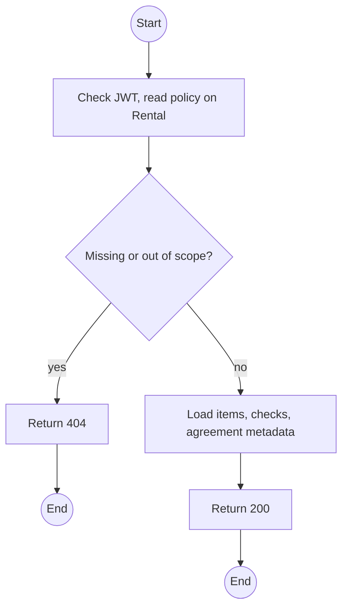
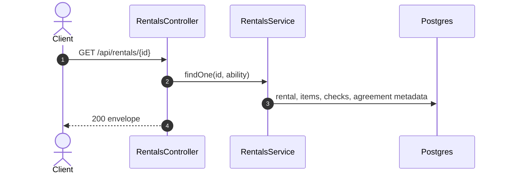

# GET /api/rentals/:id: Rental detail

> Module `rentals`. Format: `02-templates/04-api-endpoint-template.md`, with Mermaid in place of PlantUML (D-017). Envelope: D-002.

[TOC]

---
## Overview

One rental with items (device, state, handover checks, check-in, inspection), agreement versions (metadata, not bytes), settlement invoice summary from `billing`, and status history.

## API Specification

| API        | URL             |
| ---------- | --------------- |
| GET | /api/rentals/:id |
| Permission | Operator, Admin; Guide (custody); Customer (own) |
| Traces | MF-01, MF-05, US-039 |

### Path parameters

| Field | Description | Data Type | Examples |
| --- | --- | --- | --- |
| id | Rental id | uuid | `c9b8a7f6-5e4d-4c3b-2a19-0817f6e5d4c3` |

## Request sample

No request body.

## Response sample

```json
{
  "result": {
    "id": "c9b8a7f6-5e4d-4c3b-2a19-0817f6e5d4c3",
    "code": "RN-2026-000077",
    "bookingId": "7f1e2d3c-4b5a-4968-8776-655443322110",
    "trip": {
      "id": "a1c3...",
      "code": "TRP-2026-1010-TNPD"
    },
    "renterName": "Nguyen Van A",
    "custodianGuide": {
      "id": "g-1...",
      "fullName": "Tran Minh"
    },
    "status": "CHECKED_OUT",
    "dueAt": "2026-10-12T11:00:00Z",
    "items": [
      {
        "id": "e1d2c3b4-a5f6-4789-9a0b-1c2d3e4f5a6b",
        "device": {
          "id": "0d3f...",
          "assetTag": "TL-0042"
        },
        "state": "ALLOCATED",
        "participantId": "tp-1..."
      }
    ],
    "agreement": {
      "version": 1,
      "status": "SIGNED",
      "signedAt": "2026-10-09T23:35:00Z",
      "signedSha256": "9f86d0..."
    },
    "checkedOutAt": "2026-10-09T23:40:00Z",
    "settlement": null,
    "history": []
  },
  "isSuccess": true,
  "statusCode": 200,
  "message": "Rental retrieved"
}
```

## Validation

<table>
    <th>Status code</th>
    <th>Description</th>
    <th>Examples</th>
    <tbody>
        <tr>
            <td>401</td>
            <td>Missing, malformed or expired access token (<code>UNAUTHENTICATED</code>)</td>
<td>

```json
{
  "result": {
    "errorCode": "UNAUTHENTICATED"
  },
  "isSuccess": false,
  "statusCode": 401,
  "message": "Authentication required."
}
```
</td>
        </tr>
        <tr>
            <td>403</td>
            <td>Authenticated, but the caller's role or policy does not allow this action (<code>FORBIDDEN</code>)</td>
<td>

```json
{
  "result": {
    "errorCode": "FORBIDDEN"
  },
  "isSuccess": false,
  "statusCode": 403,
  "message": "You do not have permission to perform this action."
}
```
</td>
        </tr>
        <tr>
            <td>404</td>
            <td>No such rental, or outside the caller's scope (<code>NOT_FOUND</code>)</td>
<td>

```json
{
  "result": {
    "errorCode": "NOT_FOUND"
  },
  "isSuccess": false,
  "statusCode": 404,
  "message": "Rental not found."
}
```
</td>
        </tr>
    </tbody>
</table>

## Activity Diagram



## Sequence Diagram


