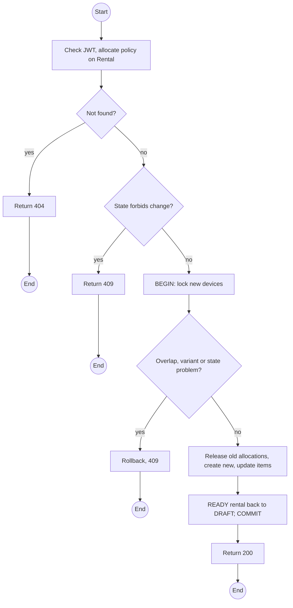
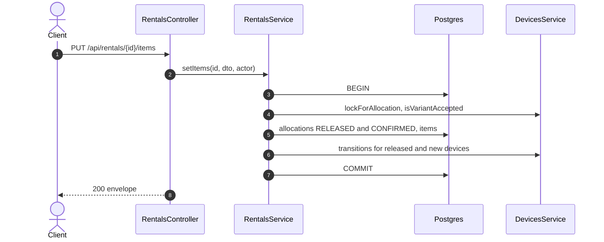

# PUT /api/rentals/:id/items: Allocate or replace devices on a rental

> Module `rentals`. Format: `02-templates/04-api-endpoint-template.md`, with Mermaid in place of PlantUML (D-017). Envelope: D-002.

[TOC]

---
## Overview

Sets the specific device of each item, or replaces a rejected one. The old allocation is released and a `CONFIRMED` allocation is created for the new device over the same window, under lock. Replacing an item on a `READY` rental sends it back to `DRAFT` because the signed agreement no longer lists the right devices.

## API Specification

| API        | URL             |
| ---------- | --------------- |
| PUT | /api/rentals/:id/items |
| Permission | Operator |
| Traces | UC-05, FR-RENT-01 (new), US-028, E01-3, REQ-EVT-11, Q50 |

### Path parameters

| Field | Description | Data Type | Examples |
| --- | --- | --- | --- |
| id | Rental id | uuid | `c9b8a7f6-5e4d-4c3b-2a19-0817f6e5d4c3` |

## Request sample

```json
{
  "items": [
    {
      "itemId": "e1d2c3b4-a5f6-4789-9a0b-1c2d3e4f5a6b",
      "deviceId": "1a2b...",
      "participantId": "tp-1..."
    }
  ]
}
```

| Field | Description | Data Type | Required | Examples |
| --- | --- | --- | --- | --- |
| items | Items to change | object[] | yes | n/a |
| items[].itemId | Existing item | uuid | yes | `e1d2c3b4-a5f6-4789-9a0b-1c2d3e4f5a6b` |
| items[].deviceId | New device | uuid | yes | `1a2b...` |
| items[].participantId | Traveller carrying it | uuid | no | `tp-1...` |

## Response sample

```json
{
  "result": {
    "id": "c9b8a7f6-5e4d-4c3b-2a19-0817f6e5d4c3",
    "code": "RN-2026-000077",
    "bookingId": "7f1e2d3c-4b5a-4968-8776-655443322110",
    "trip": {
      "id": "a1c3...",
      "code": "TRP-2026-1010-TNPD"
    },
    "renterName": "Nguyen Van A",
    "custodianGuide": {
      "id": "g-1...",
      "fullName": "Tran Minh"
    },
    "status": "DRAFT",
    "dueAt": "2026-10-12T11:00:00Z",
    "items": [
      {
        "id": "e7f8...",
        "device": {
          "id": "1a2b...",
          "assetTag": "TL-0051"
        },
        "state": "ALLOCATED",
        "replaces": "e1d2c3b4-a5f6-4789-9a0b-1c2d3e4f5a6b"
      }
    ],
    "agreement": null
  },
  "isSuccess": true,
  "statusCode": 200,
  "message": "Rental items updated"
}
```

## Validation

<table>
    <th>Status code</th>
    <th>Description</th>
    <th>Examples</th>
    <tbody>
        <tr>
            <td>401</td>
            <td>Missing, malformed or expired access token (<code>UNAUTHENTICATED</code>)</td>
<td>

```json
{
  "result": {
    "errorCode": "UNAUTHENTICATED"
  },
  "isSuccess": false,
  "statusCode": 401,
  "message": "Authentication required."
}
```
</td>
        </tr>
        <tr>
            <td>403</td>
            <td>Authenticated, but the caller's role or policy does not allow this action (<code>FORBIDDEN</code>)</td>
<td>

```json
{
  "result": {
    "errorCode": "FORBIDDEN"
  },
  "isSuccess": false,
  "statusCode": 403,
  "message": "You do not have permission to perform this action."
}
```
</td>
        </tr>
        <tr>
            <td>404</td>
            <td>No such rental, or outside the caller's scope (<code>NOT_FOUND</code>)</td>
<td>

```json
{
  "result": {
    "errorCode": "NOT_FOUND"
  },
  "isSuccess": false,
  "statusCode": 404,
  "message": "Rental not found."
}
```
</td>
        </tr>
        <tr>
            <td>409</td>
            <td>Rental checked out or later, without a rejected item (<code>INVALID_STATE_TRANSITION</code>)</td>
<td>

```json
{
  "result": {
    "errorCode": "INVALID_STATE_TRANSITION"
  },
  "isSuccess": false,
  "statusCode": 409,
  "message": "Items can only change before check-out or to replace a rejected device."
}
```
</td>
        </tr>
        <tr>
            <td>409</td>
            <td>Device overlaps another allocation (<code>ALLOCATION_CONFLICT</code>)</td>
<td>

```json
{
  "result": {
    "errorCode": "ALLOCATION_CONFLICT"
  },
  "isSuccess": false,
  "statusCode": 409,
  "message": "TL-0051 is allocated to RN-2026-000080 for overlapping dates."
}
```
</td>
        </tr>
        <tr>
            <td>409</td>
            <td>Variant not accepted (<code>VARIANT_NOT_ACCEPTED</code>)</td>
<td>

```json
{
  "result": {
    "errorCode": "VARIANT_NOT_ACCEPTED"
  },
  "isSuccess": false,
  "statusCode": 409,
  "message": "treklink-v1 devices are not accepted on this trip."
}
```
</td>
        </tr>
        <tr>
            <td>409</td>
            <td>Device in maintenance or retired (<code>DEVICE_NOT_ALLOCATABLE</code>)</td>
<td>

```json
{
  "result": {
    "errorCode": "DEVICE_NOT_ALLOCATABLE"
  },
  "isSuccess": false,
  "statusCode": 409,
  "message": "TL-0051 is in maintenance."
}
```
</td>
        </tr>
    </tbody>
</table>

## Activity Diagram



## Sequence Diagram


