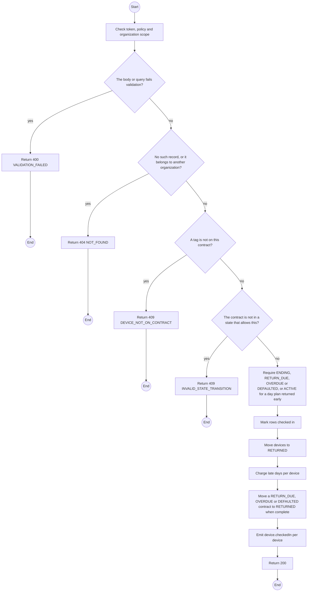
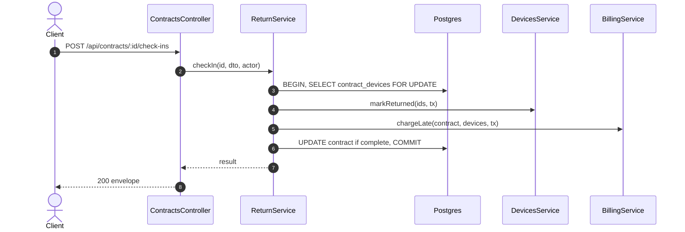

# POST /api/contracts/:id/check-ins: Check devices in

> Module `rentals`. Generated from `scripts/specs/endpoints/rentals.py` by `scripts/specs/build_api_design.py`; edit the catalog, not this file. Format: `02-templates/04-api-endpoint-template.md` with Mermaid (D-017). Envelope: D-002.

[TOC]

---
## Overview

Checks returned devices in at the counter by asset tag. Each moves to `RETURNED`, its live data stops reaching the organization (FR-MON-08), and late days are charged when it comes back after the end plus the grace (FR-BILL-03). When every device is back or recorded lost a `RETURN_DUE`, `OVERDUE` or `DEFAULTED` contract moves to `RETURNED`; an early return during `ACTIVE` (day plan) or `ENDING` waits for the end-of-plan job (D-035). A partial check-in is allowed (MSG07).

## API Specification

| API | URL |
| --- | --- |
| POST | /api/contracts/:id/check-ins |
| Permission | TrekLink Staff |
| Traces | UC-43, FR-DEV-01, FR-MON-08, FR-BILL-03, E05-1, MSG07, MSG12 |

### Path parameters

| Field | Description | Data Type | Examples |
| --- | --- | --- | --- |
| id | Contract id; members may use only their own organization's | uuid | `c0ffee00-1234-4abc-9def-001122334455` |

## Request sample

```json
{
  "assetTags": [
    "TL-0042",
    "TL-0043"
  ]
}
```

| Field | Description | Data Type | Required | Examples |
| --- | --- | --- | --- | --- |
| assetTags | Scanned tags | string[] | yes | `["TL-0042"]` |

## Response sample

```json
{
  "result": {
    "checkedIn": [
      "TL-0042",
      "TL-0043"
    ],
    "returned": 10,
    "total": 10,
    "contractStatus": "RETURNED",
    "lateFeeVnd": 0
  },
  "isSuccess": true,
  "statusCode": 200,
  "message": "Check-in complete. 10 of 10 devices returned."
}
```

## Validation

<table>
    <th>Status code</th>
    <th>Description</th>
    <th>Examples</th>
    <tbody>
        <tr>
            <td>400</td>
            <td>The body or query fails validation (<code>VALIDATION_FAILED</code>)</td>
<td>

```json
{
  "result": {
    "errorCode": "VALIDATION_FAILED"
  },
  "isSuccess": false,
  "statusCode": 400,
  "message": "{field} is required."
}
```
</td>
        </tr>
        <tr>
            <td>401</td>
            <td>Missing, malformed or expired access token or API key (<code>UNAUTHENTICATED</code>)</td>
<td>

```json
{
  "result": {
    "errorCode": "UNAUTHENTICATED"
  },
  "isSuccess": false,
  "statusCode": 401,
  "message": "Authentication required."
}
```
</td>
        </tr>
        <tr>
            <td>403</td>
            <td>The caller's role, policy or organization does not allow this action (<code>FORBIDDEN</code>)</td>
<td>

```json
{
  "result": {
    "errorCode": "FORBIDDEN"
  },
  "isSuccess": false,
  "statusCode": 403,
  "message": "You do not have access to this."
}
```
</td>
        </tr>
        <tr>
            <td>404</td>
            <td>No such record, or it belongs to another organization (<code>NOT_FOUND</code>)</td>
<td>

```json
{
  "result": {
    "errorCode": "NOT_FOUND"
  },
  "isSuccess": false,
  "statusCode": 404,
  "message": "Contract not found."
}
```
</td>
        </tr>
        <tr>
            <td>409</td>
            <td>A tag is not on this contract (<code>DEVICE_NOT_ON_CONTRACT</code>)</td>
<td>

```json
{
  "result": {
    "errorCode": "DEVICE_NOT_ON_CONTRACT"
  },
  "isSuccess": false,
  "statusCode": 409,
  "message": "TL-0099 does not belong to contract RC-2026-0042."
}
```
</td>
        </tr>
        <tr>
            <td>409</td>
            <td>The contract is not in a state that allows this (<code>INVALID_STATE_TRANSITION</code>)</td>
<td>

```json
{
  "result": {
    "errorCode": "INVALID_STATE_TRANSITION"
  },
  "isSuccess": false,
  "statusCode": 409,
  "message": "This cannot be done while it is APPROVED."
}
```
</td>
        </tr>
    </tbody>
</table>

## Activity Diagram



## Sequence Diagram


