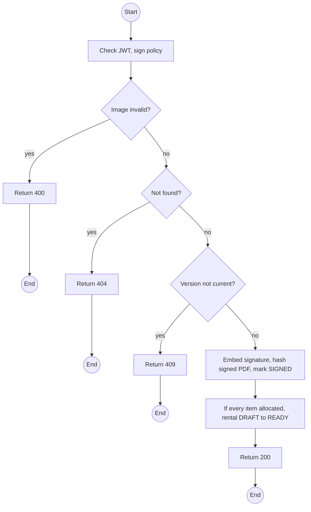
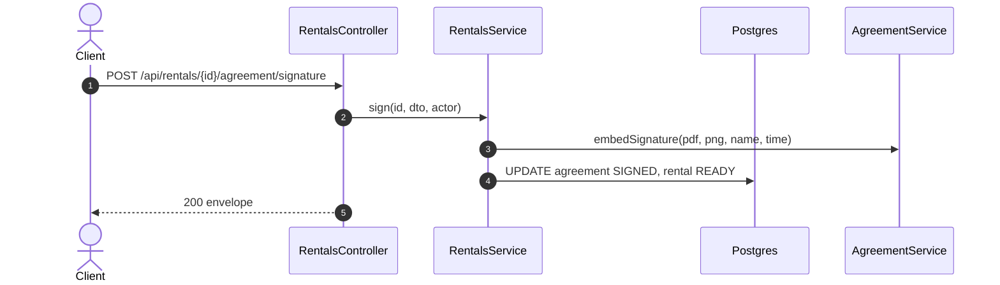

# POST /api/rentals/:id/agreement/signature: Sign the rental agreement

> Module `rentals`. Format: `02-templates/04-api-endpoint-template.md`, with Mermaid in place of PlantUML (D-017). Envelope: D-002.

[TOC]

---
## Overview

Embeds a draw-on-web signature (PNG) with signer name and UTC time into a new signed PDF of the current version, stores it with its SHA-256, and moves the rental `DRAFT` to `READY`. No certificate authority is involved (Q62).

## API Specification

| API        | URL             |
| ---------- | --------------- |
| POST | /api/rentals/:id/agreement/signature |
| Permission | Operator (hosting an in-person signature); Customer (own rental) |
| Traces | UC-07, FR-RENT-02, REQ-EVT-13, Q62 |

### Path parameters

| Field | Description | Data Type | Examples |
| --- | --- | --- | --- |
| id | Rental id | uuid | `c9b8a7f6-5e4d-4c3b-2a19-0817f6e5d4c3` |

## Request sample

```json
{
  "version": 2,
  "signerName": "Nguyen Van A",
  "signaturePng": "data:image/png;base64,iVBORw0KGgo..."
}
```

| Field | Description | Data Type | Required | Examples |
| --- | --- | --- | --- | --- |
| version | The GENERATED version being signed | int | yes | `2` |
| signerName | As written by the signer | string | yes | `Nguyen Van A` |
| signaturePng | PNG data URL, at most 200 KB | string | yes | `data:image/png;base64,...` |

## Response sample

```json
{
  "result": {
    "rentalId": "c9b8a7f6-5e4d-4c3b-2a19-0817f6e5d4c3",
    "version": 2,
    "status": "SIGNED",
    "signedSha256": "9f86d0...",
    "signedAt": "2026-10-09T23:35:00Z",
    "rentalStatus": "READY"
  },
  "isSuccess": true,
  "statusCode": 200,
  "message": "Agreement signed"
}
```

## Validation

<table>
    <th>Status code</th>
    <th>Description</th>
    <th>Examples</th>
    <tbody>
        <tr>
            <td>400</td>
            <td>Not a PNG, too large, or empty (<code>VALIDATION_FAILED</code>)</td>
<td>

```json
{
  "result": {
    "errorCode": "VALIDATION_FAILED"
  },
  "isSuccess": false,
  "statusCode": 400,
  "message": "signaturePng must be a PNG data URL under 200 KB."
}
```
</td>
        </tr>
        <tr>
            <td>401</td>
            <td>Missing, malformed or expired access token (<code>UNAUTHENTICATED</code>)</td>
<td>

```json
{
  "result": {
    "errorCode": "UNAUTHENTICATED"
  },
  "isSuccess": false,
  "statusCode": 401,
  "message": "Authentication required."
}
```
</td>
        </tr>
        <tr>
            <td>403</td>
            <td>Authenticated, but the caller's role or policy does not allow this action (<code>FORBIDDEN</code>)</td>
<td>

```json
{
  "result": {
    "errorCode": "FORBIDDEN"
  },
  "isSuccess": false,
  "statusCode": 403,
  "message": "You do not have permission to perform this action."
}
```
</td>
        </tr>
        <tr>
            <td>404</td>
            <td>No such rental, or outside the caller's scope (<code>NOT_FOUND</code>)</td>
<td>

```json
{
  "result": {
    "errorCode": "NOT_FOUND"
  },
  "isSuccess": false,
  "statusCode": 404,
  "message": "Rental not found."
}
```
</td>
        </tr>
        <tr>
            <td>409</td>
            <td>Version not the current GENERATED one (<code>INVALID_STATE_TRANSITION</code>)</td>
<td>

```json
{
  "result": {
    "errorCode": "INVALID_STATE_TRANSITION"
  },
  "isSuccess": false,
  "statusCode": 409,
  "message": "Version 1 has been superseded. Sign version 2."
}
```
</td>
        </tr>
    </tbody>
</table>

## Activity Diagram



## Sequence Diagram


