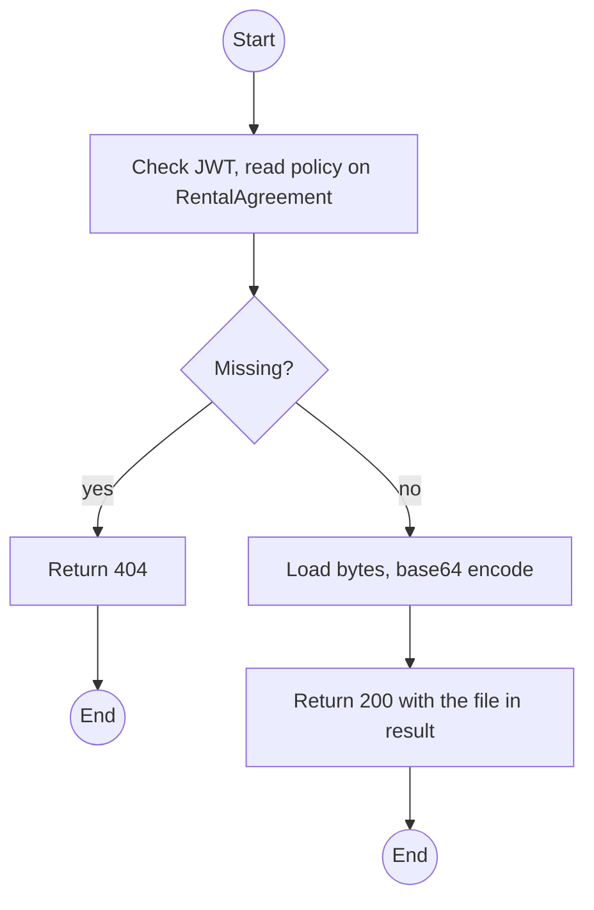
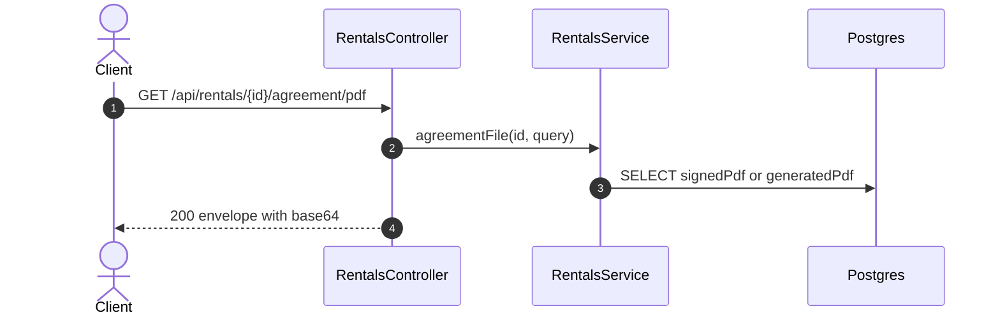

# GET /api/rentals/:id/agreement/pdf: Download the agreement PDF

> Module `rentals`. Format: `02-templates/04-api-endpoint-template.md`, with Mermaid in place of PlantUML (D-017). Envelope: D-002.

[TOC]

---
## Overview

Returns the latest signed PDF, or the latest generated one if unsigned, **inside the D-002 envelope** as base64 with its SHA-256, so the envelope rule holds without an exception for binary responses. The frontend decodes and offers it as a download. See C-002 for the alternative (a raw `application/pdf` response as the single documented exception).

## API Specification

| API        | URL             |
| ---------- | --------------- |
| GET | /api/rentals/:id/agreement/pdf |
| Permission | Operator, Admin; Customer (own) |
| Traces | UC-07, Q62, D-002 |

### Path parameters

| Field | Description | Data Type | Examples |
| --- | --- | --- | --- |
| id | Rental id | uuid | `c9b8a7f6-5e4d-4c3b-2a19-0817f6e5d4c3` |

### Query parameters

| Field | Description | Data Type | Required | Examples |
| --- | --- | --- | --- | --- |
| version | Specific version; default latest | int | no | `2` |
| variant | `signed` or `generated`; default signed if present | string | no | `signed` |

## Request sample

No request body. Query string example:

```
GET /api/rentals/{id}/agreement/pdf?variant=signed
```

## Response sample

```json
{
  "result": {
    "fileName": "RN-2026-000077-v2-signed.pdf",
    "contentType": "application/pdf",
    "sha256": "9f86d0...",
    "base64": "JVBERi0xLjcK..."
  },
  "isSuccess": true,
  "statusCode": 200,
  "message": "Agreement retrieved"
}
```

## Validation

<table>
    <th>Status code</th>
    <th>Description</th>
    <th>Examples</th>
    <tbody>
        <tr>
            <td>401</td>
            <td>Missing, malformed or expired access token (<code>UNAUTHENTICATED</code>)</td>
<td>

```json
{
  "result": {
    "errorCode": "UNAUTHENTICATED"
  },
  "isSuccess": false,
  "statusCode": 401,
  "message": "Authentication required."
}
```
</td>
        </tr>
        <tr>
            <td>403</td>
            <td>Authenticated, but the caller's role or policy does not allow this action (<code>FORBIDDEN</code>)</td>
<td>

```json
{
  "result": {
    "errorCode": "FORBIDDEN"
  },
  "isSuccess": false,
  "statusCode": 403,
  "message": "You do not have permission to perform this action."
}
```
</td>
        </tr>
        <tr>
            <td>404</td>
            <td>No such rental, or outside the caller's scope (<code>NOT_FOUND</code>)</td>
<td>

```json
{
  "result": {
    "errorCode": "NOT_FOUND"
  },
  "isSuccess": false,
  "statusCode": 404,
  "message": "Rental not found."
}
```
</td>
        </tr>
        <tr>
            <td>404</td>
            <td>No agreement generated yet (<code>NOT_FOUND</code>)</td>
<td>

```json
{
  "result": {
    "errorCode": "NOT_FOUND"
  },
  "isSuccess": false,
  "statusCode": 404,
  "message": "No agreement has been generated for this rental."
}
```
</td>
        </tr>
    </tbody>
</table>

## Activity Diagram



## Sequence Diagram


