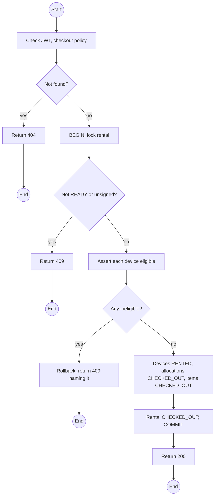
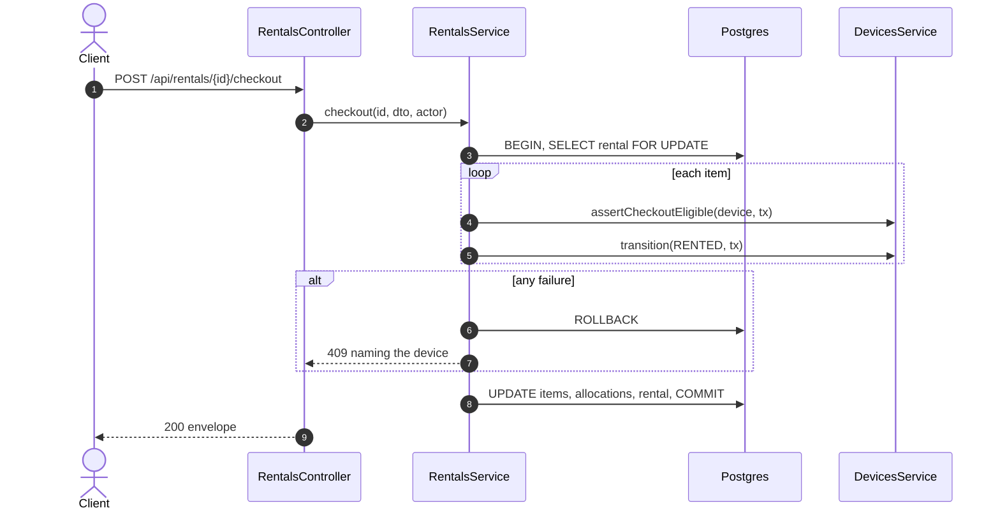

# POST /api/rentals/:id/checkout: Check devices out

> Module `rentals`. Format: `02-templates/04-api-endpoint-template.md`, with Mermaid in place of PlantUML (D-017). Envelope: D-002.

[TOC]

---
## Overview

Hands every device of a `READY` rental to the custodian Guide. For each item `devices` asserts eligibility (state `RESERVED`, PSK version current) and moves the unit to `RENTED`. All items or none: one ineligible device blocks the whole check-out and is named. The Guide then runs the handover check per device.

## API Specification

| API        | URL             |
| ---------- | --------------- |
| POST | /api/rentals/:id/checkout |
| Permission | Operator |
| Traces | UC-08, FR-RENT-03 (new), FR-DEV-05, US-032, REQ-EVT-14, REQ-STA-03, REQ-ERR-06, D-021 |

### Path parameters

| Field | Description | Data Type | Examples |
| --- | --- | --- | --- |
| id | Rental id | uuid | `c9b8a7f6-5e4d-4c3b-2a19-0817f6e5d4c3` |

## Request sample

```json
{
  "expectedItemCount": 3,
  "note": "Handed to Tran Minh at the office"
}
```

| Field | Description | Data Type | Required | Examples |
| --- | --- | --- | --- | --- |
| expectedItemCount | Items the Operator is handing over; must match | int | yes | `3` |
| note | Optional | string | no | `Handed at office` |

## Response sample

```json
{
  "result": {
    "id": "c9b8a7f6-5e4d-4c3b-2a19-0817f6e5d4c3",
    "code": "RN-2026-000077",
    "bookingId": "7f1e2d3c-4b5a-4968-8776-655443322110",
    "trip": {
      "id": "a1c3...",
      "code": "TRP-2026-1010-TNPD"
    },
    "renterName": "Nguyen Van A",
    "custodianGuide": {
      "id": "g-1...",
      "fullName": "Tran Minh"
    },
    "status": "CHECKED_OUT",
    "dueAt": "2026-10-12T11:00:00Z",
    "items": [
      {
        "id": "e1d2c3b4-a5f6-4789-9a0b-1c2d3e4f5a6b",
        "device": {
          "assetTag": "TL-0042"
        },
        "state": "CHECKED_OUT"
      }
    ],
    "agreement": null,
    "checkedOutAt": "2026-10-09T23:40:00Z"
  },
  "isSuccess": true,
  "statusCode": 200,
  "message": "Devices checked out"
}
```

## Validation

<table>
    <th>Status code</th>
    <th>Description</th>
    <th>Examples</th>
    <tbody>
        <tr>
            <td>400</td>
            <td>Item count mismatch (<code>VALIDATION_FAILED</code>)</td>
<td>

```json
{
  "result": {
    "errorCode": "VALIDATION_FAILED"
  },
  "isSuccess": false,
  "statusCode": 400,
  "message": "expectedItemCount 2 does not match the 3 items on this rental."
}
```
</td>
        </tr>
        <tr>
            <td>401</td>
            <td>Missing, malformed or expired access token (<code>UNAUTHENTICATED</code>)</td>
<td>

```json
{
  "result": {
    "errorCode": "UNAUTHENTICATED"
  },
  "isSuccess": false,
  "statusCode": 401,
  "message": "Authentication required."
}
```
</td>
        </tr>
        <tr>
            <td>403</td>
            <td>Authenticated, but the caller's role or policy does not allow this action (<code>FORBIDDEN</code>)</td>
<td>

```json
{
  "result": {
    "errorCode": "FORBIDDEN"
  },
  "isSuccess": false,
  "statusCode": 403,
  "message": "You do not have permission to perform this action."
}
```
</td>
        </tr>
        <tr>
            <td>404</td>
            <td>No such rental, or outside the caller's scope (<code>NOT_FOUND</code>)</td>
<td>

```json
{
  "result": {
    "errorCode": "NOT_FOUND"
  },
  "isSuccess": false,
  "statusCode": 404,
  "message": "Rental not found."
}
```
</td>
        </tr>
        <tr>
            <td>409</td>
            <td>Rental not READY (<code>INVALID_STATE_TRANSITION</code>)</td>
<td>

```json
{
  "result": {
    "errorCode": "INVALID_STATE_TRANSITION"
  },
  "isSuccess": false,
  "statusCode": 409,
  "message": "Only a ready rental can be checked out."
}
```
</td>
        </tr>
        <tr>
            <td>409</td>
            <td>Agreement not signed (<code>AGREEMENT_NOT_SIGNED</code>)</td>
<td>

```json
{
  "result": {
    "errorCode": "AGREEMENT_NOT_SIGNED"
  },
  "isSuccess": false,
  "statusCode": 409,
  "message": "The rental agreement must be signed before check-out."
}
```
</td>
        </tr>
        <tr>
            <td>409</td>
            <td>A device has an old PSK version (<code>PSK_NOT_CURRENT</code>)</td>
<td>

```json
{
  "result": {
    "errorCode": "PSK_NOT_CURRENT"
  },
  "isSuccess": false,
  "statusCode": 409,
  "message": "TL-0042 carries PSK version 1; version 2 is required."
}
```
</td>
        </tr>
        <tr>
            <td>409</td>
            <td>A device is not RESERVED (<code>DEVICE_NOT_RESERVED</code>)</td>
<td>

```json
{
  "result": {
    "errorCode": "DEVICE_NOT_RESERVED"
  },
  "isSuccess": false,
  "statusCode": 409,
  "message": "TL-0051 is in MAINTENANCE."
}
```
</td>
        </tr>
        <tr>
            <td>409</td>
            <td>Trip not in BOOKING_OPEN or READY (<code>TRIP_NOT_BOOKABLE</code>)</td>
<td>

```json
{
  "result": {
    "errorCode": "TRIP_NOT_BOOKABLE"
  },
  "isSuccess": false,
  "statusCode": 409,
  "message": "Devices cannot be checked out for a cancelled trip."
}
```
</td>
        </tr>
    </tbody>
</table>

## Activity Diagram



## Sequence Diagram


