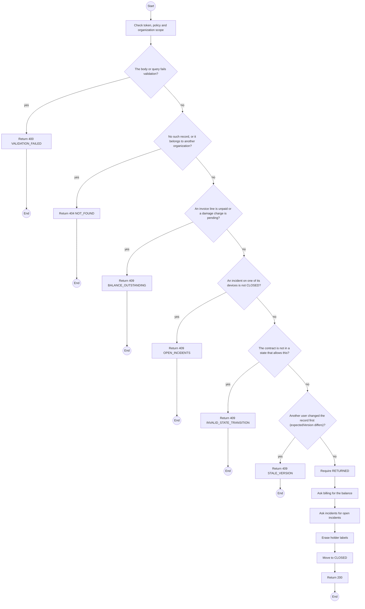
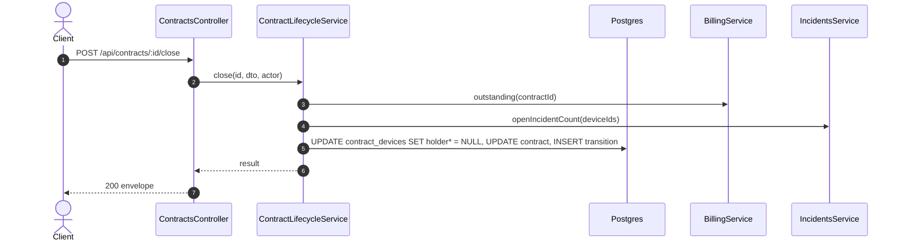

# POST /api/contracts/:id/close: Close a contract

> Module `rentals`. Generated from `scripts/specs/endpoints/rentals.py` by `scripts/specs/build_api_design.py`; edit the catalog, not this file. Format: `02-templates/04-api-endpoint-template.md` with Mermaid (D-017). Envelope: D-002.

[TOC]

---
## Overview

Closes a `RETURNED` contract when every device is `RETURNED` or `LOST`, nothing is owed, no damage charge awaits approval, and no incident on its devices is outside `CLOSED`. Holder labels are erased (FR-CON-13, FR-CON-14, BR-27, E05-7).

## API Specification

| API | URL |
| --- | --- |
| POST | /api/contracts/:id/close |
| Permission | TrekLink Staff, TrekLink Admin |
| Traces | UC-51, FR-CON-13, FR-CON-14, BR-27, BR-33, E05-4, E05-7, MSG29 |

### Path parameters

| Field | Description | Data Type | Examples |
| --- | --- | --- | --- |
| id | Contract id; members may use only their own organization's | uuid | `c0ffee00-1234-4abc-9def-001122334455` |

## Request sample

```json
{
  "expectedVersion": 9
}
```

| Field | Description | Data Type | Required | Examples |
| --- | --- | --- | --- | --- |
| expectedVersion | Contract version the caller saw | int | yes | `4` |

## Response sample

```json
{
  "result": {
    "id": "c0ffee00-1234-4abc-9def-001122334455",
    "code": "RC-2026-0042",
    "organization": {
      "id": "5b1d2c0e-7f3a-4e21-9c8d-1a2b3c4d5e6f",
      "code": "ORG-0007",
      "legalName": "ACME Trek Co., Ltd."
    },
    "planType": "MONTHLY",
    "dayPlanDays": null,
    "hardwareVariant": {
      "id": "a1b2c3d4-e5f6-4a7b-8c9d-0e1f2a3b4c5d",
      "code": "treklink-v3"
    },
    "quantity": 10,
    "requestedStartDate": "2026-10-25",
    "monthlyUnitPriceVnd": 450000,
    "dayPremium": null,
    "holdingFeeRatio": 0.5,
    "status": "CLOSED",
    "statusChangedAt": "2026-10-20T03:15:00.000Z",
    "handedOverAt": "2026-10-20T03:15:00.000Z",
    "currentTerm": {
      "seq": 1,
      "startsAt": "2026-10-25T02:00:00Z",
      "endsAt": "2026-11-25T02:00:00Z"
    },
    "endsAt": null,
    "noticeGivenAt": null,
    "returnDueAt": null,
    "version": 4,
    "closedAt": "2026-10-20T03:15:00.000Z"
  },
  "isSuccess": true,
  "statusCode": 200,
  "message": "Contract closed"
}
```

## Validation

<table>
    <th>Status code</th>
    <th>Description</th>
    <th>Examples</th>
    <tbody>
        <tr>
            <td>400</td>
            <td>The body or query fails validation (<code>VALIDATION_FAILED</code>)</td>
<td>

```json
{
  "result": {
    "errorCode": "VALIDATION_FAILED"
  },
  "isSuccess": false,
  "statusCode": 400,
  "message": "{field} is required."
}
```
</td>
        </tr>
        <tr>
            <td>401</td>
            <td>Missing, malformed or expired access token or API key (<code>UNAUTHENTICATED</code>)</td>
<td>

```json
{
  "result": {
    "errorCode": "UNAUTHENTICATED"
  },
  "isSuccess": false,
  "statusCode": 401,
  "message": "Authentication required."
}
```
</td>
        </tr>
        <tr>
            <td>403</td>
            <td>The caller's role, policy or organization does not allow this action (<code>FORBIDDEN</code>)</td>
<td>

```json
{
  "result": {
    "errorCode": "FORBIDDEN"
  },
  "isSuccess": false,
  "statusCode": 403,
  "message": "You do not have access to this."
}
```
</td>
        </tr>
        <tr>
            <td>404</td>
            <td>No such record, or it belongs to another organization (<code>NOT_FOUND</code>)</td>
<td>

```json
{
  "result": {
    "errorCode": "NOT_FOUND"
  },
  "isSuccess": false,
  "statusCode": 404,
  "message": "Contract not found."
}
```
</td>
        </tr>
        <tr>
            <td>409</td>
            <td>An invoice line is unpaid or a damage charge is pending (<code>BALANCE_OUTSTANDING</code>)</td>
<td>

```json
{
  "result": {
    "errorCode": "BALANCE_OUTSTANDING"
  },
  "isSuccess": false,
  "statusCode": 409,
  "message": "This cannot be done while it has open balances."
}
```
</td>
        </tr>
        <tr>
            <td>409</td>
            <td>An incident on one of its devices is not CLOSED (<code>OPEN_INCIDENTS</code>)</td>
<td>

```json
{
  "result": {
    "errorCode": "OPEN_INCIDENTS"
  },
  "isSuccess": false,
  "statusCode": 409,
  "message": "This cannot be done while it has open incidents."
}
```
</td>
        </tr>
        <tr>
            <td>409</td>
            <td>The contract is not in a state that allows this (<code>INVALID_STATE_TRANSITION</code>)</td>
<td>

```json
{
  "result": {
    "errorCode": "INVALID_STATE_TRANSITION"
  },
  "isSuccess": false,
  "statusCode": 409,
  "message": "This cannot be done while it is OVERDUE."
}
```
</td>
        </tr>
        <tr>
            <td>409</td>
            <td>Another user changed the record first (expectedVersion differs) (<code>STALE_VERSION</code>)</td>
<td>

```json
{
  "result": {
    "errorCode": "STALE_VERSION"
  },
  "isSuccess": false,
  "statusCode": 409,
  "message": "This was changed by someone else. Reload and try again."
}
```
</td>
        </tr>
    </tbody>
</table>

## Activity Diagram



## Sequence Diagram


