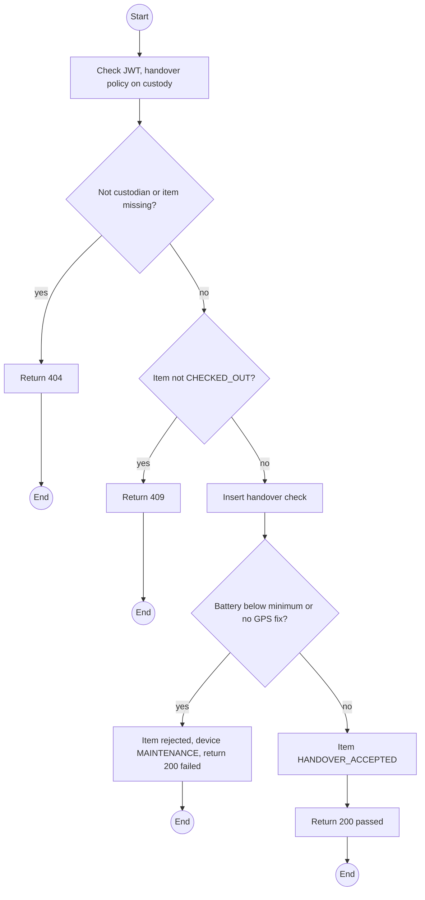
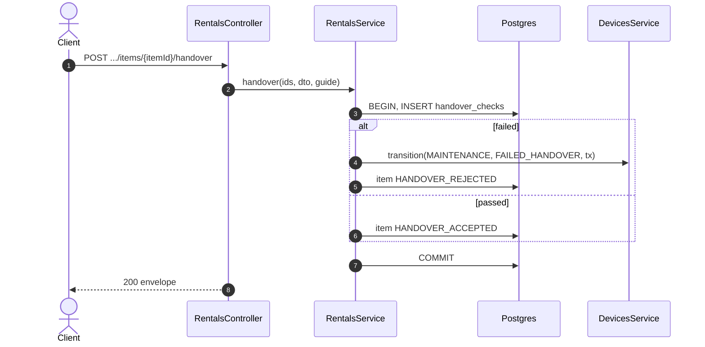

# POST /api/rentals/:id/items/:itemId/handover: Guide handover check

> Module `rentals`. Format: `02-templates/04-api-endpoint-template.md`, with Mermaid in place of PlantUML (D-017). Envelope: D-002.

[TOC]

---
## Overview

The Guide checks one device by hand: battery percentage read from the device, GPS fix, and the channel shown in the Meshtastic app. The check passes only if battery ≥ `devices.minHandoverBatteryPct` and GPS has a fix. A failure moves the device to `MAINTENANCE`, marks the item for replacement, and leaves the booking untouched (E01-3). Telemetry is shown for reference and never decides (Q52).

## API Specification

| API        | URL             |
| ---------- | --------------- |
| POST | /api/rentals/:id/items/:itemId/handover |
| Permission | Custodian Guide of the rental |
| Traces | UC-38 (new), FR-RENT-04 (new), US-033, BR-04, E01-3, REQ-EVT-15, REQ-ERR-09, Q52 |

### Path parameters

| Field | Description | Data Type | Examples |
| --- | --- | --- | --- |
| id | Rental id | uuid | `c9b8a7f6-5e4d-4c3b-2a19-0817f6e5d4c3` |
| itemId | Item id | uuid | `e1d2c3b4-a5f6-4789-9a0b-1c2d3e4f5a6b` |

## Request sample

```json
{
  "batteryPct": 35,
  "gpsFix": false,
  "pskVerified": true,
  "note": "No fix after 5 minutes in open sky"
}
```

| Field | Description | Data Type | Required | Examples |
| --- | --- | --- | --- | --- |
| batteryPct | 0 to 100, read by a person | int | yes | `35` |
| gpsFix | Fix obtained | bool | yes | `false` |
| pskVerified | Channel name matches in the app | bool | yes | `true` |
| note | Required on failure | string | no | `No fix` |

## Response sample

```json
{
  "result": {
    "itemId": "e1d2c3b4-a5f6-4789-9a0b-1c2d3e4f5a6b",
    "passed": false,
    "itemState": "HANDOVER_REJECTED",
    "deviceStatus": "MAINTENANCE",
    "replacementRequired": true,
    "telemetryBatteryPct": 41
  },
  "isSuccess": true,
  "statusCode": 200,
  "message": "Handover check recorded"
}
```

## Validation

<table>
    <th>Status code</th>
    <th>Description</th>
    <th>Examples</th>
    <tbody>
        <tr>
            <td>400</td>
            <td>Out of range or note missing on failure (<code>VALIDATION_FAILED</code>)</td>
<td>

```json
{
  "result": {
    "errorCode": "VALIDATION_FAILED"
  },
  "isSuccess": false,
  "statusCode": 400,
  "message": "note is required when the check fails."
}
```
</td>
        </tr>
        <tr>
            <td>401</td>
            <td>Missing, malformed or expired access token (<code>UNAUTHENTICATED</code>)</td>
<td>

```json
{
  "result": {
    "errorCode": "UNAUTHENTICATED"
  },
  "isSuccess": false,
  "statusCode": 401,
  "message": "Authentication required."
}
```
</td>
        </tr>
        <tr>
            <td>403</td>
            <td>Caller is not the custodian Guide (<code>FORBIDDEN</code>)</td>
<td>

```json
{
  "result": {
    "errorCode": "FORBIDDEN"
  },
  "isSuccess": false,
  "statusCode": 403,
  "message": "You do not have permission to perform this action."
}
```
</td>
        </tr>
        <tr>
            <td>404</td>
            <td>No such rental or item (<code>NOT_FOUND</code>)</td>
<td>

```json
{
  "result": {
    "errorCode": "NOT_FOUND"
  },
  "isSuccess": false,
  "statusCode": 404,
  "message": "Rental item not found."
}
```
</td>
        </tr>
        <tr>
            <td>409</td>
            <td>Item not CHECKED_OUT (<code>INVALID_STATE_TRANSITION</code>)</td>
<td>

```json
{
  "result": {
    "errorCode": "INVALID_STATE_TRANSITION"
  },
  "isSuccess": false,
  "statusCode": 409,
  "message": "This device has already been checked."
}
```
</td>
        </tr>
    </tbody>
</table>

## Activity Diagram



## Sequence Diagram


