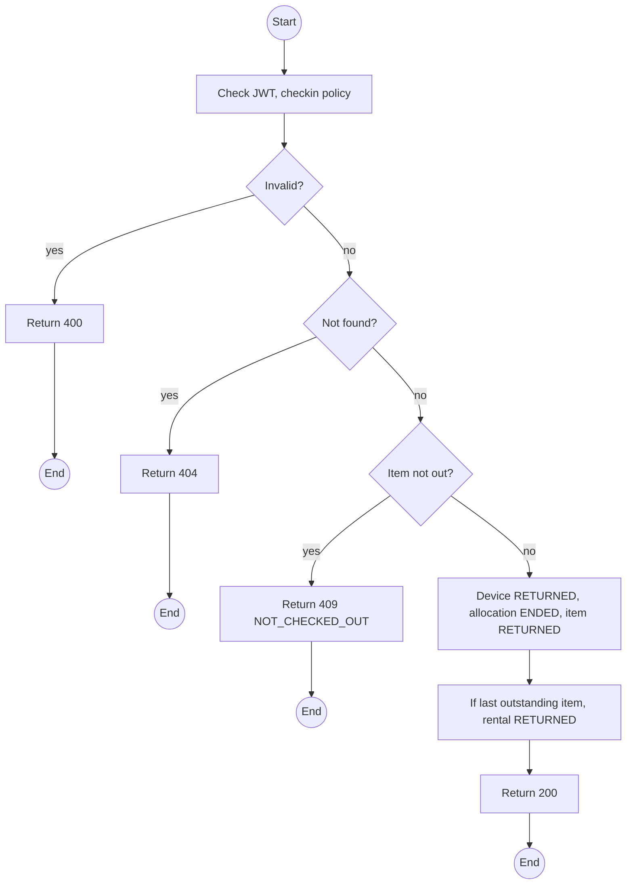
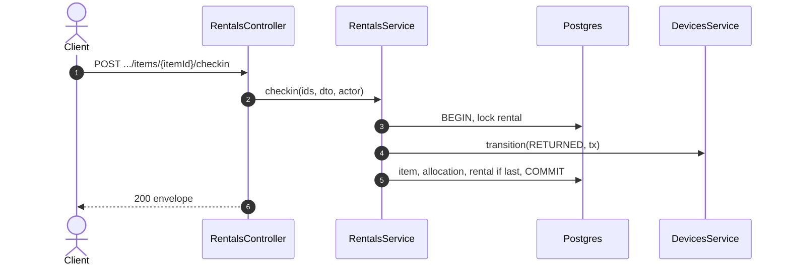

# POST /api/rentals/:id/items/:itemId/checkin: Check a device in

> Module `rentals`. Format: `02-templates/04-api-endpoint-template.md`, with Mermaid in place of PlantUML (D-017). Envelope: D-002.

[TOC]

---
## Overview

Records the return of one device, handed back by the Guide (Q71). The device goes to `RETURNED`, the allocation ends, and when the last item is back or lost the rental moves to `RETURNED`. Lateness is recorded as `returnedAt` against `dueAt`; the fee is computed at settlement by `billing`.

## API Specification

| API        | URL             |
| ---------- | --------------- |
| POST | /api/rentals/:id/items/:itemId/checkin |
| Permission | Operator |
| Traces | UC-09, FR-RENT-05 (new), US-034, E05-1, REQ-EVT-18, REQ-ERR-10, Q71 |

### Path parameters

| Field | Description | Data Type | Examples |
| --- | --- | --- | --- |
| id | Rental id | uuid | `c9b8a7f6-5e4d-4c3b-2a19-0817f6e5d4c3` |
| itemId | Item id | uuid | `e1d2c3b4-a5f6-4789-9a0b-1c2d3e4f5a6b` |

## Request sample

```json
{
  "returnedAt": "2026-10-12T12:30:00Z",
  "note": "Returned by Tran Minh"
}
```

| Field | Description | Data Type | Required | Examples |
| --- | --- | --- | --- | --- |
| returnedAt | Defaults to now; may be earlier when entered after the fact, never in the future | datetime | no | `2026-10-12T12:30:00Z` |
| note | Optional | string | no | `Returned by Guide` |

## Response sample

```json
{
  "result": {
    "itemId": "e1d2c3b4-a5f6-4789-9a0b-1c2d3e4f5a6b",
    "itemState": "RETURNED",
    "deviceStatus": "RETURNED",
    "lateByMinutes": 90,
    "rentalStatus": "RETURNED",
    "inspectionRequired": true
  },
  "isSuccess": true,
  "statusCode": 200,
  "message": "Device checked in"
}
```

## Validation

<table>
    <th>Status code</th>
    <th>Description</th>
    <th>Examples</th>
    <tbody>
        <tr>
            <td>400</td>
            <td>`returnedAt` in the future or before check-out (<code>VALIDATION_FAILED</code>)</td>
<td>

```json
{
  "result": {
    "errorCode": "VALIDATION_FAILED"
  },
  "isSuccess": false,
  "statusCode": 400,
  "message": "returnedAt cannot be in the future."
}
```
</td>
        </tr>
        <tr>
            <td>401</td>
            <td>Missing, malformed or expired access token (<code>UNAUTHENTICATED</code>)</td>
<td>

```json
{
  "result": {
    "errorCode": "UNAUTHENTICATED"
  },
  "isSuccess": false,
  "statusCode": 401,
  "message": "Authentication required."
}
```
</td>
        </tr>
        <tr>
            <td>403</td>
            <td>Authenticated, but the caller's role or policy does not allow this action (<code>FORBIDDEN</code>)</td>
<td>

```json
{
  "result": {
    "errorCode": "FORBIDDEN"
  },
  "isSuccess": false,
  "statusCode": 403,
  "message": "You do not have permission to perform this action."
}
```
</td>
        </tr>
        <tr>
            <td>404</td>
            <td>No such rental or item (<code>NOT_FOUND</code>)</td>
<td>

```json
{
  "result": {
    "errorCode": "NOT_FOUND"
  },
  "isSuccess": false,
  "statusCode": 404,
  "message": "Rental item not found."
}
```
</td>
        </tr>
        <tr>
            <td>409</td>
            <td>Item not out (<code>NOT_CHECKED_OUT</code>)</td>
<td>

```json
{
  "result": {
    "errorCode": "NOT_CHECKED_OUT"
  },
  "isSuccess": false,
  "statusCode": 409,
  "message": "This device is not checked out on this rental."
}
```
</td>
        </tr>
    </tbody>
</table>

## Activity Diagram



## Sequence Diagram


