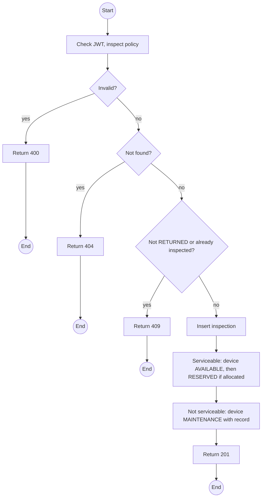
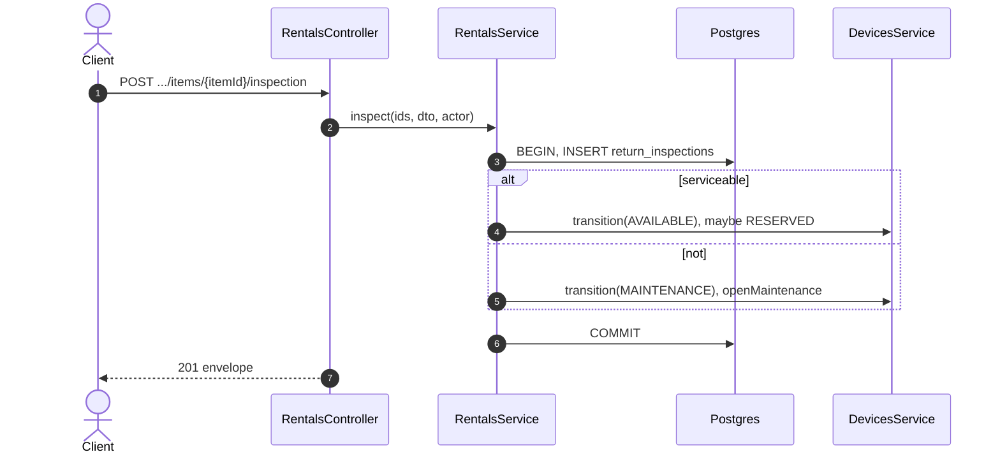

# POST /api/rentals/:id/items/:itemId/inspection: Record a return inspection

> Module `rentals`. Format: `02-templates/04-api-endpoint-template.md`, with Mermaid in place of PlantUML (D-017). Envelope: D-002.

[TOC]

---
## Overview

One inspection per returned item: condition, accessories, battery, damage notes, evidence references. Serviceable units go back to `AVAILABLE` (then `RESERVED` if allocated ahead); others go to `MAINTENANCE` with a record. Condition is independent of incident history (E05-6). The damage fee is not computed here; `billing` reads the condition at settlement.

## API Specification

| API        | URL             |
| ---------- | --------------- |
| POST | /api/rentals/:id/items/:itemId/inspection |
| Permission | Operator |
| Traces | UC-10, FR-RENT-06 (new), E05-2, E05-6, REQ-EVT-19, MF-05 steps 2 and 6 |

### Path parameters

| Field | Description | Data Type | Examples |
| --- | --- | --- | --- |
| id | Rental id | uuid | `c9b8a7f6-5e4d-4c3b-2a19-0817f6e5d4c3` |
| itemId | Item id | uuid | `e1d2c3b4-a5f6-4789-9a0b-1c2d3e4f5a6b` |

## Request sample

```json
{
  "condition": "MAJOR_DAMAGE",
  "accessoriesComplete": true,
  "batteryPct": 22,
  "damageNotes": "Housing cracked near the antenna mount",
  "evidenceRefs": [
    "file-8a1f..."
  ],
  "serviceable": false
}
```

| Field | Description | Data Type | Required | Examples |
| --- | --- | --- | --- | --- |
| condition | GOOD, MINOR_DAMAGE, MAJOR_DAMAGE, MISSING_ACCESSORIES | enum | yes | `MAJOR_DAMAGE` |
| accessoriesComplete | Lanyard, cable, case | bool | yes | `true` |
| batteryPct | 0 to 100 | int | no | `22` |
| damageNotes | Required unless GOOD | string | no | `Housing cracked` |
| evidenceRefs | Uploaded photo references (storage per C-003) | string[] | no | `file-8a1f...` |
| serviceable | Can go back into service now | bool | yes | `false` |

## Response sample

```json
{
  "result": {
    "inspectionId": "ri-5...",
    "itemId": "e1d2c3b4-a5f6-4789-9a0b-1c2d3e4f5a6b",
    "condition": "MAJOR_DAMAGE",
    "serviceable": false,
    "deviceStatus": "MAINTENANCE",
    "maintenanceRecordId": "mr-21..."
  },
  "isSuccess": true,
  "statusCode": 201,
  "message": "Inspection recorded"
}
```

## Validation

<table>
    <th>Status code</th>
    <th>Description</th>
    <th>Examples</th>
    <tbody>
        <tr>
            <td>400</td>
            <td>Notes missing for a non-GOOD condition, or GOOD marked unserviceable without notes (<code>VALIDATION_FAILED</code>)</td>
<td>

```json
{
  "result": {
    "errorCode": "VALIDATION_FAILED"
  },
  "isSuccess": false,
  "statusCode": 400,
  "message": "damageNotes is required unless the condition is GOOD."
}
```
</td>
        </tr>
        <tr>
            <td>401</td>
            <td>Missing, malformed or expired access token (<code>UNAUTHENTICATED</code>)</td>
<td>

```json
{
  "result": {
    "errorCode": "UNAUTHENTICATED"
  },
  "isSuccess": false,
  "statusCode": 401,
  "message": "Authentication required."
}
```
</td>
        </tr>
        <tr>
            <td>403</td>
            <td>Authenticated, but the caller's role or policy does not allow this action (<code>FORBIDDEN</code>)</td>
<td>

```json
{
  "result": {
    "errorCode": "FORBIDDEN"
  },
  "isSuccess": false,
  "statusCode": 403,
  "message": "You do not have permission to perform this action."
}
```
</td>
        </tr>
        <tr>
            <td>404</td>
            <td>No such rental or item (<code>NOT_FOUND</code>)</td>
<td>

```json
{
  "result": {
    "errorCode": "NOT_FOUND"
  },
  "isSuccess": false,
  "statusCode": 404,
  "message": "Rental item not found."
}
```
</td>
        </tr>
        <tr>
            <td>409</td>
            <td>Item not RETURNED (<code>INVALID_STATE_TRANSITION</code>)</td>
<td>

```json
{
  "result": {
    "errorCode": "INVALID_STATE_TRANSITION"
  },
  "isSuccess": false,
  "statusCode": 409,
  "message": "Check the device in before inspecting it."
}
```
</td>
        </tr>
        <tr>
            <td>409</td>
            <td>Already inspected (<code>INSPECTION_EXISTS</code>)</td>
<td>

```json
{
  "result": {
    "errorCode": "INSPECTION_EXISTS"
  },
  "isSuccess": false,
  "statusCode": 409,
  "message": "This device has already been inspected for this rental."
}
```
</td>
        </tr>
    </tbody>
</table>

## Activity Diagram



## Sequence Diagram


