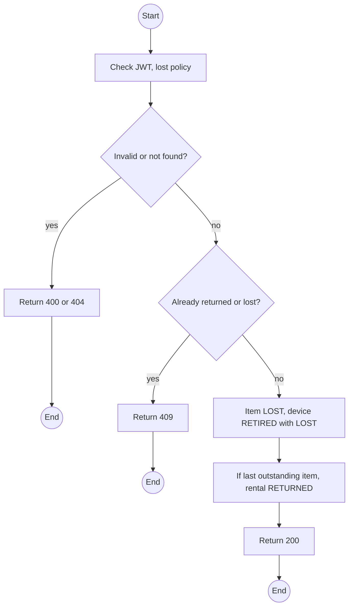
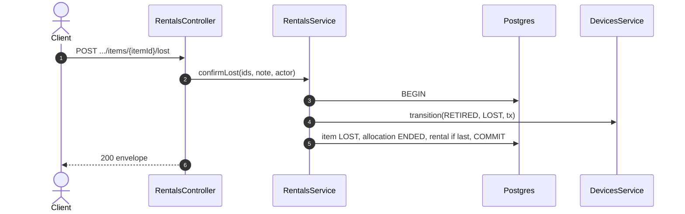

# POST /api/rentals/:id/items/:itemId/lost: Confirm a device lost

> Module `rentals`. Format: `02-templates/04-api-endpoint-template.md`, with Mermaid in place of PlantUML (D-017). Envelope: D-002.

[TOC]

---
## Overview

Confirms an unreturned device lost. The item becomes `LOST`, the device is retired with reason `LOST`, and the item counts as closed for the rental's completeness. Allowed on items `MISSING_REPORTED` or `LOSS_SUSPECTED`, or any checked-out item with a note. The loss fee is added by `billing` at settlement.

## API Specification

| API        | URL             |
| ---------- | --------------- |
| POST | /api/rentals/:id/items/:itemId/lost |
| Permission | Operator |
| Traces | UC-33, FR-DEV-09, BR-22, E05-3, REQ-EVT-20, REQ-STA-02 |

### Path parameters

| Field | Description | Data Type | Examples |
| --- | --- | --- | --- |
| id | Rental id | uuid | `c9b8a7f6-5e4d-4c3b-2a19-0817f6e5d4c3` |
| itemId | Item id | uuid | `e1d2c3b4-a5f6-4789-9a0b-1c2d3e4f5a6b` |

## Request sample

```json
{
  "note": "Guide reported it fell into the Ta Nang river on day 2; search unsuccessful"
}
```

| Field | Description | Data Type | Required | Examples |
| --- | --- | --- | --- | --- |
| note | Required | string | yes | `Fell into the river` |

## Response sample

```json
{
  "result": {
    "itemId": "e1d2c3b4-a5f6-4789-9a0b-1c2d3e4f5a6b",
    "itemState": "LOST",
    "deviceStatus": "RETIRED",
    "retireReason": "LOST",
    "rentalStatus": "RETURNED"
  },
  "isSuccess": true,
  "statusCode": 200,
  "message": "Device recorded as lost"
}
```

## Validation

<table>
    <th>Status code</th>
    <th>Description</th>
    <th>Examples</th>
    <tbody>
        <tr>
            <td>400</td>
            <td>Note missing (<code>VALIDATION_FAILED</code>)</td>
<td>

```json
{
  "result": {
    "errorCode": "VALIDATION_FAILED"
  },
  "isSuccess": false,
  "statusCode": 400,
  "message": "note is required."
}
```
</td>
        </tr>
        <tr>
            <td>401</td>
            <td>Missing, malformed or expired access token (<code>UNAUTHENTICATED</code>)</td>
<td>

```json
{
  "result": {
    "errorCode": "UNAUTHENTICATED"
  },
  "isSuccess": false,
  "statusCode": 401,
  "message": "Authentication required."
}
```
</td>
        </tr>
        <tr>
            <td>403</td>
            <td>Authenticated, but the caller's role or policy does not allow this action (<code>FORBIDDEN</code>)</td>
<td>

```json
{
  "result": {
    "errorCode": "FORBIDDEN"
  },
  "isSuccess": false,
  "statusCode": 403,
  "message": "You do not have permission to perform this action."
}
```
</td>
        </tr>
        <tr>
            <td>404</td>
            <td>No such rental or item (<code>NOT_FOUND</code>)</td>
<td>

```json
{
  "result": {
    "errorCode": "NOT_FOUND"
  },
  "isSuccess": false,
  "statusCode": 404,
  "message": "Rental item not found."
}
```
</td>
        </tr>
        <tr>
            <td>409</td>
            <td>Item already returned or lost (<code>INVALID_STATE_TRANSITION</code>)</td>
<td>

```json
{
  "result": {
    "errorCode": "INVALID_STATE_TRANSITION"
  },
  "isSuccess": false,
  "statusCode": 409,
  "message": "This device has already been returned."
}
```
</td>
        </tr>
    </tbody>
</table>

## Activity Diagram



## Sequence Diagram


