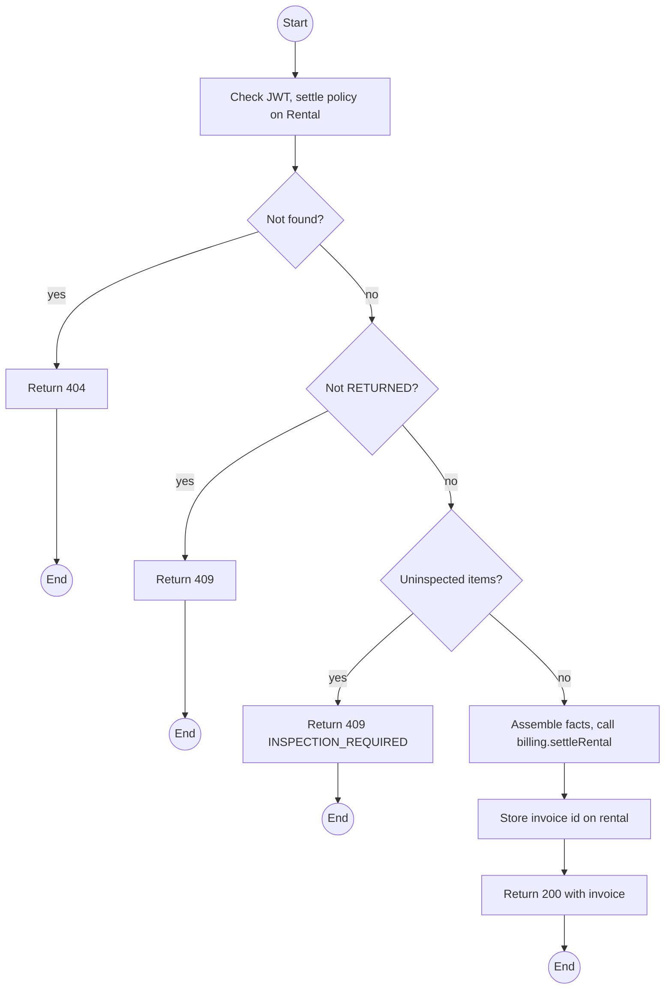
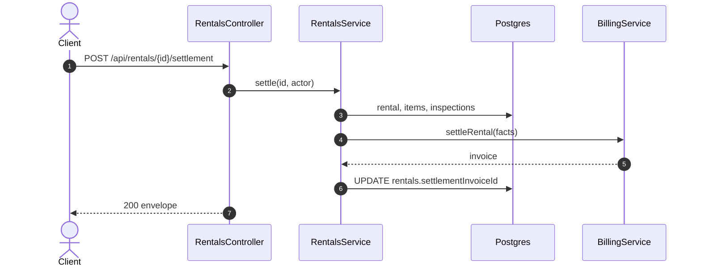

# POST /api/rentals/:id/settlement: Settle a returned rental

> Module `rentals`. Format: `02-templates/04-api-endpoint-template.md`, with Mermaid in place of PlantUML (D-017). Envelope: D-002.

[TOC]

---
## Overview

Sends the settlement facts of a `RETURNED` rental to `billing`, which issues an itemised invoice (base fee if not prepaid, late fee, damage fees, loss fees, deposit applied, refund or balance). Requires every returned item to be inspected. Idempotent: calling it again returns the existing invoice unless facts changed.

## API Specification

| API        | URL             |
| ---------- | --------------- |
| POST | /api/rentals/:id/settlement |
| Permission | Operator |
| Traces | UC-11, UC-24, UC-25, BR-17, E05-1, E05-2, E05-5, REQ-EVT-21, MF-05 step 3 |

### Path parameters

| Field | Description | Data Type | Examples |
| --- | --- | --- | --- |
| id | Rental id | uuid | `c9b8a7f6-5e4d-4c3b-2a19-0817f6e5d4c3` |

## Request sample

No request body.

## Response sample

```json
{
  "result": {
    "rentalId": "c9b8a7f6-5e4d-4c3b-2a19-0817f6e5d4c3",
    "invoice": {
      "id": "inv-40...",
      "number": "INV-2026-000140",
      "status": "ISSUED",
      "lines": [
        {
          "type": "LATE_FEE",
          "description": "Late return, 1 day after 2 h grace",
          "amount": 50000
        },
        {
          "type": "DAMAGE_FEE",
          "description": "TL-0042 MAJOR_DAMAGE",
          "amount": 700000
        },
        {
          "type": "DEPOSIT_APPLIED",
          "amount": -300000
        }
      ],
      "total": 450000,
      "balanceDue": 450000,
      "refundDue": 0
    }
  },
  "isSuccess": true,
  "statusCode": 200,
  "message": "Settlement invoice issued"
}
```

## Validation

<table>
    <th>Status code</th>
    <th>Description</th>
    <th>Examples</th>
    <tbody>
        <tr>
            <td>401</td>
            <td>Missing, malformed or expired access token (<code>UNAUTHENTICATED</code>)</td>
<td>

```json
{
  "result": {
    "errorCode": "UNAUTHENTICATED"
  },
  "isSuccess": false,
  "statusCode": 401,
  "message": "Authentication required."
}
```
</td>
        </tr>
        <tr>
            <td>403</td>
            <td>Authenticated, but the caller's role or policy does not allow this action (<code>FORBIDDEN</code>)</td>
<td>

```json
{
  "result": {
    "errorCode": "FORBIDDEN"
  },
  "isSuccess": false,
  "statusCode": 403,
  "message": "You do not have permission to perform this action."
}
```
</td>
        </tr>
        <tr>
            <td>404</td>
            <td>No such rental, or outside the caller's scope (<code>NOT_FOUND</code>)</td>
<td>

```json
{
  "result": {
    "errorCode": "NOT_FOUND"
  },
  "isSuccess": false,
  "statusCode": 404,
  "message": "Rental not found."
}
```
</td>
        </tr>
        <tr>
            <td>409</td>
            <td>Rental not RETURNED (<code>INVALID_STATE_TRANSITION</code>)</td>
<td>

```json
{
  "result": {
    "errorCode": "INVALID_STATE_TRANSITION"
  },
  "isSuccess": false,
  "statusCode": 409,
  "message": "Only a returned rental can be settled."
}
```
</td>
        </tr>
        <tr>
            <td>409</td>
            <td>A returned item lacks an inspection (<code>INSPECTION_REQUIRED</code>)</td>
<td>

```json
{
  "result": {
    "errorCode": "INSPECTION_REQUIRED"
  },
  "isSuccess": false,
  "statusCode": 409,
  "message": "Inspect TL-0042 before settlement."
}
```
</td>
        </tr>
    </tbody>
</table>

## Activity Diagram



## Sequence Diagram


