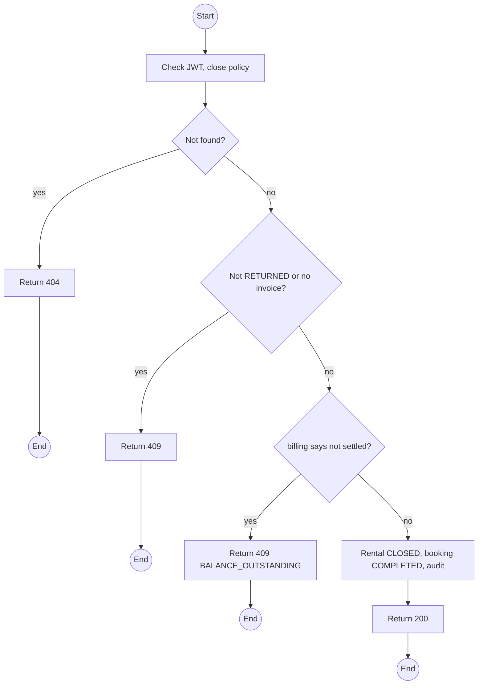
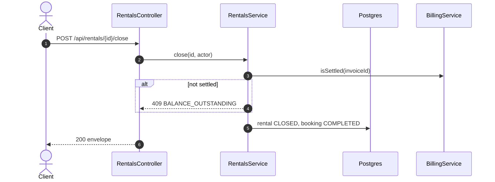

# POST /api/rentals/:id/close: Close a rental

> Module `rentals`. Format: `02-templates/04-api-endpoint-template.md`, with Mermaid in place of PlantUML (D-017). Envelope: D-002.

[TOC]

---
## Overview

Closes a `RETURNED` rental when `billing` reports its settlement invoice settled (balance paid, refund paid, or both zero). The booking becomes `COMPLETED`. While a balance remains the rental stays open and the balance stays visible (E05-4).

## API Specification

| API        | URL             |
| ---------- | --------------- |
| POST | /api/rentals/:id/close |
| Permission | Operator |
| Traces | UC-12, FR-BILL-05, BR-19, E05-4, REQ-EVT-22, REQ-STA-05, MF-05 step 5 |

### Path parameters

| Field | Description | Data Type | Examples |
| --- | --- | --- | --- |
| id | Rental id | uuid | `c9b8a7f6-5e4d-4c3b-2a19-0817f6e5d4c3` |

## Request sample

No request body.

## Response sample

```json
{
  "result": {
    "rentalId": "c9b8a7f6-5e4d-4c3b-2a19-0817f6e5d4c3",
    "status": "CLOSED",
    "closedAt": "2026-10-13T03:00:00Z",
    "bookingStatus": "COMPLETED"
  },
  "isSuccess": true,
  "statusCode": 200,
  "message": "Rental closed"
}
```

## Validation

<table>
    <th>Status code</th>
    <th>Description</th>
    <th>Examples</th>
    <tbody>
        <tr>
            <td>401</td>
            <td>Missing, malformed or expired access token (<code>UNAUTHENTICATED</code>)</td>
<td>

```json
{
  "result": {
    "errorCode": "UNAUTHENTICATED"
  },
  "isSuccess": false,
  "statusCode": 401,
  "message": "Authentication required."
}
```
</td>
        </tr>
        <tr>
            <td>403</td>
            <td>Authenticated, but the caller's role or policy does not allow this action (<code>FORBIDDEN</code>)</td>
<td>

```json
{
  "result": {
    "errorCode": "FORBIDDEN"
  },
  "isSuccess": false,
  "statusCode": 403,
  "message": "You do not have permission to perform this action."
}
```
</td>
        </tr>
        <tr>
            <td>404</td>
            <td>No such rental, or outside the caller's scope (<code>NOT_FOUND</code>)</td>
<td>

```json
{
  "result": {
    "errorCode": "NOT_FOUND"
  },
  "isSuccess": false,
  "statusCode": 404,
  "message": "Rental not found."
}
```
</td>
        </tr>
        <tr>
            <td>409</td>
            <td>Rental not RETURNED or not settled yet (<code>INVALID_STATE_TRANSITION</code>)</td>
<td>

```json
{
  "result": {
    "errorCode": "INVALID_STATE_TRANSITION"
  },
  "isSuccess": false,
  "statusCode": 409,
  "message": "Settle the rental before closing it."
}
```
</td>
        </tr>
        <tr>
            <td>409</td>
            <td>Balance outstanding (<code>BALANCE_OUTSTANDING</code>)</td>
<td>

```json
{
  "result": {
    "errorCode": "BALANCE_OUTSTANDING"
  },
  "isSuccess": false,
  "statusCode": 409,
  "message": "A balance of 450,000 VND is outstanding."
}
```
</td>
        </tr>
    </tbody>
</table>

## Activity Diagram



## Sequence Diagram


