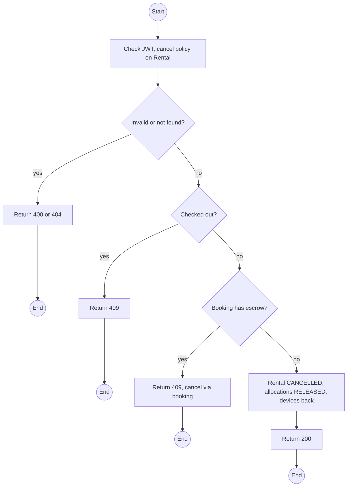
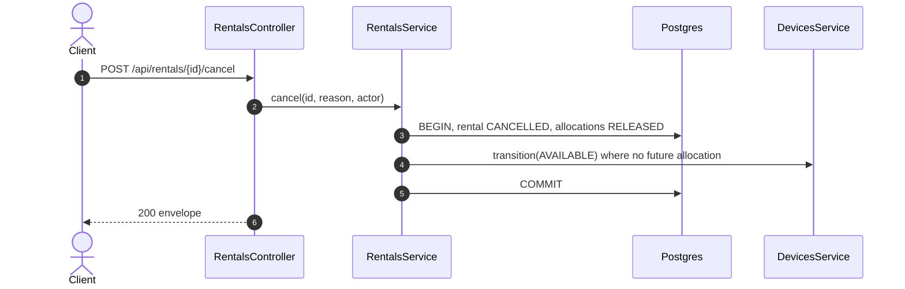

# POST /api/rentals/:id/cancel: Cancel a rental before check-out

> Module `rentals`. Format: `02-templates/04-api-endpoint-template.md`, with Mermaid in place of PlantUML (D-017). Envelope: D-002.

[TOC]

---
## Overview

Cancels a `DRAFT` or `READY` rental, releasing its allocations. A rental from a booking is normally cancelled through the booking (endpoint 07), which also settles money; this endpoint serves direct rentals and Staff corrections.

## API Specification

| API        | URL             |
| ---------- | --------------- |
| POST | /api/rentals/:id/cancel |
| Permission | Operator |
| Traces | E01-2, REQ-EVT-08, REQ-ERR-07 |

### Path parameters

| Field | Description | Data Type | Examples |
| --- | --- | --- | --- |
| id | Rental id | uuid | `c9b8a7f6-5e4d-4c3b-2a19-0817f6e5d4c3` |

## Request sample

```json
{
  "reason": "Provisioned by mistake"
}
```

| Field | Description | Data Type | Required | Examples |
| --- | --- | --- | --- | --- |
| reason | Required | string | yes | `Provisioned by mistake` |

## Response sample

```json
{
  "result": {
    "rentalId": "c9b8a7f6-5e4d-4c3b-2a19-0817f6e5d4c3",
    "status": "CANCELLED",
    "releasedAllocationCount": 3
  },
  "isSuccess": true,
  "statusCode": 200,
  "message": "Rental cancelled"
}
```

## Validation

<table>
    <th>Status code</th>
    <th>Description</th>
    <th>Examples</th>
    <tbody>
        <tr>
            <td>400</td>
            <td>Reason missing (<code>VALIDATION_FAILED</code>)</td>
<td>

```json
{
  "result": {
    "errorCode": "VALIDATION_FAILED"
  },
  "isSuccess": false,
  "statusCode": 400,
  "message": "reason is required."
}
```
</td>
        </tr>
        <tr>
            <td>401</td>
            <td>Missing, malformed or expired access token (<code>UNAUTHENTICATED</code>)</td>
<td>

```json
{
  "result": {
    "errorCode": "UNAUTHENTICATED"
  },
  "isSuccess": false,
  "statusCode": 401,
  "message": "Authentication required."
}
```
</td>
        </tr>
        <tr>
            <td>403</td>
            <td>Authenticated, but the caller's role or policy does not allow this action (<code>FORBIDDEN</code>)</td>
<td>

```json
{
  "result": {
    "errorCode": "FORBIDDEN"
  },
  "isSuccess": false,
  "statusCode": 403,
  "message": "You do not have permission to perform this action."
}
```
</td>
        </tr>
        <tr>
            <td>404</td>
            <td>No such rental, or outside the caller's scope (<code>NOT_FOUND</code>)</td>
<td>

```json
{
  "result": {
    "errorCode": "NOT_FOUND"
  },
  "isSuccess": false,
  "statusCode": 404,
  "message": "Rental not found."
}
```
</td>
        </tr>
        <tr>
            <td>409</td>
            <td>Already checked out (<code>CANCEL_AFTER_CHECKOUT</code>)</td>
<td>

```json
{
  "result": {
    "errorCode": "CANCEL_AFTER_CHECKOUT"
  },
  "isSuccess": false,
  "statusCode": 409,
  "message": "Devices are already checked out. Check them in instead."
}
```
</td>
        </tr>
        <tr>
            <td>409</td>
            <td>Rental belongs to a booking with escrow (<code>INVALID_STATE_TRANSITION</code>)</td>
<td>

```json
{
  "result": {
    "errorCode": "INVALID_STATE_TRANSITION"
  },
  "isSuccess": false,
  "statusCode": 409,
  "message": "Cancel the booking instead, so the escrow is settled."
}
```
</td>
        </tr>
    </tbody>
</table>

## Activity Diagram



## Sequence Diagram


