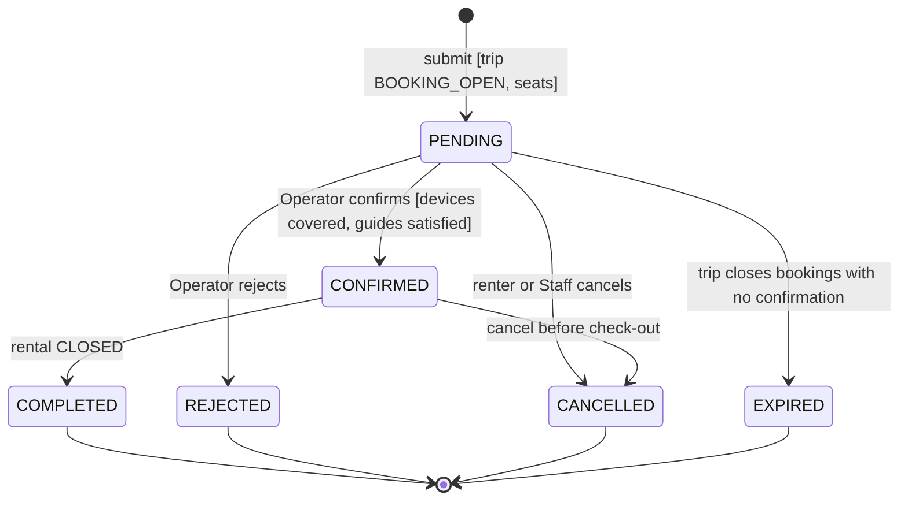
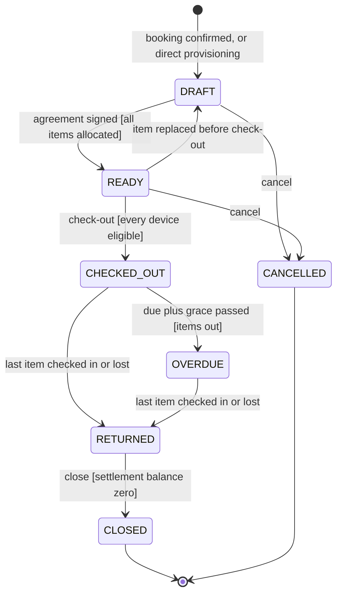
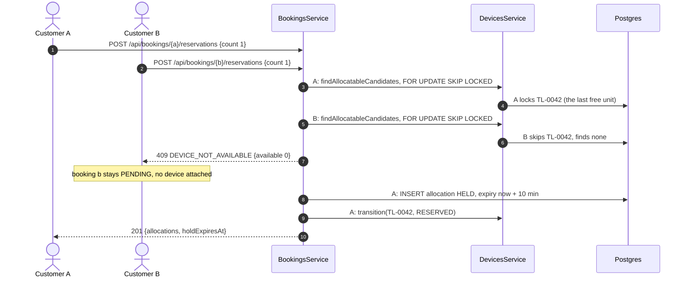
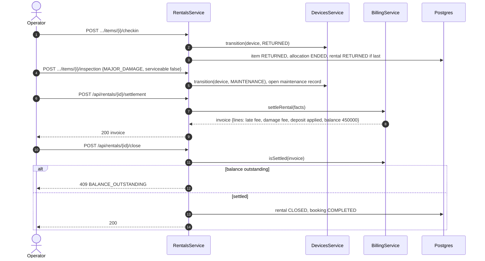

# Technical Design: rentals

> Fulfills `requirements.md` in this folder. ERD slice: `specs/platform/design.md` Figure 8. This file carries two Review 2 artefacts: the **Rental lifecycle state machine** (§2.2) and the **MF-01 activity diagram** (§3.1, three parts). Both are copied to `_handoff/outbound/capstone/Documents/reports/sdd-diagrams/`.

---

## 1. Domain Model & Data Schema

```prisma
enum BookingStatus    { PENDING CONFIRMED COMPLETED CANCELLED REJECTED EXPIRED }
enum BookingChannel   { CUSTOMER GUIDE STAFF }
enum AllocationStatus { HELD CONFIRMED CHECKED_OUT ENDED RELEASED }
enum RentalStatus     { DRAFT READY CHECKED_OUT OVERDUE RETURNED CLOSED CANCELLED }
enum RentalItemState  { ALLOCATED CHECKED_OUT HANDOVER_ACCEPTED HANDOVER_REJECTED MISSING_REPORTED LOSS_SUSPECTED RETURNED LOST REPLACED }
enum AgreementStatus  { GENERATED SIGNED VOID }
enum ReturnCondition  { GOOD MINOR_DAMAGE MAJOR_DAMAGE MISSING_ACCESSORIES }

model Booking {
  id                String         @id @default(uuid())
  code              String         @unique        // BK-2026-000123
  tripId            String
  channel           BookingChannel
  customerId        String?                       // Customer account, null for an unauthenticated renter [Q55]
  renterName        String                        // always set; copied from the account when present
  renterPhone       String?
  createdById       String
  groupSize         Int
  requestedDevices  Int
  status            BookingStatus  @default(PENDING)
  holdDisabled      Boolean        @default(false) // Staff and Guide channels [Q59]
  escrowPaidAt      DateTime?                     // set from billing's payment event [Q60]
  confirmedById     String?
  confirmedAt       DateTime?
  decisionReason    String?                       // reject or cancel reason
  cancelledAt       DateTime?
  termsAcceptedAt   DateTime
  createdAt         DateTime       @default(now())
  updatedAt         DateTime       @updatedAt
  @@index([tripId, status])
  @@index([customerId, status])
  @@map("bookings")
}

model DeviceAllocation {
  id            String           @id @default(uuid())
  deviceId      String
  bookingId     String?
  rentalItemId  String?          @unique
  windowStart   DateTime
  windowEnd     DateTime
  status        AllocationStatus
  holdExpiresAt DateTime?
  createdById   String?
  createdAt     DateTime         @default(now())
  updatedAt     DateTime         @updatedAt
  @@index([deviceId, status])
  @@index([status, holdExpiresAt])
  @@map("device_allocations")
}
// migration (raw SQL, platform task 1.5):
//   CREATE EXTENSION IF NOT EXISTS btree_gist;
//   ALTER TABLE device_allocations ADD CONSTRAINT no_double_allocation
//     EXCLUDE USING gist (device_id WITH =, tstzrange(window_start, window_end, '[)') WITH &&)
//     WHERE (status IN ('HELD','CONFIRMED','CHECKED_OUT'));

model Rental {
  id                 String       @id @default(uuid())
  code               String       @unique          // RN-2026-000077
  bookingId          String?      @unique          // null for direct provisioning [Q55]
  tripId             String
  renterId           String?
  renterName         String
  custodianGuideId   String                        // devices go to the Guide, come back through the Guide [Q71]
  status             RentalStatus @default(DRAFT)
  dueAt              DateTime                      // trip endAt
  checkedOutAt       DateTime?
  checkedOutById     String?
  returnedAt         DateTime?
  settlementInvoiceId String?
  closedAt           DateTime?
  closedById         String?
  cancelledReason    String?
  createdById        String
  createdAt          DateTime     @default(now())
  updatedAt          DateTime     @updatedAt
  @@index([tripId, status])
  @@index([custodianGuideId, status])
  @@map("rentals")
}

model RentalItem {
  id               String          @id @default(uuid())
  rentalId         String
  deviceId         String
  participantId    String?                          // who carries it on the trail [Q69]
  state            RentalItemState @default(ALLOCATED)
  checkedOutAt     DateTime?
  returnedAt       DateTime?
  receivedById     String?
  replacedByItemId String?
  lostConfirmedAt  DateTime?
  lostConfirmedById String?
  @@index([rentalId])
  @@index([deviceId, state])
  @@map("rental_items")
}

model RentalAgreement {
  id             String          @id @default(uuid())
  rentalId       String
  version        Int
  status         AgreementStatus
  termsVersion   String
  generatedPdf   Bytes                              // storage proposal, C-002
  generatedSha256 String
  generatedById  String
  generatedAt    DateTime        @default(now())
  signedPdf      Bytes?
  signedSha256   String?
  signerName     String?
  signedAt       DateTime?
  signatureCapturedById String?                     // Staff session that hosted the signing, if any
  @@unique([rentalId, version])
  @@map("rental_agreements")
}

model HandoverCheck {
  id           String   @id @default(uuid())
  rentalItemId String
  guideId      String
  batteryPct   Int                                   // read by a person, not telemetry [Q52]
  gpsFix       Boolean
  pskVerified  Boolean
  passed       Boolean
  note         String?
  createdAt    DateTime @default(now())
  @@map("handover_checks")                            // append-only
}

model ReturnInspection {
  id                  String          @id @default(uuid())
  rentalItemId        String          @unique
  inspectorId         String
  condition           ReturnCondition
  accessoriesComplete Boolean
  batteryPct          Int?
  damageNotes         String?
  evidenceRefs        String[]                        // file references, storage per C-002
  serviceable         Boolean
  createdAt           DateTime        @default(now())
  @@map("return_inspections")                         // append-only
}

model BookingStatusHistory { id String @id @default(uuid())  bookingId String  fromStatus BookingStatus?  toStatus BookingStatus  actorId String?  reason String?  createdAt DateTime @default(now())  @@map("booking_status_history") }
model RentalStatusHistory  { id String @id @default(uuid())  rentalId String   fromStatus RentalStatus?   toStatus RentalStatus   actorId String?  reason String?  createdAt DateTime @default(now())  @@map("rental_status_history") }
```

The two history models are written one field per line in the migration; they are compressed here only to keep the listing short.

---

## 2. Service / Business Logic Design

### 2.1 Booking lifecycle

See **Figure 1**.



***Figure 1***: Booking lifecycle, 6 states. A hold expiring does **not** change the booking state; it removes the devices and leaves the booking `PENDING` (E01-1, REQ-EVT-05).

Mapping to Q56's proposal (`start, sent, pending, completed`): `start` is the client-side form before submission and is not persisted; `sent` and `pending` collapse into `PENDING`, with hold and payment tracked on the allocations and `escrowPaidAt`; `completed` is `COMPLETED`. The terminal failure states are added because E01-2 and UC-04 need them. Confirmation requested in C-002.

### 2.2 Rental lifecycle state machine

See **Figure 2**.



***Figure 2***: Rental lifecycle, 7 states. `OVERDUE` exists so a late or unreturned rental is visible as a state, not only as a computed flag (E05-1, E05-3). `RETURNED` holds the rental open until the money is settled (E05-4, BR-19).

| From | To | Trigger | Actor | Guard | Required by |
|---|---|---|---|---|---|
| (none) | DRAFT | booking confirmed or direct create | Operator, Guide (direct) | trip bookable | UC-04, Q55 |
| DRAFT | READY | agreement signed | renter, Operator | every item `ALLOCATED` with a `CONFIRMED` allocation | UC-07 |
| READY | DRAFT | an item replaced | Operator | none | E01-3 before check-out |
| READY | CHECKED_OUT | check-out | Operator | signed agreement, all devices eligible | UC-08 |
| CHECKED_OUT | OVERDUE | scheduler | system | `now > dueAt + billing.lateGraceHours` and items out | E05-1 |
| CHECKED_OUT, OVERDUE | RETURNED | last item returned or lost | Operator | none | UC-09, E05-3 |
| RETURNED | CLOSED | close | Operator | `billing.isSettled(invoice)` | BR-19, E05-4 |
| DRAFT, READY | CANCELLED | cancel | Operator, renter via booking | not checked out | E01-2 |

### 2.3 Reservation under contention (E01-1)

```
BEGIN
  trip  = TripsService.assertBookable(tripId)                       -- status, window
  win   = trip.window widened by lead and trail hours
  busy  = SELECT device_id FROM device_allocations
          WHERE status IN (HELD, CONFIRMED, CHECKED_OUT) AND tstzrange(...) && win
  cands = DevicesService.findAllocatableCandidates(acceptedVariants, busy, tx)
          -- SELECT ... FROM devices WHERE status NOT IN (MAINTENANCE, RETIRED)
          --   AND id <> ALL(busy) ORDER BY status = 'AVAILABLE' DESC, asset_tag
          --   LIMIT n FOR UPDATE SKIP LOCKED
  if |cands| < n: ROLLBACK, 409 DEVICE_NOT_AVAILABLE
  INSERT allocations HELD, holdExpiresAt   -- exclusion constraint arbitrates any race
  for each AVAILABLE cand: DevicesService.transition(cand, RESERVED, ALLOCATION_CREATED, tx)
COMMIT
```

`SKIP LOCKED` makes concurrent reservers pick different devices rather than queue on the same row. The exclusion constraint catches the one remaining race (another transaction committed an allocation after `busy` was read); the service retries per REQ-ERR-02. Candidate ordering prefers units already `AVAILABLE`, so a unit out on another trip is only pre-allocated when the warehouse is empty (Q53).

### 2.4 Services and exported surface

| Service | Responsibility |
|---|---|
| `BookingsService` | create, reserve, confirm, reject, cancel, hold changes, expiry job |
| `RentalsService` | create direct, allocate and replace, agreement, check-out, handover, check-in, inspection, loss, settlement hand-off, close, cancel, overdue job |
| `AgreementService` | PDF render (`pdfkit`, a new dependency flagged in C-002), signature embedding, hashing |
| `RentalsEventsHandler` | `trip.status.changed`, `device.unavailable`, `payment.succeeded` (escrow) |

Exported for other modules: `allocatedDeviceIds(from, to)` (availability), `findActiveAssignmentForDevice(deviceId)` returning `{ rentalId, tripId, custodianGuideId }` (incidents, E03-4), `devicesForTrip(tripId)` (monitoring), `RESCHEDULE_GUARD` implementation (trips).

### 2.5 Billing hand-off contract

`rentals` never computes money. It calls:

| Call | When | Returns |
|---|---|---|
| `BillingService.quoteBooking(tripId, channel, groupSize, devices)` | before submit, for display | itemised quote |
| `BillingService.openEscrow(bookingId, quoteInput)` | reservation on Customer channel | escrow invoice id |
| `BillingService.cancellationSettlement(bookingId, cancelledAt)` | cancel | refund amount, fee line |
| `BillingService.settleRental(facts)` | settlement request | settlement invoice |
| `BillingService.isSettled(invoiceId)` | close | boolean |

`facts` = `{ rentalId, renterId, tripPackageId, channel, dueAt, items: [{ deviceId, variantId, returnedAt, condition, lost }], prepaidInvoiceId }`. `billing` answers with an invoice, and emits `payment.succeeded` which `rentals` consumes to set `escrowPaidAt` and confirm holds (REQ-EVT-04).

### 2.6 Error catalogue

| Code | HTTP | Raised when |
|---|---|---|
| `TRIP_NOT_BOOKABLE`, `TRIP_FULL` | 409 | from `trips` |
| `GROUP_SIZE_OUT_OF_RANGE` | 400 | group outside package bounds |
| `TOO_MANY_DEVICES` | 400 | over the per-channel maximum |
| `DEVICE_NOT_AVAILABLE` | 409 | not enough allocatable devices (E01-1) |
| `ALLOCATION_CONFLICT` | 409 | requested device overlaps (E01-5) |
| `VARIANT_NOT_ACCEPTED` | 409 | device variant not accepted by the trip |
| `RESERVATION_INCOMPLETE` | 409 | confirm without covered, paid allocations |
| `GUIDES_NOT_SATISFIED` | 409 | confirm without required Guides (E01-4) |
| `HOLD_EXPIRED` | 409 | payment or confirm after hold expiry |
| `AGREEMENT_NOT_SIGNED` | 409 | check-out without signature |
| `DEVICE_NOT_RESERVED`, `PSK_NOT_CURRENT` | 409 | check-out eligibility |
| `CANCEL_AFTER_CHECKOUT` | 409 | cancel once devices are out |
| `NOT_CHECKED_OUT` | 409 | check-in of an item not out |
| `INSPECTION_EXISTS` | 409 | second inspection of an item |
| `BALANCE_OUTSTANDING` | 409 | close with unpaid balance (E05-4) |
| `INVALID_STATE_TRANSITION` | 409 | any FSM violation |

---

## 3. Flows

### 3.1 MF-01 activity diagram

The Review 2 template asks for an activity diagram with branching and parallelism; lanes are actors per `13-diagram-and-figure-conventions.md` §2. The flow is split into three figures joined by connector nodes, because as one swimlane it prints at about 3 pt (chain depth drives height, §7 there). See **Figure 3**, **Figure 4** and **Figure 5**.

```mermaid
swimlane-beta TB
    subgraph customer["Customer"]
        c0((Start))
        c1[Pick trip,<br/>submit booking]
        c3[Reserve device]
        c4[Pay escrow]
    end
    subgraph backend["Cloud Backend"]
        b1{Trip open,<br/>group ok?}
        b2[Booking PENDING]
        b3{Free device<br/>under lock?}
        b4[Allocation HELD,<br/>device RESERVED]
        b5{Paid before<br/>expiry?}
        b7((Hold confirmed,<br/>to part 2))
    end
    c0 --> c1 --> b1
    b1 -->|no| c1
    b1 -->|yes| b2 --> c3 --> b3
    b3 -->|"no: 409,<br/>stays PENDING"| c3
    b3 -->|yes| b4 --> c4 --> b5
    b5 -->|"no: hold<br/>released"| c3
    b5 -->|yes| b7
```

***Figure 3***: MF-01 activity, part 1 of 3, booking and device hold. Two loops send the Customer back: a lost race for the last device (E01-1) and a hold that expires unpaid (Q59). In both the booking stays `PENDING` with no device attached.

```mermaid
swimlane-beta TB
    subgraph staff["Operator"]
        t0((From part 1))
        t1{Guides assigned,<br/>devices covered?}
        t2[Assign Guide or<br/>resolve conflict]
        t3[Confirm booking]
    end
    subgraph backend["Cloud Backend"]
        f1[Fork]
        b7[Booking CONFIRMED]
        b8[Rental DRAFT,<br/>one item per device]
        j1[Join]
        b9((To part 3))
    end
    subgraph customer["Customer"]
        c5[Receive<br/>confirmation]
    end
    t0 --> t1
    t1 -->|no| t2 --> t1
    t1 -->|yes| t3 --> f1
    f1 --> b7 --> c5 --> j1
    f1 --> b8 --> j1
    j1 --> b9
    style f1 stroke-width:4px
    style j1 stroke-width:4px
```

***Figure 4***: MF-01 activity, part 2 of 3, Staff review and confirmation. The loop is E01-4: a missing Guide is resolved before confirmation, never after. Confirmation forks into two parallel paths, notifying the Customer and opening the rental, which join before preparation continues.

```mermaid
swimlane-beta TB
    subgraph staff["Operator"]
        t0((From part 1))
        t4[Allocate specific<br/>devices]
        t5[Generate agreement,<br/>renter signs]
        t6[Check out]
        t7[Replace device]
    end
    subgraph backend["Cloud Backend"]
        b9[Rental READY]
        b10{All devices<br/>eligible?}
        b11[Devices RENTED,<br/>rental CHECKED_OUT]
        b12[Device to<br/>MAINTENANCE]
    end
    subgraph guide["Guide"]
        g1{Battery and GPS<br/>pass by hand?}
        g2[Ready for trek]
        g3((End))
    end
    t0 --> t4 --> t5 --> b9 --> t6 --> b10
    b10 -->|no| t4
    b10 -->|yes| b11 --> g1
    g1 -->|no| b12 --> t7 --> t6
    g1 -->|yes| g2 --> g3
```

***Figure 5***: MF-01 activity, part 3 of 3, preparation, check-out and handover. The two loops are an ineligible device at check-out (PSK not current, D-021) and a failed handover check (E01-3), where the unit goes to maintenance and is replaced on the same rental.

### 3.2 Reservation race for the last device (E01-1)

See **Figure 6**.



***Figure 6***: The loser is told immediately and is never oversold. The exclusion constraint on `device_allocations` stays underneath as the last line of defence.

### 3.3 Return, inspection, settlement and close (MF-05)

See **Figure 7**.



***Figure 7***: MF-05 from the rentals side. Money is computed in `billing`; the rental cannot close while a balance remains (E05-4).

---

## 4. API Endpoints in this module

| # | Method | Route | Permission | Spec |
|---|---|---|---|---|
| 01 | POST | `/api/bookings` | Customer; Guide (own trips); Operator | `api-design/01-post-bookings-create.md` |
| 02 | POST | `/api/bookings/:id/reservations` | booking owner; Guide (own trips); Operator | `api-design/02-post-bookings-reserve.md` |
| 03 | GET | `/api/bookings` | Operator, Admin; Guide (own trips); Customer (own) | `api-design/03-get-bookings-list.md` |
| 04 | GET | `/api/bookings/:id` | as above | `api-design/04-get-bookings-detail.md` |
| 05 | POST | `/api/bookings/:id/confirm` | Operator | `api-design/05-post-bookings-confirm.md` |
| 06 | POST | `/api/bookings/:id/reject` | Operator | `api-design/06-post-bookings-reject.md` |
| 07 | POST | `/api/bookings/:id/cancel` | Customer (own); Operator | `api-design/07-post-bookings-cancel.md` |
| 08 | PATCH | `/api/bookings/:id/hold` | Operator | `api-design/08-patch-bookings-hold.md` |
| 09 | POST | `/api/rentals` | Operator; Guide (own trips) | `api-design/09-post-rentals-create.md` |
| 10 | GET | `/api/rentals` | Operator, Admin; Guide (custody); Customer (own) | `api-design/10-get-rentals-list.md` |
| 11 | GET | `/api/rentals/:id` | as above | `api-design/11-get-rentals-detail.md` |
| 12 | PUT | `/api/rentals/:id/items` | Operator | `api-design/12-put-rentals-items.md` |
| 13 | POST | `/api/rentals/:id/agreement` | Operator | `api-design/13-post-rentals-agreement.md` |
| 14 | POST | `/api/rentals/:id/agreement/signature` | Operator (in person); Customer (own) | `api-design/14-post-rentals-agreement-sign.md` |
| 15 | GET | `/api/rentals/:id/agreement/pdf` | Operator, Admin; Customer (own) | `api-design/15-get-rentals-agreement-pdf.md` |
| 16 | POST | `/api/rentals/:id/checkout` | Operator | `api-design/16-post-rentals-checkout.md` |
| 17 | POST | `/api/rentals/:id/items/:itemId/handover` | custodian Guide | `api-design/17-post-rentals-item-handover.md` |
| 18 | POST | `/api/rentals/:id/items/:itemId/checkin` | Operator | `api-design/18-post-rentals-item-checkin.md` |
| 19 | POST | `/api/rentals/:id/items/:itemId/inspection` | Operator | `api-design/19-post-rentals-item-inspection.md` |
| 20 | POST | `/api/rentals/:id/items/:itemId/lost` | Operator | `api-design/20-post-rentals-item-lost.md` |
| 21 | POST | `/api/rentals/:id/settlement` | Operator | `api-design/21-post-rentals-settlement.md` |
| 22 | POST | `/api/rentals/:id/close` | Operator | `api-design/22-post-rentals-close.md` |
| 23 | POST | `/api/rentals/:id/cancel` | Operator | `api-design/23-post-rentals-cancel.md` |

`RentalsModule` also serves `GET /api/devices/availability` (`specs/devices/api-design/13`) and `GET /api/trips/:id/participants` (`specs/trips/api-design/12`), because both need allocation data and the dependency direction forbids `devices` and `trips` from reading it.

---

## 5. Frontend impact

- Customer: `features/BookingWizard` (3 steps: trip and group, travellers, review and pay; hold countdown visible), `pages/MyBookingsPage`, `features/SignAgreement` (canvas signature).
- Operator: `pages/BookingsQueuePage` (Pattern A, PENDING first, conflicts shown inline), `pages/RentalDetailPage` (items, agreement, check-out, check-in, inspection, settlement), `features/CheckOutWizard` (≤4 steps), `features/InspectionForm` (single step, 6 fields).
- Guide: `features/HandoverCheck` (per device: battery by eye, GPS fix, PSK channel shown in app; pass or reject).
