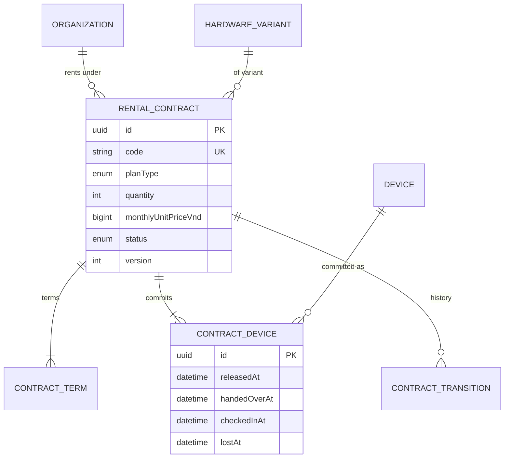
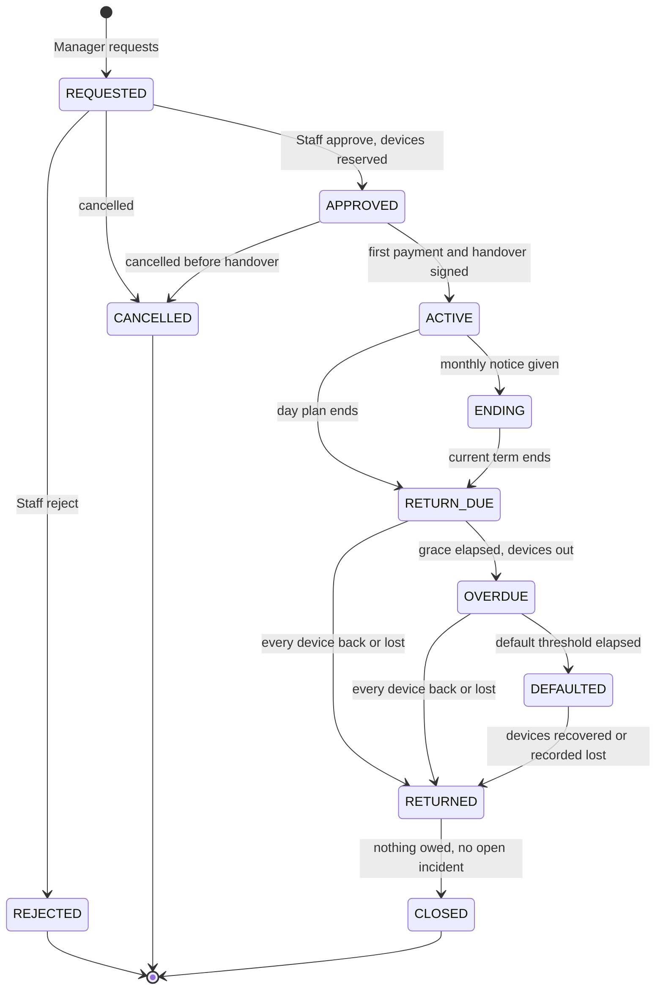
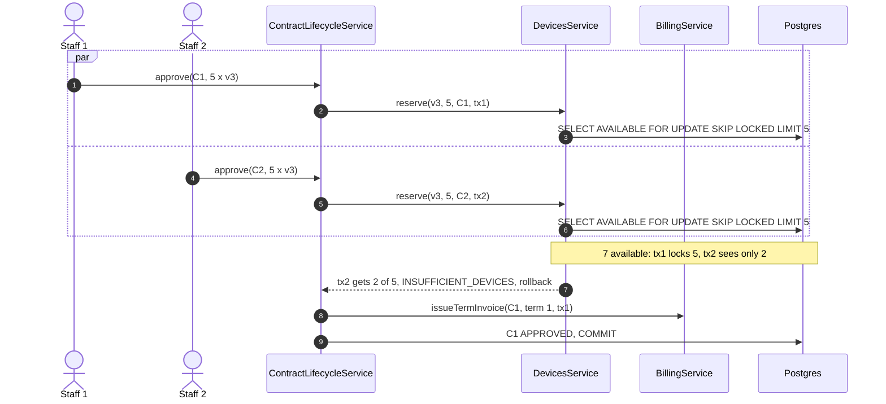

# Technical Design: rentals

> Fulfills `requirements.md` in this folder. Schema: the `// @module rentals` block of
> `backend/prisma/schema.prisma` is authoritative.

---

## 1. Data model

```mermaid
erDiagram
    ORGANIZATION ||--o{ RENTAL_CONTRACT : "rents under"
    HARDWARE_VARIANT ||--o{ RENTAL_CONTRACT : "of variant"
    RENTAL_CONTRACT ||--|{ CONTRACT_TERM : "terms"
    RENTAL_CONTRACT ||--|{ CONTRACT_DEVICE : "commits"
    DEVICE ||--o{ CONTRACT_DEVICE : "committed as"
    RENTAL_CONTRACT ||--o{ CONTRACT_TRANSITION : "history"
    RENTAL_CONTRACT {
        uuid id PK
        string code UK
        enum planType
        int quantity
        bigint monthlyUnitPriceVnd
        enum status
        int version
    }
    CONTRACT_DEVICE {
        uuid id PK
        datetime releasedAt
        datetime handedOverAt
        datetime checkedInAt
        datetime lostAt
    }
```

***Figure 1***: rentals slice. A `ContractDevice` row is live while `releasedAt`, `checkedInAt` and
`lostAt` are all null; one live row per device (BR-03).

---

## 2. Rental-contract lifecycle (D-035)

```mermaid
stateDiagram-v2
    [*] --> REQUESTED : Manager requests
    REQUESTED --> APPROVED : Staff approve, devices reserved
    REQUESTED --> REJECTED : Staff reject
    REQUESTED --> CANCELLED : cancelled
    APPROVED --> CANCELLED : cancelled before handover
    APPROVED --> ACTIVE : first payment and handover signed
    ACTIVE --> ENDING : monthly notice given
    ACTIVE --> RETURN_DUE : day plan ends
    ENDING --> RETURN_DUE : current term ends
    RETURN_DUE --> RETURNED : every device back or lost
    RETURN_DUE --> OVERDUE : grace elapsed, devices out
    OVERDUE --> RETURNED : every device back or lost
    OVERDUE --> DEFAULTED : default threshold elapsed
    DEFAULTED --> RETURNED : devices recovered or recorded lost
    RETURNED --> CLOSED : nothing owed, no open incident
    REJECTED --> [*]
    CANCELLED --> [*]
    CLOSED --> [*]
```

***Figure 2***: Rental-contract lifecycle; SRS Figure 26. Devices checked in early, while a day plan is
`ACTIVE` or a monthly contract `ENDING`, stay checked in; when the plan or term ends, the job moves the
contract to `RETURN_DUE` and, finding every device back or lost, straight on to `RETURNED` in the same
transaction. No edge outside D-035 is needed.

| From | To | Trigger | Actor |
|---|---|---|---|
| `REQUESTED` | `APPROVED`, `REJECTED` | approve, reject | Staff |
| `REQUESTED`, `APPROVED` | `CANCELLED` | cancel | Manager, Staff |
| `APPROVED` | `ACTIVE` | handover | Staff |
| `ACTIVE` | `ENDING` | notice (monthly) | Manager |
| `ACTIVE` | `RETURN_DUE` | day plan end | `SYSTEM` |
| `ENDING` | `RETURN_DUE` | term end | `SYSTEM` |
| `RETURN_DUE` | `OVERDUE` | grace elapsed | `SYSTEM` |
| `OVERDUE` | `DEFAULTED` | default threshold | `SYSTEM` (suspends the organization) |
| `RETURN_DUE`, `OVERDUE`, `DEFAULTED` | `RETURNED` | last device checked in or lost | Staff |
| `RETURNED` | `CLOSED` | close | Staff |

`returnDueAt` is the day-plan end, or the current term's end for an `ENDING` contract.

---

## 3. Terms and money

Terms are anchored to the **requested start date** at 09:00 UTC+7, not to the handover moment, so an
invoice's due dates are known when it is issued and never move (REQ-UBI-02 of `billing`). A **monthly**
contract's term *n* runs from the start date plus *n−1* calendar months to plus *n* months. At approval
term 1 is created and `billing.issueTermInvoice(contract, term, tx)` issues one invoice with two dated
lines (D-037): the holding fee (ratio × monthly unit price × quantity) due at the term start, and the
balance due at the term end. The handover may happen on the start date or later; a later handover does not
move the term, so Staff reschedule by rejecting and re-requesting before approval if the date slips. A
handover before the start date is refused. At each term end the rollover job, in one transaction, closes
the term and either opens the next with its invoice (no notice) or moves the contract to `RETURN_DUE`
(after notice).

A **day plan** has one term from the start date for its length, created at approval; its invoice has one `DAY_PLAN_FEE` line due at the start date, paid at the latest at the counter.

Every charge is computed by `billing` from the contract's snapshot; this module never does money
arithmetic.

---

## 4. Handover at the counter

1. Staff open the approved contract; the counter app lists the reserved devices.
2. Each device: Staff write the organization channel key with the provisioning tool, then record it
   (`POST .../provisioning`); the platform keeps only the key version (D-021).
3. Each device: battery and GPS fix are checked; a failing unit is swapped (E01-5).
4. The Manager reads the preview note and signs on the screen; Staff enter the identity document seen.
5. `HandoverService.complete` checks the first payment through `billing`, readiness through `devices`,
   renders the PDF with the signature, stores it under `HANDOVER_NOTE_STORAGE_DIR` with its SHA-256, and
   commits the `RENTED` devices and `ACTIVE` together.

---

## 5. Scheduler jobs

| Job | Rule | Idempotency |
|---|---|---|
| `rentals.termRollover` | terms with `endsAt <= now` and status `OPEN`; day plans past their end; a contract reaching `RETURN_DUE` with every device back or lost continues to `RETURNED` | each term closed by compare-and-set; a re-run finds nothing |
| `rentals.overdueAndDefault` | `RETURN_DUE` past grace to `OVERDUE`; `OVERDUE` past threshold to `DEFAULTED` and `organizations.suspendForDefault` | state compare-and-set |
| `rentals.reservationReminders` | `APPROVED` past `reservationExpiresAt`, not yet reminded | reminder flag in the transition reason |

---

## 6. Services and ports

| Export | Used by |
|---|---|
| `RentalsService.contractHolding(deviceId, at)` returns the contract and organization for a device in `ACTIVE`, `ENDING`, `RETURN_DUE`, `OVERDUE` or `DEFAULTED` | incidents, gateway-sync |
| `RentalsService.visibleDevices(ctx)`, `rentalPeriods(deviceId, orgId)` | monitoring |
| `RentalsService.contractsOfDevice(deviceId)`, `statusOf(contractId)`, `utilization(range)` | monitoring, incidents |
| provider of `ORGANIZATION_EXIT_CHECKS.canClose` | organizations |

Declares `CONTRACT_CLOSE_CHECKS` (multi): `{ blockingReason(contractId, deviceIds): Promise<Reason | null> }`.

Events emitted: `contract.statusChanged`, `device.handedOver`, `device.checkedIn`, `device.labelChanged`, `audit.record`.

---

## 7. Error catalogue

| Code | HTTP |
|---|---|
| `BELOW_MOQ` | 400 |
| `DAY_PLAN_LENGTH` | 400 |
| `ORGANIZATION_NOT_ACTIVE` | 409 |
| `INSUFFICIENT_DEVICES` | 409 |
| `DEVICE_NOT_ON_CONTRACT` | 409 |
| `FIRST_PAYMENT_MISSING` | 409 |
| `DEVICE_NOT_PROVISIONED` | 409 |
| `DEVICE_CHECK_FAILED` | 409 |
| `LOW_BATTERY` | 409 |
| `SIGNER_NOT_MANAGER` | 400 |
| `NOTE_NOT_SIGNED` | 409 |
| `BEFORE_START_DATE` | 409 |
| `DAY_PLAN_NO_NOTICE` | 409 |
| `BALANCE_OUTSTANDING` | 409 |
| `OPEN_INCIDENTS` | 409 |
| `KEY_VERSION_MISMATCH` | 409 |
| `RESET_REQUIRED` | 409 |

---

## 8. Sequence: approval under contention

```mermaid
sequenceDiagram
    autonumber
    actor S1 as Staff 1
    actor S2 as Staff 2
    participant L as ContractLifecycleService
    participant D as DevicesService
    participant B as BillingService
    participant DB as Postgres
    par
        S1->>L: approve(C1, 5 x v3)
        L->>D: reserve(v3, 5, C1, tx1)
        D->>DB: SELECT AVAILABLE FOR UPDATE SKIP LOCKED LIMIT 5
    and
        S2->>L: approve(C2, 5 x v3)
        L->>D: reserve(v3, 5, C2, tx2)
        D->>DB: SELECT AVAILABLE FOR UPDATE SKIP LOCKED LIMIT 5
    end
    Note over D,DB: 7 available: tx1 locks 5, tx2 sees only 2
    D-->>L: tx2 gets 2 of 5, INSUFFICIENT_DEVICES, rollback
    L->>B: issueTermInvoice(C1, term 1, tx1)
    L->>DB: C1 APPROVED, COMMIT
```

***Figure 3***: E01-1. `SKIP LOCKED` makes the loser count only unlocked rows, so it fails fast instead of
waiting and then over-allocating.

---

## 9. Testing strategy

Lifecycle matrix; the approval race on Postgres; term rollover across month ends (31 to 30 days) and
across a scheduler outage; overdue and default timing with a fake clock; close guards through stubbed
ports; holder labels erased on close.
