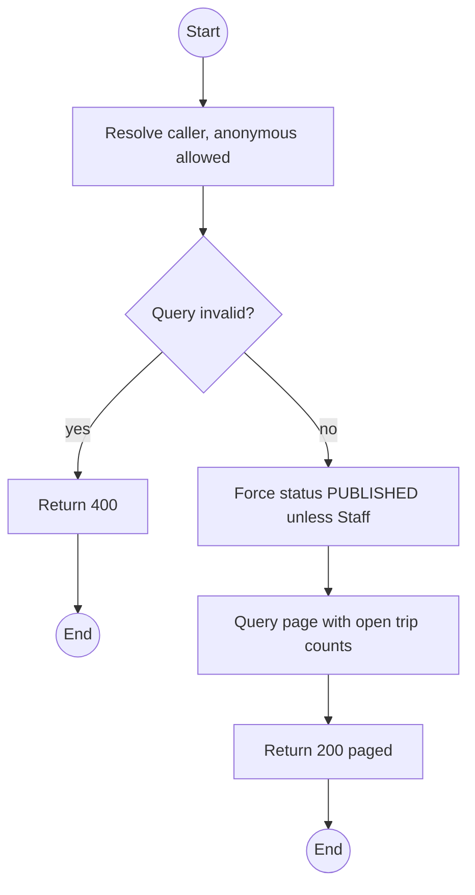
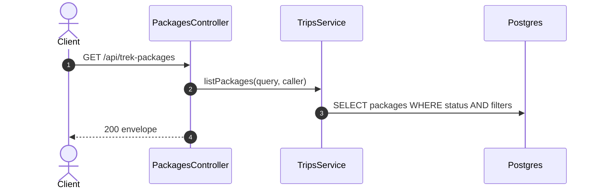

# GET /api/trek-packages: Browse trek packages

> Module `trips`. Format: `02-templates/04-api-endpoint-template.md`, with Mermaid in place of PlantUML (D-017). Envelope: D-002.

[TOC]

---
## Overview

Paged package catalogue. Anonymous callers and Customers see `PUBLISHED` packages only; Staff can filter by status. Each item carries the count of upcoming `BOOKING_OPEN` trips; prices are fetched separately from `billing` (quote endpoint) so pricing stays in one module.

## API Specification

| API        | URL             |
| ---------- | --------------- |
| GET | /api/trek-packages |
| Permission | Public (PUBLISHED only); Operator, Admin (all statuses) |
| Traces | UC-01, FR-TRIP-01 (new), US-024, REQ-UBI-04, Q30, Q70 |

### Query parameters

| Field | Description | Data Type | Required | Examples |
| --- | --- | --- | --- | --- |
| search | Name, code or region | string | no | `Ta Nang` |
| difficulty | EASY, MODERATE, HARD, EXPERT | enum | no | `MODERATE` |
| status | Staff only | enum | no | `DRAFT` |
| pageNumber | 1-based | int | no | `1` |
| pageSize | Default 20, max 100 | int | no | `12` |

## Request sample

No request body. Query string example:

```
GET /api/trek-packages?difficulty=MODERATE&pageSize=12
```

## Response sample

```json
{
  "result": {
    "items": [
      {
        "id": "pk-01...",
        "code": "TN-PD-3D",
        "name": "Ta Nang - Phan Dung, 3 days",
        "summary": "Grassland ridges across three provinces",
        "region": "Lam Dong - Binh Thuan",
        "durationDays": 3,
        "difficulty": "MODERATE",
        "minGroupSize": 4,
        "maxGroupSize": 12,
        "acceptedVariants": [
          {
            "id": "hv-03...",
            "code": "treklink-v3"
          },
          {
            "id": "hv-04...",
            "code": "treklink-v4"
          }
        ],
        "coverImageUrl": null,
        "status": "PUBLISHED",
        "openTripCount": 2
      }
    ],
    "pageNumber": 1,
    "pageSize": 12,
    "totalCount": 1,
    "totalPages": 1
  },
  "isSuccess": true,
  "statusCode": 200,
  "message": "Trek packages retrieved"
}
```

## Validation

<table>
    <th>Status code</th>
    <th>Description</th>
    <th>Examples</th>
    <tbody>
        <tr>
            <td>400</td>
            <td>Bad filter, or `status` supplied by a non-Staff caller (<code>VALIDATION_FAILED</code>)</td>
<td>

```json
{
  "result": {
    "errorCode": "VALIDATION_FAILED"
  },
  "isSuccess": false,
  "statusCode": 400,
  "message": "status filter is available to Staff only."
}
```
</td>
        </tr>
    </tbody>
</table>

## Activity Diagram



## Sequence Diagram


