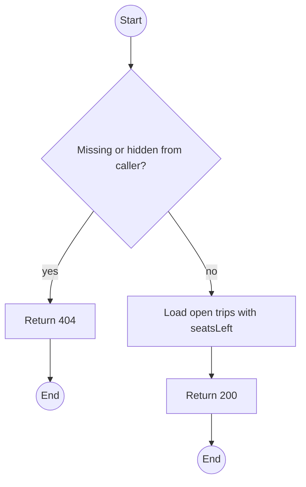
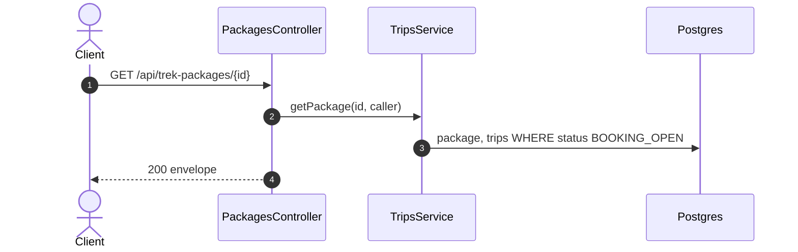

# GET /api/trek-packages/:id: Package detail with open trips

> Module `trips`. Format: `02-templates/04-api-endpoint-template.md`, with Mermaid in place of PlantUML (D-017). Envelope: D-002.

[TOC]

---
## Overview

One package with its description and its upcoming `BOOKING_OPEN` trips and seats left. Draft and archived packages return 404 to non-Staff callers.

## API Specification

| API        | URL             |
| ---------- | --------------- |
| GET | /api/trek-packages/:id |
| Permission | Public (PUBLISHED); Staff |
| Traces | UC-01, FR-TRIP-01, US-024 |

### Path parameters

| Field | Description | Data Type | Examples |
| --- | --- | --- | --- |
| id | Package id or code | string | `TN-PD-3D` |

## Request sample

No request body.

## Response sample

```json
{
  "result": {
    "id": "pk-01...",
    "code": "TN-PD-3D",
    "name": "Ta Nang - Phan Dung, 3 days",
    "summary": "Grassland ridges across three provinces",
    "region": "Lam Dong - Binh Thuan",
    "durationDays": 3,
    "difficulty": "MODERATE",
    "minGroupSize": 4,
    "maxGroupSize": 12,
    "acceptedVariants": [
      {
        "id": "hv-03...",
        "code": "treklink-v3"
      },
      {
        "id": "hv-04...",
        "code": "treklink-v4"
      }
    ],
    "coverImageUrl": null,
    "status": "PUBLISHED",
    "description": "Day 1: ...",
    "openTrips": [
      {
        "id": "a1c3e5f7-2b4d-4f6a-8c0e-1a2b3c4d5e6f",
        "code": "TRP-2026-1010-TNPD",
        "startAt": "2026-10-10T00:00:00Z",
        "endAt": "2026-10-12T11:00:00Z",
        "seatsLeft": 7
      }
    ]
  },
  "isSuccess": true,
  "statusCode": 200,
  "message": "Trek package retrieved"
}
```

## Validation

<table>
    <th>Status code</th>
    <th>Description</th>
    <th>Examples</th>
    <tbody>
        <tr>
            <td>404</td>
            <td>No such package, or not published and caller is not Staff (<code>NOT_FOUND</code>)</td>
<td>

```json
{
  "result": {
    "errorCode": "NOT_FOUND"
  },
  "isSuccess": false,
  "statusCode": 404,
  "message": "Trek package not found."
}
```
</td>
        </tr>
    </tbody>
</table>

## Activity Diagram



## Sequence Diagram


