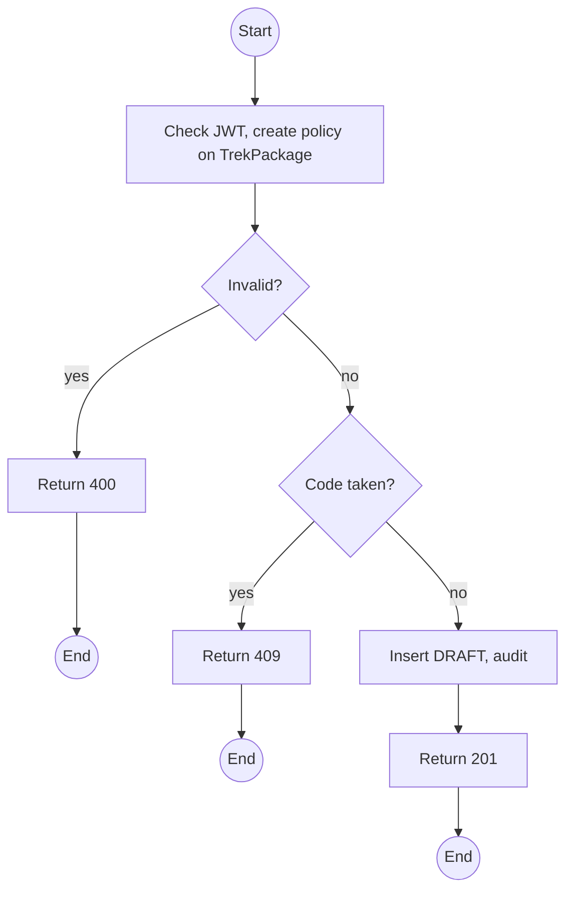
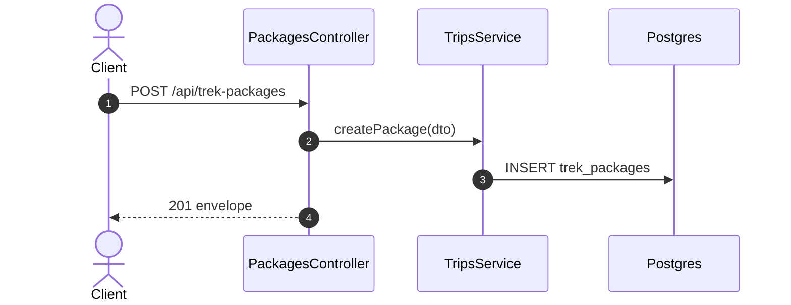

# POST /api/trek-packages: Create a trek package

> Module `trips`. Format: `02-templates/04-api-endpoint-template.md`, with Mermaid in place of PlantUML (D-017). Envelope: D-002.

[TOC]

---
## Overview

Creates a package in `DRAFT`. Publishing is `PATCH` with `status: PUBLISHED`. Accepted variants restrict which hardware `rentals` may allocate for trips of this package (Q50); empty means any.

## API Specification

| API        | URL             |
| ---------- | --------------- |
| POST | /api/trek-packages |
| Permission | Operator |
| Traces | UC-31 (new), FR-TRIP-02 (new), US-023, Q70, Q50 |

## Request sample

```json
{
  "code": "TN-PD-3D",
  "name": "Ta Nang - Phan Dung, 3 days",
  "summary": "Grassland ridges across three provinces",
  "description": "Day 1: ...",
  "region": "Lam Dong - Binh Thuan",
  "durationDays": 3,
  "difficulty": "MODERATE",
  "minGroupSize": 4,
  "maxGroupSize": 12,
  "acceptedVariantIds": [
    "hv-03...",
    "hv-04..."
  ]
}
```

| Field | Description | Data Type | Required | Examples |
| --- | --- | --- | --- | --- |
| code | Unique, upper-case, dash-separated | string | yes | `TN-PD-3D` |
| name | 1 to 120 chars | string | yes | `Ta Nang - Phan Dung, 3 days` |
| summary | Up to 200 chars | string | yes | `Grassland ridges` |
| description | Markdown text | string | yes | `Day 1: ...` |
| region | Free text | string | yes | `Lam Dong` |
| durationDays | 1 to 30 | int | yes | `3` |
| difficulty | Difficulty enum | enum | yes | `MODERATE` |
| minGroupSize | 1 or more | int | yes | `4` |
| maxGroupSize | At least minGroupSize | int | yes | `12` |
| acceptedVariantIds | Active variants; empty for any | uuid[] | no | `hv-03...` |

## Response sample

```json
{
  "result": {
    "id": "pk-01...",
    "code": "TN-PD-3D",
    "name": "Ta Nang - Phan Dung, 3 days",
    "summary": "Grassland ridges across three provinces",
    "region": "Lam Dong - Binh Thuan",
    "durationDays": 3,
    "difficulty": "MODERATE",
    "minGroupSize": 4,
    "maxGroupSize": 12,
    "acceptedVariants": [
      {
        "id": "hv-03...",
        "code": "treklink-v3"
      },
      {
        "id": "hv-04...",
        "code": "treklink-v4"
      }
    ],
    "coverImageUrl": null,
    "status": "DRAFT"
  },
  "isSuccess": true,
  "statusCode": 201,
  "message": "Trek package created"
}
```

## Validation

<table>
    <th>Status code</th>
    <th>Description</th>
    <th>Examples</th>
    <tbody>
        <tr>
            <td>400</td>
            <td>Validation, including maxGroupSize below minGroupSize (<code>VALIDATION_FAILED</code>)</td>
<td>

```json
{
  "result": {
    "errorCode": "VALIDATION_FAILED"
  },
  "isSuccess": false,
  "statusCode": 400,
  "message": "maxGroupSize must be at least minGroupSize."
}
```
</td>
        </tr>
        <tr>
            <td>401</td>
            <td>Missing, malformed or expired access token (<code>UNAUTHENTICATED</code>)</td>
<td>

```json
{
  "result": {
    "errorCode": "UNAUTHENTICATED"
  },
  "isSuccess": false,
  "statusCode": 401,
  "message": "Authentication required."
}
```
</td>
        </tr>
        <tr>
            <td>403</td>
            <td>Authenticated, but the caller's role or policy does not allow this action (<code>FORBIDDEN</code>)</td>
<td>

```json
{
  "result": {
    "errorCode": "FORBIDDEN"
  },
  "isSuccess": false,
  "statusCode": 403,
  "message": "You do not have permission to perform this action."
}
```
</td>
        </tr>
        <tr>
            <td>409</td>
            <td>Code used (<code>PACKAGE_CODE_TAKEN</code>)</td>
<td>

```json
{
  "result": {
    "errorCode": "PACKAGE_CODE_TAKEN"
  },
  "isSuccess": false,
  "statusCode": 409,
  "message": "A package with this code already exists."
}
```
</td>
        </tr>
    </tbody>
</table>

## Activity Diagram



## Sequence Diagram


