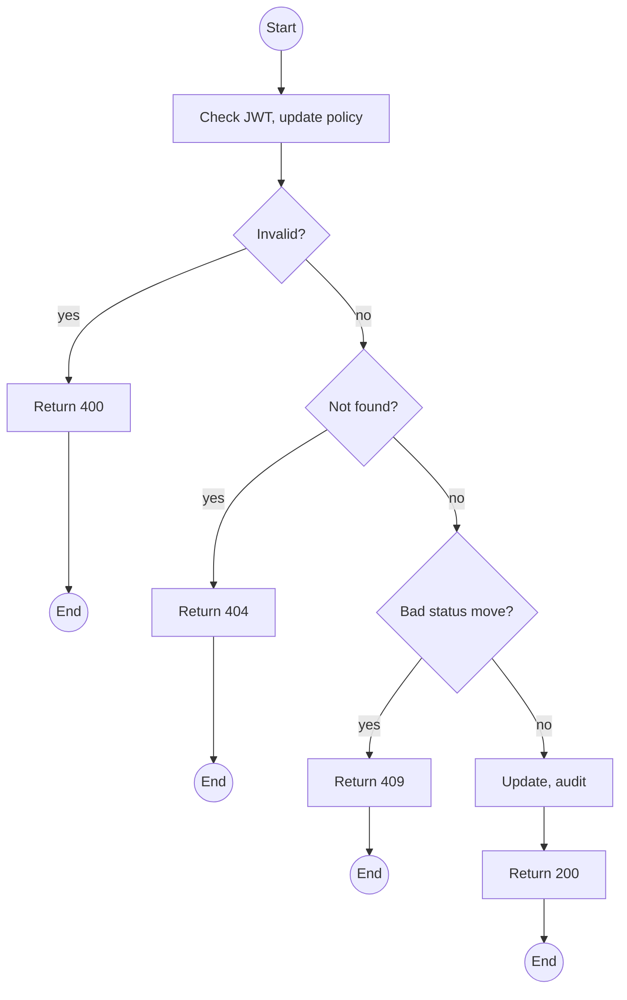
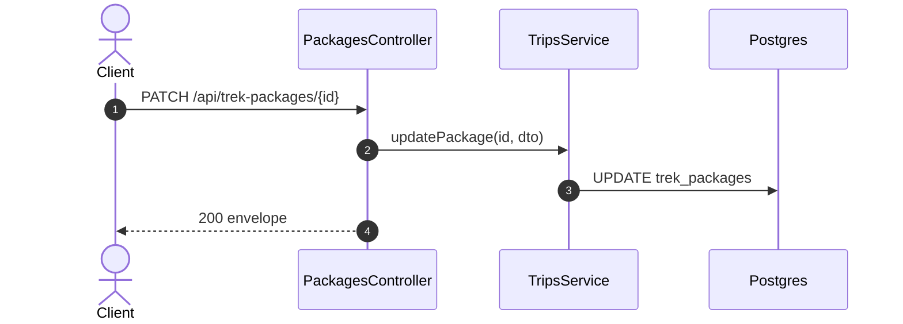

# PATCH /api/trek-packages/:id: Edit, publish or archive a package

> Module `trips`. Format: `02-templates/04-api-endpoint-template.md`, with Mermaid in place of PlantUML (D-017). Envelope: D-002.

[TOC]

---
## Overview

Edits package fields or moves status `DRAFT` to `PUBLISHED` to `ARCHIVED`. Archiving leaves existing trips untouched and blocks new ones. Group-size changes do not alter existing trips.

## API Specification

| API        | URL             |
| ---------- | --------------- |
| PATCH | /api/trek-packages/:id |
| Permission | Operator |
| Traces | FR-TRIP-02, US-023, REQ-ERR-05 |

### Path parameters

| Field | Description | Data Type | Examples |
| --- | --- | --- | --- |
| id | Package id | uuid | `pk-01...` |

## Request sample

```json
{
  "status": "PUBLISHED"
}
```

| Field | Description | Data Type | Required | Examples |
| --- | --- | --- | --- | --- |
| status | PUBLISHED or ARCHIVED; no return to DRAFT | enum | no | `PUBLISHED` |
| name, summary, description, region, durationDays, difficulty, minGroupSize, maxGroupSize, acceptedVariantIds | As in create | various | no | n/a |

## Response sample

```json
{
  "result": {
    "id": "pk-01...",
    "code": "TN-PD-3D",
    "name": "Ta Nang - Phan Dung, 3 days",
    "summary": "Grassland ridges across three provinces",
    "region": "Lam Dong - Binh Thuan",
    "durationDays": 3,
    "difficulty": "MODERATE",
    "minGroupSize": 4,
    "maxGroupSize": 12,
    "acceptedVariants": [
      {
        "id": "hv-03...",
        "code": "treklink-v3"
      },
      {
        "id": "hv-04...",
        "code": "treklink-v4"
      }
    ],
    "coverImageUrl": null,
    "status": "PUBLISHED"
  },
  "isSuccess": true,
  "statusCode": 200,
  "message": "Trek package updated"
}
```

## Validation

<table>
    <th>Status code</th>
    <th>Description</th>
    <th>Examples</th>
    <tbody>
        <tr>
            <td>400</td>
            <td>Validation (<code>VALIDATION_FAILED</code>)</td>
<td>

```json
{
  "result": {
    "errorCode": "VALIDATION_FAILED"
  },
  "isSuccess": false,
  "statusCode": 400,
  "message": "maxGroupSize must be at least minGroupSize."
}
```
</td>
        </tr>
        <tr>
            <td>401</td>
            <td>Missing, malformed or expired access token (<code>UNAUTHENTICATED</code>)</td>
<td>

```json
{
  "result": {
    "errorCode": "UNAUTHENTICATED"
  },
  "isSuccess": false,
  "statusCode": 401,
  "message": "Authentication required."
}
```
</td>
        </tr>
        <tr>
            <td>403</td>
            <td>Authenticated, but the caller's role or policy does not allow this action (<code>FORBIDDEN</code>)</td>
<td>

```json
{
  "result": {
    "errorCode": "FORBIDDEN"
  },
  "isSuccess": false,
  "statusCode": 403,
  "message": "You do not have permission to perform this action."
}
```
</td>
        </tr>
        <tr>
            <td>404</td>
            <td>No such package (<code>NOT_FOUND</code>)</td>
<td>

```json
{
  "result": {
    "errorCode": "NOT_FOUND"
  },
  "isSuccess": false,
  "statusCode": 404,
  "message": "Trek package not found."
}
```
</td>
        </tr>
        <tr>
            <td>409</td>
            <td>Status move not allowed (<code>INVALID_STATE_TRANSITION</code>)</td>
<td>

```json
{
  "result": {
    "errorCode": "INVALID_STATE_TRANSITION"
  },
  "isSuccess": false,
  "statusCode": 409,
  "message": "An archived package cannot be published again."
}
```
</td>
        </tr>
    </tbody>
</table>

## Activity Diagram



## Sequence Diagram


