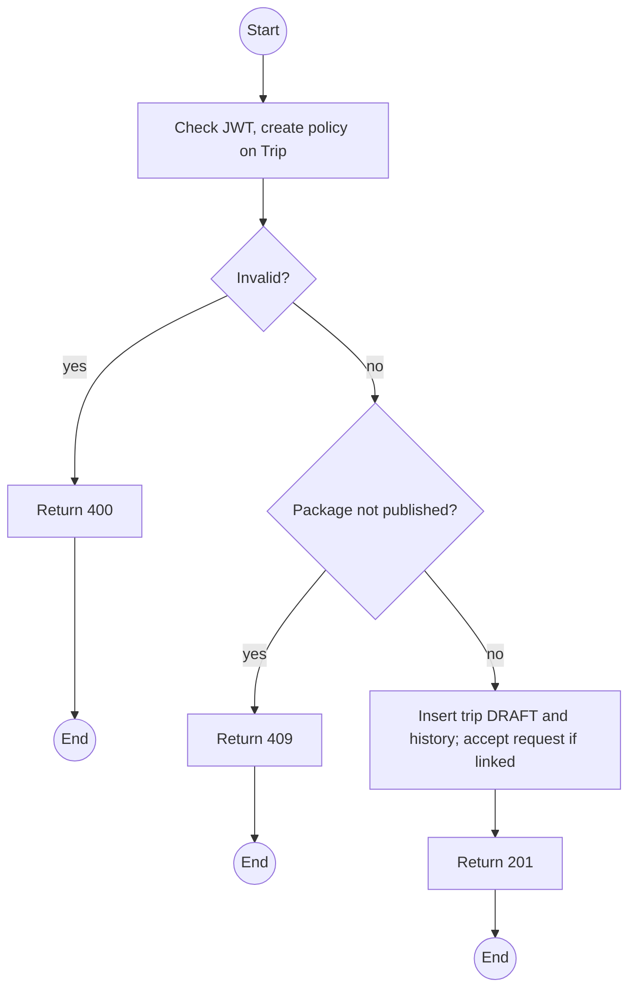
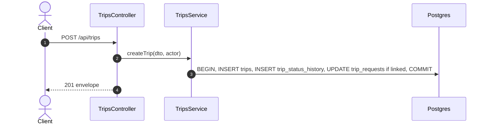

# POST /api/trips: Schedule a trip

> Module `trips`. Format: `02-templates/04-api-endpoint-template.md`, with Mermaid in place of PlantUML (D-017). Envelope: D-002.

[TOC]

---
## Overview

Creates a trip from a published package in `DRAFT`. Optionally links the Guide request it answers, which marks the request `ACCEPTED`.

## API Specification

| API        | URL             |
| ---------- | --------------- |
| POST | /api/trips |
| Permission | Operator |
| Traces | UC-35 (new), FR-TRIP-03 (new), REQ-EVT-01, Q65, Q68 |

## Request sample

```json
{
  "packageId": "pk-01...",
  "title": "Ta Nang - Phan Dung, 10 to 12 Oct",
  "startAt": "2026-10-10T00:00:00Z",
  "endAt": "2026-10-12T11:00:00Z",
  "capacity": 12,
  "requiredGuideCount": 2,
  "requestId": null
}
```

| Field | Description | Data Type | Required | Examples |
| --- | --- | --- | --- | --- |
| packageId | Published package | uuid | yes | `pk-01...` |
| title | Defaults to package name plus dates | string | no | `Ta Nang...` |
| startAt | UTC, in the future | datetime | yes | `2026-10-10T00:00:00Z` |
| endAt | After startAt | datetime | yes | `2026-10-12T11:00:00Z` |
| capacity | At least package minGroupSize | int | yes | `12` |
| requiredGuideCount | Default `trips.defaultRequiredGuideCount` | int | no | `2` |
| requestId | Guide request being accepted | uuid | no | `tr-4...` |

## Response sample

```json
{
  "result": {
    "id": "a1c3e5f7-2b4d-4f6a-8c0e-1a2b3c4d5e6f",
    "code": "TRP-2026-1010-TNPD",
    "title": "Ta Nang - Phan Dung, 10 to 12 Oct",
    "package": {
      "id": "pk-01...",
      "code": "TN-PD-3D"
    },
    "startAt": "2026-10-10T00:00:00Z",
    "endAt": "2026-10-12T11:00:00Z",
    "capacity": 12,
    "seatsTaken": 0,
    "seatsLeft": 12,
    "requiredGuideCount": 2,
    "guidesSatisfied": false,
    "status": "DRAFT",
    "guides": []
  },
  "isSuccess": true,
  "statusCode": 201,
  "message": "Trip created"
}
```

## Validation

<table>
    <th>Status code</th>
    <th>Description</th>
    <th>Examples</th>
    <tbody>
        <tr>
            <td>400</td>
            <td>Window or capacity invalid (<code>VALIDATION_FAILED</code>)</td>
<td>

```json
{
  "result": {
    "errorCode": "VALIDATION_FAILED"
  },
  "isSuccess": false,
  "statusCode": 400,
  "message": "endAt must be later than startAt."
}
```
</td>
        </tr>
        <tr>
            <td>401</td>
            <td>Missing, malformed or expired access token (<code>UNAUTHENTICATED</code>)</td>
<td>

```json
{
  "result": {
    "errorCode": "UNAUTHENTICATED"
  },
  "isSuccess": false,
  "statusCode": 401,
  "message": "Authentication required."
}
```
</td>
        </tr>
        <tr>
            <td>403</td>
            <td>Authenticated, but the caller's role or policy does not allow this action (<code>FORBIDDEN</code>)</td>
<td>

```json
{
  "result": {
    "errorCode": "FORBIDDEN"
  },
  "isSuccess": false,
  "statusCode": 403,
  "message": "You do not have permission to perform this action."
}
```
</td>
        </tr>
        <tr>
            <td>409</td>
            <td>Package not published (<code>PACKAGE_NOT_PUBLISHED</code>)</td>
<td>

```json
{
  "result": {
    "errorCode": "PACKAGE_NOT_PUBLISHED"
  },
  "isSuccess": false,
  "statusCode": 409,
  "message": "Trips can only be scheduled from a published package."
}
```
</td>
        </tr>
        <tr>
            <td>409</td>
            <td>Request already decided (<code>INVALID_STATE_TRANSITION</code>)</td>
<td>

```json
{
  "result": {
    "errorCode": "INVALID_STATE_TRANSITION"
  },
  "isSuccess": false,
  "statusCode": 409,
  "message": "This trip request has already been decided."
}
```
</td>
        </tr>
    </tbody>
</table>

## Activity Diagram



## Sequence Diagram


