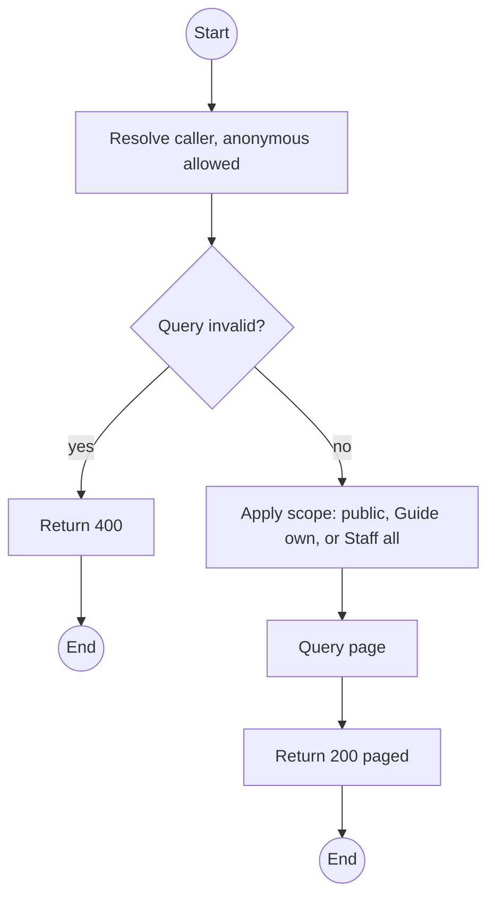
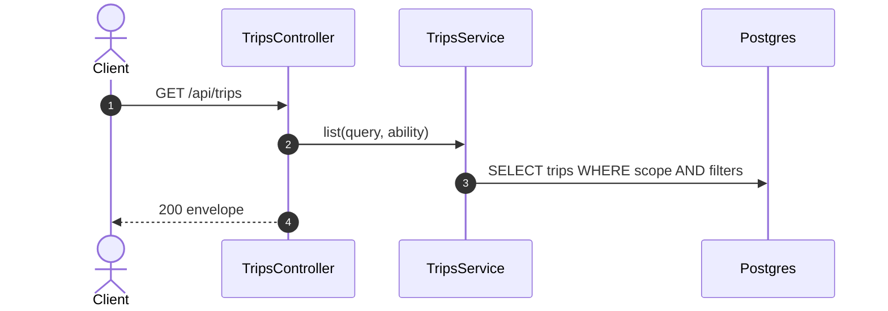

# GET /api/trips: List trips

> Module `trips`. Format: `02-templates/04-api-endpoint-template.md`, with Mermaid in place of PlantUML (D-017). Envelope: D-002.

[TOC]

---
## Overview

Paged trip list. Anonymous callers and Customers see `BOOKING_OPEN` trips with seats left. Guides see their assigned trips in any status (`mine=true` is implied). Staff see all and may filter.

## API Specification

| API        | URL             |
| ---------- | --------------- |
| GET | /api/trips |
| Permission | Public (BOOKING_OPEN); Operator, Admin (all); Guide (own) |
| Traces | UC-01, UC-14, FR-TRIP-01, FR-AUTH-03, US-037, BR-13 |

### Query parameters

| Field | Description | Data Type | Required | Examples |
| --- | --- | --- | --- | --- |
| status | One or more statuses, Staff and Guide only | enum[] | no | `READY,IN_PROGRESS` |
| packageId | Package filter | uuid | no | `pk-01...` |
| from | Trips ending after | datetime | no | `2026-10-01T00:00:00Z` |
| to | Trips starting before | datetime | no | `2026-10-31T00:00:00Z` |
| guideId | Staff only | uuid | no | `g-1...` |
| pageNumber | 1-based | int | no | `1` |
| pageSize | Default 20, max 100 | int | no | `20` |

## Request sample

No request body. Query string example:

```
GET /api/trips?status=IN_PROGRESS
```

## Response sample

```json
{
  "result": {
    "items": [
      {
        "id": "a1c3e5f7-2b4d-4f6a-8c0e-1a2b3c4d5e6f",
        "code": "TRP-2026-1010-TNPD",
        "title": "Ta Nang - Phan Dung, 10 to 12 Oct",
        "package": {
          "id": "pk-01...",
          "code": "TN-PD-3D"
        },
        "startAt": "2026-10-10T00:00:00Z",
        "endAt": "2026-10-12T11:00:00Z",
        "capacity": 12,
        "seatsTaken": 5,
        "seatsLeft": 7,
        "requiredGuideCount": 2,
        "guidesSatisfied": true,
        "status": "BOOKING_OPEN",
        "guides": [
          {
            "id": "g-1...",
            "fullName": "Tran Minh",
            "role": "LEAD"
          },
          {
            "id": "g-2...",
            "fullName": "Le Hoa",
            "role": "ASSISTANT"
          }
        ]
      }
    ],
    "pageNumber": 1,
    "pageSize": 20,
    "totalCount": 1,
    "totalPages": 1
  },
  "isSuccess": true,
  "statusCode": 200,
  "message": "Trips retrieved"
}
```

### Rules

Public items omit `guides[].phoneNumber` and participant data (REQ-UBI-04).

## Validation

<table>
    <th>Status code</th>
    <th>Description</th>
    <th>Examples</th>
    <tbody>
        <tr>
            <td>400</td>
            <td>Bad filter (<code>VALIDATION_FAILED</code>)</td>
<td>

```json
{
  "result": {
    "errorCode": "VALIDATION_FAILED"
  },
  "isSuccess": false,
  "statusCode": 400,
  "message": "to must be later than from."
}
```
</td>
        </tr>
    </tbody>
</table>

## Activity Diagram



## Sequence Diagram


