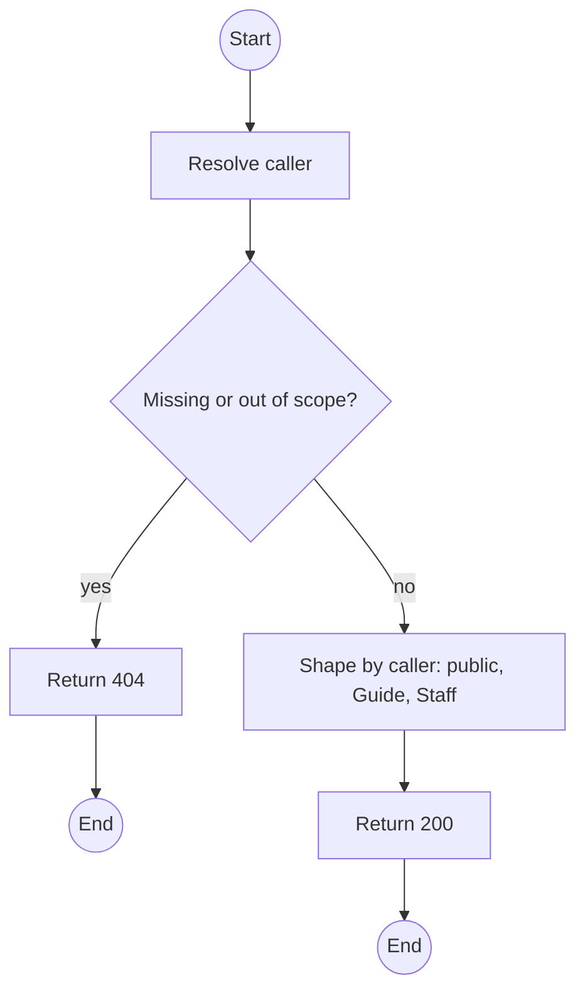
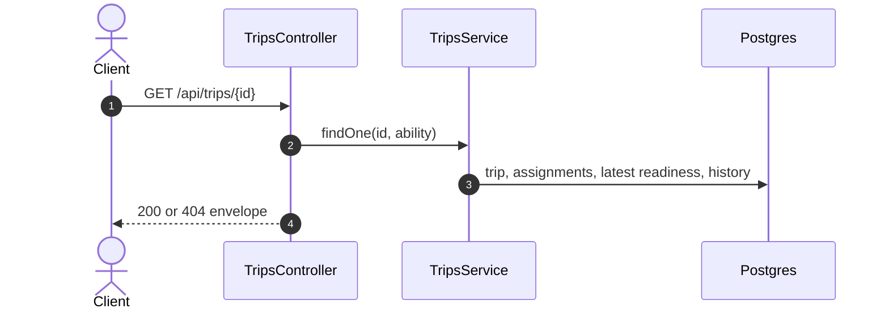

# GET /api/trips/:id: Trip detail

> Module `trips`. Format: `02-templates/04-api-endpoint-template.md`, with Mermaid in place of PlantUML (D-017). Envelope: D-002.

[TOC]

---
## Overview

One trip with Guides, seats, readiness state and status history. Guides requesting a trip that is not theirs receive 404 (E04-5); the public view of a `BOOKING_OPEN` trip omits everything but schedule, package and seats.

## API Specification

| API        | URL             |
| ---------- | --------------- |
| GET | /api/trips/:id |
| Permission | Public (BOOKING_OPEN, reduced view); Operator, Admin; Guide (own) |
| Traces | UC-14, FR-AUTH-03, US-037, E04-5 |

### Path parameters

| Field | Description | Data Type | Examples |
| --- | --- | --- | --- |
| id | Trip id | uuid | `a1c3e5f7-2b4d-4f6a-8c0e-1a2b3c4d5e6f` |

## Request sample

No request body.

## Response sample

```json
{
  "result": {
    "id": "a1c3e5f7-2b4d-4f6a-8c0e-1a2b3c4d5e6f",
    "code": "TRP-2026-1010-TNPD",
    "title": "Ta Nang - Phan Dung, 10 to 12 Oct",
    "package": {
      "id": "pk-01...",
      "code": "TN-PD-3D"
    },
    "startAt": "2026-10-10T00:00:00Z",
    "endAt": "2026-10-12T11:00:00Z",
    "capacity": 12,
    "seatsTaken": 5,
    "seatsLeft": 7,
    "requiredGuideCount": 2,
    "guidesSatisfied": true,
    "status": "BOOKING_OPEN",
    "guides": [
      {
        "id": "g-1...",
        "fullName": "Tran Minh",
        "role": "LEAD"
      },
      {
        "id": "g-2...",
        "fullName": "Le Hoa",
        "role": "ASSISTANT"
      }
    ],
    "readiness": {
      "latest": {
        "result": "PASS",
        "guide": "Tran Minh",
        "at": "2026-10-09T23:30:00Z"
      }
    },
    "history": [
      {
        "from": "PREPARING",
        "to": "BOOKING_OPEN",
        "actor": "op.lan",
        "at": "2026-10-01T03:00:00Z"
      }
    ]
  },
  "isSuccess": true,
  "statusCode": 200,
  "message": "Trip retrieved"
}
```

## Validation

<table>
    <th>Status code</th>
    <th>Description</th>
    <th>Examples</th>
    <tbody>
        <tr>
            <td>404</td>
            <td>No such trip, or outside the caller's scope (<code>NOT_FOUND</code>)</td>
<td>

```json
{
  "result": {
    "errorCode": "NOT_FOUND"
  },
  "isSuccess": false,
  "statusCode": 404,
  "message": "Trip not found."
}
```
</td>
        </tr>
    </tbody>
</table>

## Activity Diagram



## Sequence Diagram


