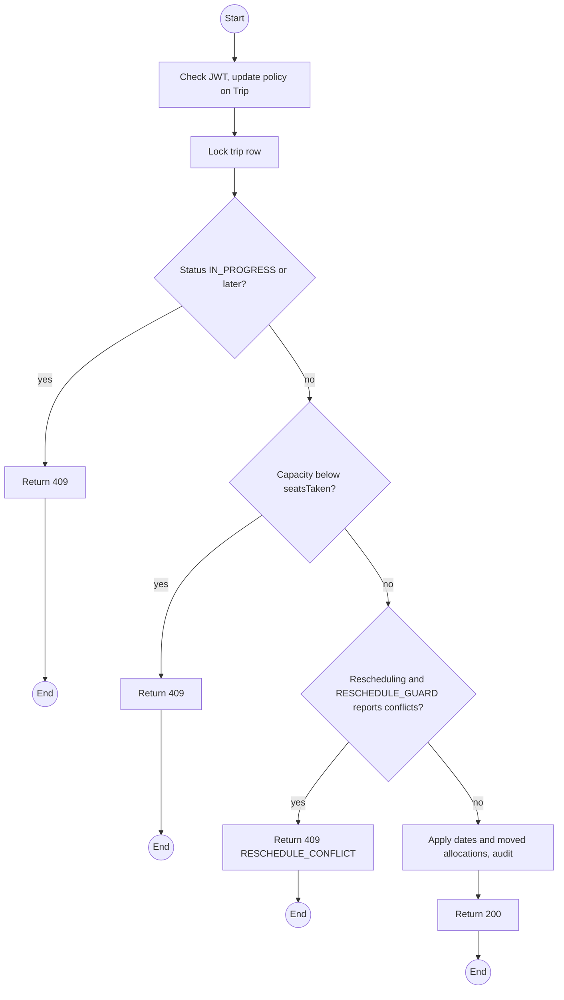
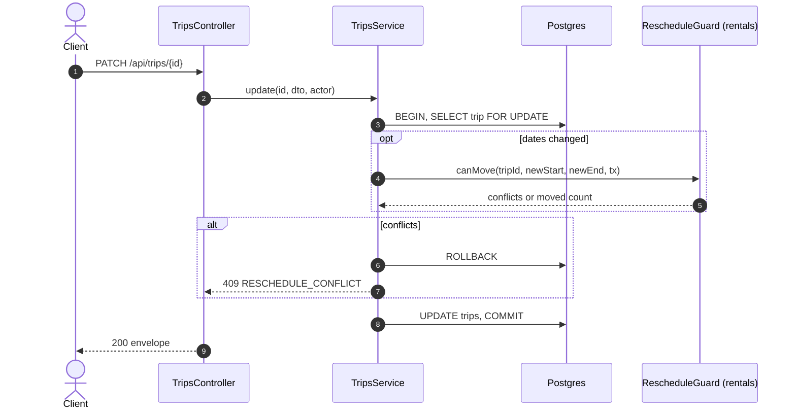

# PATCH /api/trips/:id: Edit or reschedule a trip

> Module `trips`. Format: `02-templates/04-api-endpoint-template.md`, with Mermaid in place of PlantUML (D-017). Envelope: D-002.

[TOC]

---
## Overview

Edits title, capacity or required guide count, or reschedules `startAt` and `endAt`. A reschedule asks `rentals` (through `RESCHEDULE_GUARD`) to move every device allocation to the new window; either everything moves or nothing does. Not allowed once the trip is `IN_PROGRESS`.

## API Specification

| API        | URL             |
| ---------- | --------------- |
| PATCH | /api/trips/:id |
| Permission | Operator |
| Traces | FR-TRIP-03, REQ-EVT-07, REQ-STA-05, REQ-ERR-03, REQ-ERR-04, Q72 |

### Path parameters

| Field | Description | Data Type | Examples |
| --- | --- | --- | --- |
| id | Trip id | uuid | `a1c3e5f7-2b4d-4f6a-8c0e-1a2b3c4d5e6f` |

## Request sample

```json
{
  "startAt": "2026-10-17T00:00:00Z",
  "endAt": "2026-10-19T11:00:00Z",
  "reason": "Storm forecast for 10 Oct"
}
```

| Field | Description | Data Type | Required | Examples |
| --- | --- | --- | --- | --- |
| title | Display title | string | no | `...` |
| startAt | New start | datetime | no | `2026-10-17T00:00:00Z` |
| endAt | New end | datetime | no | `2026-10-19T11:00:00Z` |
| capacity | Not below seatsTaken | int | no | `12` |
| requiredGuideCount | At least 1 | int | no | `2` |
| reason | Required for a reschedule; sent to booked customers | string | no | `Storm forecast` |

## Response sample

```json
{
  "result": {
    "id": "a1c3e5f7-2b4d-4f6a-8c0e-1a2b3c4d5e6f",
    "code": "TRP-2026-1010-TNPD",
    "title": "Ta Nang - Phan Dung, 10 to 12 Oct",
    "package": {
      "id": "pk-01...",
      "code": "TN-PD-3D"
    },
    "startAt": "2026-10-17T00:00:00Z",
    "endAt": "2026-10-19T11:00:00Z",
    "capacity": 12,
    "seatsTaken": 5,
    "seatsLeft": 7,
    "requiredGuideCount": 2,
    "guidesSatisfied": true,
    "status": "BOOKING_OPEN",
    "guides": [
      {
        "id": "g-1...",
        "fullName": "Tran Minh",
        "role": "LEAD"
      },
      {
        "id": "g-2...",
        "fullName": "Le Hoa",
        "role": "ASSISTANT"
      }
    ],
    "movedAllocationCount": 5
  },
  "isSuccess": true,
  "statusCode": 200,
  "message": "Trip updated"
}
```

## Validation

<table>
    <th>Status code</th>
    <th>Description</th>
    <th>Examples</th>
    <tbody>
        <tr>
            <td>400</td>
            <td>Invalid window or missing reason (<code>VALIDATION_FAILED</code>)</td>
<td>

```json
{
  "result": {
    "errorCode": "VALIDATION_FAILED"
  },
  "isSuccess": false,
  "statusCode": 400,
  "message": "reason is required when rescheduling."
}
```
</td>
        </tr>
        <tr>
            <td>401</td>
            <td>Missing, malformed or expired access token (<code>UNAUTHENTICATED</code>)</td>
<td>

```json
{
  "result": {
    "errorCode": "UNAUTHENTICATED"
  },
  "isSuccess": false,
  "statusCode": 401,
  "message": "Authentication required."
}
```
</td>
        </tr>
        <tr>
            <td>403</td>
            <td>Authenticated, but the caller's role or policy does not allow this action (<code>FORBIDDEN</code>)</td>
<td>

```json
{
  "result": {
    "errorCode": "FORBIDDEN"
  },
  "isSuccess": false,
  "statusCode": 403,
  "message": "You do not have permission to perform this action."
}
```
</td>
        </tr>
        <tr>
            <td>404</td>
            <td>No such trip (<code>NOT_FOUND</code>)</td>
<td>

```json
{
  "result": {
    "errorCode": "NOT_FOUND"
  },
  "isSuccess": false,
  "statusCode": 404,
  "message": "Trip not found."
}
```
</td>
        </tr>
        <tr>
            <td>409</td>
            <td>Trip in progress or finished (<code>INVALID_STATE_TRANSITION</code>)</td>
<td>

```json
{
  "result": {
    "errorCode": "INVALID_STATE_TRANSITION"
  },
  "isSuccess": false,
  "statusCode": 409,
  "message": "A trip in progress cannot be rescheduled."
}
```
</td>
        </tr>
        <tr>
            <td>409</td>
            <td>Capacity under booked seats (<code>CAPACITY_BELOW_BOOKED</code>)</td>
<td>

```json
{
  "result": {
    "errorCode": "CAPACITY_BELOW_BOOKED"
  },
  "isSuccess": false,
  "statusCode": 409,
  "message": "Capacity cannot be lower than the 5 seats already booked."
}
```
</td>
        </tr>
        <tr>
            <td>409</td>
            <td>Allocations cannot move (<code>RESCHEDULE_CONFLICT</code>)</td>
<td>

```json
{
  "result": {
    "errorCode": "RESCHEDULE_CONFLICT"
  },
  "isSuccess": false,
  "statusCode": 409,
  "message": "TL-0042 is allocated to TRP-2026-1017-BML over the new dates."
}
```
</td>
        </tr>
    </tbody>
</table>

## Activity Diagram



## Sequence Diagram


