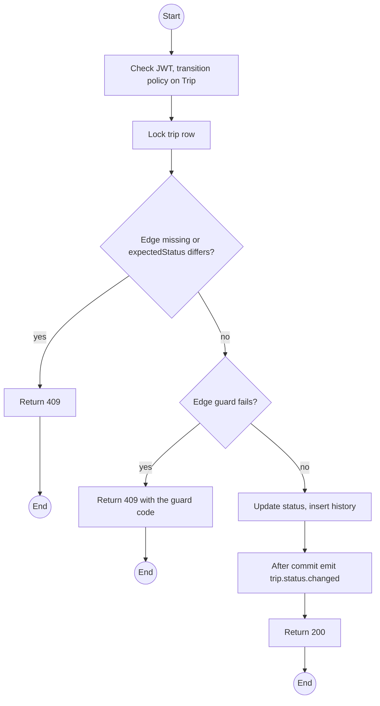
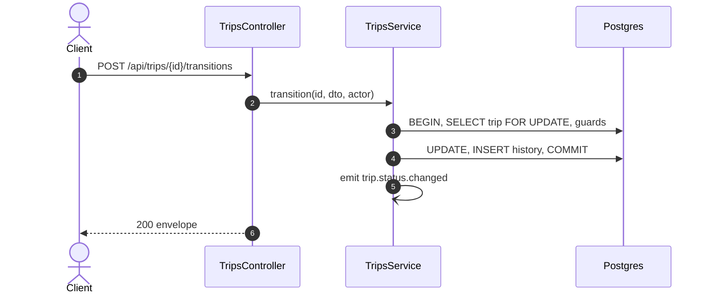

# POST /api/trips/:id/transitions: Move a trip through its lifecycle

> Module `trips`. Format: `02-templates/04-api-endpoint-template.md`, with Mermaid in place of PlantUML (D-017). Envelope: D-002.

[TOC]

---
## Overview

Takes one edge of the trip FSM (`design.md` §2.1). Starting emits `trip.status.changed` so rented devices go `IN_FIELD`; finishing accepts the device ids the Guide reports missing; cancelling cascades to bookings in `rentals` without a customer fee; declaring an emergency alerts every Staff session.

## API Specification

| API        | URL             |
| ---------- | --------------- |
| POST | /api/trips/:id/transitions |
| Permission | Operator (all edges); Lead Guide of the trip (start, finish) |
| Traces | FR-TRIP-04 (new), REQ-UBI-01, REQ-EVT-04, REQ-EVT-05, REQ-EVT-06, REQ-EVT-09, REQ-STA-04, Q66, Q71 |

### Path parameters

| Field | Description | Data Type | Examples |
| --- | --- | --- | --- |
| id | Trip id | uuid | `a1c3e5f7-2b4d-4f6a-8c0e-1a2b3c4d5e6f` |

## Request sample

```json
{
  "toStatus": "FINISHED",
  "note": "All back at basecamp 17:40",
  "missingDeviceIds": [
    "0d3f6a2b-..."
  ],
  "expectedStatus": "IN_PROGRESS"
}
```

| Field | Description | Data Type | Required | Examples |
| --- | --- | --- | --- | --- |
| toStatus | Target state | enum | yes | `FINISHED` |
| note | Required for CANCELLED, EMERGENCY and leaving EMERGENCY | string | no | `All back` |
| missingDeviceIds | Only with FINISHED | uuid[] | no | `0d3f...` |
| expectedStatus | State the caller saw | enum | no | `IN_PROGRESS` |

## Response sample

```json
{
  "result": {
    "id": "a1c3e5f7-2b4d-4f6a-8c0e-1a2b3c4d5e6f",
    "status": "FINISHED",
    "statusChangedAt": "2026-10-12T10:45:00Z",
    "missingDeviceIds": [
      "0d3f6a2b-..."
    ]
  },
  "isSuccess": true,
  "statusCode": 200,
  "message": "Trip status changed"
}
```

## Validation

<table>
    <th>Status code</th>
    <th>Description</th>
    <th>Examples</th>
    <tbody>
        <tr>
            <td>400</td>
            <td>Note missing where required (<code>VALIDATION_FAILED</code>)</td>
<td>

```json
{
  "result": {
    "errorCode": "VALIDATION_FAILED"
  },
  "isSuccess": false,
  "statusCode": 400,
  "message": "note is required to declare an emergency."
}
```
</td>
        </tr>
        <tr>
            <td>401</td>
            <td>Missing, malformed or expired access token (<code>UNAUTHENTICATED</code>)</td>
<td>

```json
{
  "result": {
    "errorCode": "UNAUTHENTICATED"
  },
  "isSuccess": false,
  "statusCode": 401,
  "message": "Authentication required."
}
```
</td>
        </tr>
        <tr>
            <td>403</td>
            <td>Guide who is not the trip's Lead, or a Guide attempting an Operator-only edge (<code>FORBIDDEN</code>)</td>
<td>

```json
{
  "result": {
    "errorCode": "FORBIDDEN"
  },
  "isSuccess": false,
  "statusCode": 403,
  "message": "You do not have permission to perform this action."
}
```
</td>
        </tr>
        <tr>
            <td>404</td>
            <td>No such trip or not the caller's (<code>NOT_FOUND</code>)</td>
<td>

```json
{
  "result": {
    "errorCode": "NOT_FOUND"
  },
  "isSuccess": false,
  "statusCode": 404,
  "message": "Trip not found."
}
```
</td>
        </tr>
        <tr>
            <td>409</td>
            <td>Edge not allowed or state changed (<code>INVALID_STATE_TRANSITION</code>)</td>
<td>

```json
{
  "result": {
    "errorCode": "INVALID_STATE_TRANSITION"
  },
  "isSuccess": false,
  "statusCode": 409,
  "message": "Cannot move a trip from DRAFT to READY."
}
```
</td>
        </tr>
        <tr>
            <td>409</td>
            <td>No PASS readiness check (<code>READINESS_REQUIRED</code>)</td>
<td>

```json
{
  "result": {
    "errorCode": "READINESS_REQUIRED"
  },
  "isSuccess": false,
  "statusCode": 409,
  "message": "The Lead Guide must pass the readiness checklist before the trip starts."
}
```
</td>
        </tr>
        <tr>
            <td>409</td>
            <td>Opening bookings without a Lead Guide (<code>LEAD_GUIDE_REQUIRED</code>)</td>
<td>

```json
{
  "result": {
    "errorCode": "LEAD_GUIDE_REQUIRED"
  },
  "isSuccess": false,
  "statusCode": 409,
  "message": "Assign a Lead Guide before opening bookings."
}
```
</td>
        </tr>
    </tbody>
</table>

## Activity Diagram



## Sequence Diagram


