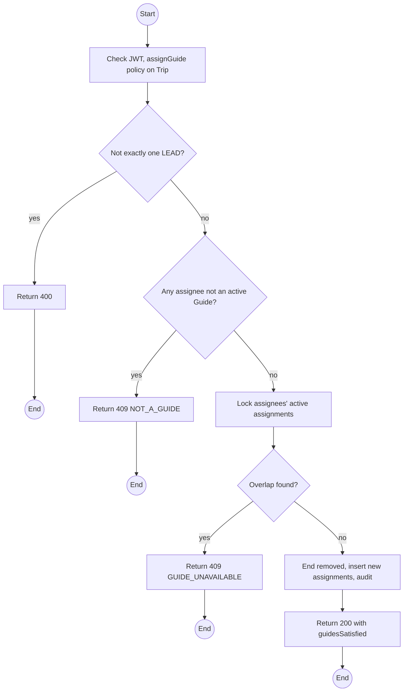
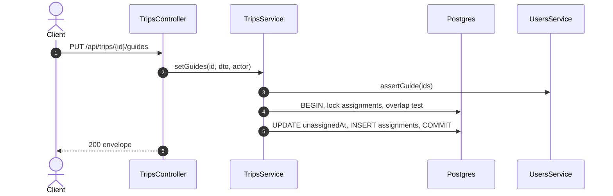

# PUT /api/trips/:id/guides: Assign Guides to a trip

> Module `trips`. Format: `02-templates/04-api-endpoint-template.md`, with Mermaid in place of PlantUML (D-017). Envelope: D-002.

[TOC]

---
## Overview

Replaces the Guide set of a trip. Each Guide must be an active Staff account with `GUIDE`, free of overlapping assignments. Exactly one `LEAD`. Returns `guidesSatisfied` so the Operator sees before confirming bookings whether the trip is staffed (E01-4: the conflict is visible before confirmation, not after).

## API Specification

| API        | URL             |
| ---------- | --------------- |
| PUT | /api/trips/:id/guides |
| Permission | Operator |
| Traces | UC-06, FR-TRIP-05 (new), FR-BOOK-04, US-029, BR-02, E01-4, REQ-EVT-03, REQ-STA-02, Q44, Q68 |

### Path parameters

| Field | Description | Data Type | Examples |
| --- | --- | --- | --- |
| id | Trip id | uuid | `a1c3e5f7-2b4d-4f6a-8c0e-1a2b3c4d5e6f` |

## Request sample

```json
{
  "guides": [
    {
      "guideId": "g-1...",
      "role": "LEAD"
    },
    {
      "guideId": "g-2...",
      "role": "ASSISTANT"
    }
  ]
}
```

| Field | Description | Data Type | Required | Examples |
| --- | --- | --- | --- | --- |
| guides | Complete new set; one LEAD | object[] | yes | n/a |
| guides[].guideId | Guide user id | uuid | yes | `g-1...` |
| guides[].role | LEAD or ASSISTANT | enum | yes | `LEAD` |

## Response sample

```json
{
  "result": {
    "tripId": "a1c3e5f7-2b4d-4f6a-8c0e-1a2b3c4d5e6f",
    "guides": [
      {
        "id": "g-1...",
        "fullName": "Tran Minh",
        "role": "LEAD"
      },
      {
        "id": "g-2...",
        "fullName": "Le Hoa",
        "role": "ASSISTANT"
      }
    ],
    "requiredGuideCount": 2,
    "guidesSatisfied": true
  },
  "isSuccess": true,
  "statusCode": 200,
  "message": "Guides assigned"
}
```

## Validation

<table>
    <th>Status code</th>
    <th>Description</th>
    <th>Examples</th>
    <tbody>
        <tr>
            <td>400</td>
            <td>No LEAD or more than one (<code>VALIDATION_FAILED</code>)</td>
<td>

```json
{
  "result": {
    "errorCode": "VALIDATION_FAILED"
  },
  "isSuccess": false,
  "statusCode": 400,
  "message": "Exactly one LEAD is required."
}
```
</td>
        </tr>
        <tr>
            <td>401</td>
            <td>Missing, malformed or expired access token (<code>UNAUTHENTICATED</code>)</td>
<td>

```json
{
  "result": {
    "errorCode": "UNAUTHENTICATED"
  },
  "isSuccess": false,
  "statusCode": 401,
  "message": "Authentication required."
}
```
</td>
        </tr>
        <tr>
            <td>403</td>
            <td>Authenticated, but the caller's role or policy does not allow this action (<code>FORBIDDEN</code>)</td>
<td>

```json
{
  "result": {
    "errorCode": "FORBIDDEN"
  },
  "isSuccess": false,
  "statusCode": 403,
  "message": "You do not have permission to perform this action."
}
```
</td>
        </tr>
        <tr>
            <td>404</td>
            <td>No such trip (<code>NOT_FOUND</code>)</td>
<td>

```json
{
  "result": {
    "errorCode": "NOT_FOUND"
  },
  "isSuccess": false,
  "statusCode": 404,
  "message": "Trip not found."
}
```
</td>
        </tr>
        <tr>
            <td>409</td>
            <td>Assignee not an active Guide (<code>NOT_A_GUIDE</code>)</td>
<td>

```json
{
  "result": {
    "errorCode": "NOT_A_GUIDE"
  },
  "isSuccess": false,
  "statusCode": 409,
  "message": "User le.hoa does not hold the GUIDE role."
}
```
</td>
        </tr>
        <tr>
            <td>409</td>
            <td>Guide on an overlapping trip (<code>GUIDE_UNAVAILABLE</code>)</td>
<td>

```json
{
  "result": {
    "errorCode": "GUIDE_UNAVAILABLE"
  },
  "isSuccess": false,
  "statusCode": 409,
  "message": "Tran Minh leads TRP-2026-1011-BML over overlapping dates."
}
```
</td>
        </tr>
        <tr>
            <td>409</td>
            <td>Trip finished or cancelled (<code>INVALID_STATE_TRANSITION</code>)</td>
<td>

```json
{
  "result": {
    "errorCode": "INVALID_STATE_TRANSITION"
  },
  "isSuccess": false,
  "statusCode": 409,
  "message": "Guides cannot be changed on a finished trip."
}
```
</td>
        </tr>
    </tbody>
</table>

## Activity Diagram



## Sequence Diagram


