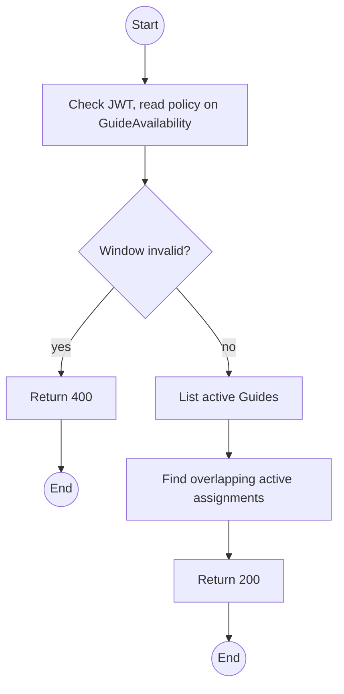
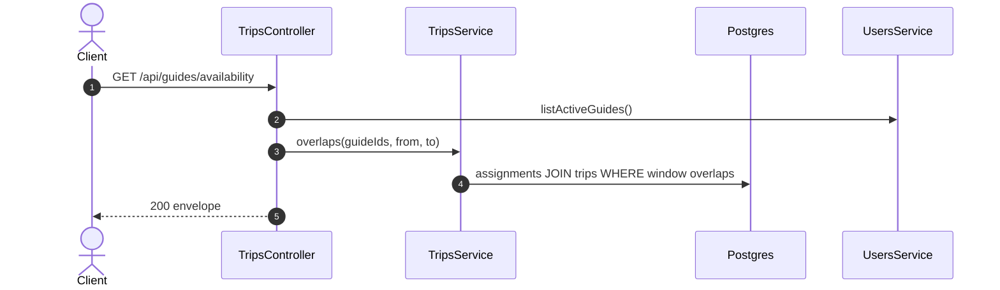

# GET /api/guides/availability: Guide availability for a window

> Module `trips`. Format: `02-templates/04-api-endpoint-template.md`, with Mermaid in place of PlantUML (D-017). Envelope: D-002.

[TOC]

---
## Overview

Lists active Guides with, for the given window, whether they are free and which trips overlap. Feeds the assign-guides dialog so conflicts are visible before assignment.

## API Specification

| API        | URL             |
| ---------- | --------------- |
| GET | /api/guides/availability |
| Permission | Operator |
| Traces | UC-06, E01-4, US-029 |

### Query parameters

| Field | Description | Data Type | Required | Examples |
| --- | --- | --- | --- | --- |
| from | Window start | datetime | yes | `2026-10-10T00:00:00Z` |
| to | Window end | datetime | yes | `2026-10-12T11:00:00Z` |
| excludeTripId | Ignore assignments on this trip (when editing it) | uuid | no | `a1c3e5f7-2b4d-4f6a-8c0e-1a2b3c4d5e6f` |

## Request sample

No request body. Query string example:

```
GET /api/guides/availability?from=2026-10-10T00:00:00Z&to=2026-10-12T11:00:00Z
```

## Response sample

```json
{
  "result": [
    {
      "guideId": "g-1...",
      "fullName": "Tran Minh",
      "skills": [
        "first aid"
      ],
      "available": true,
      "conflicts": []
    },
    {
      "guideId": "g-3...",
      "fullName": "Pham Son",
      "skills": [
        "rope rescue"
      ],
      "available": false,
      "conflicts": [
        {
          "tripId": "t-9...",
          "code": "TRP-2026-1011-BML",
          "startAt": "2026-10-11T00:00:00Z",
          "endAt": "2026-10-13T10:00:00Z"
        }
      ]
    }
  ],
  "isSuccess": true,
  "statusCode": 200,
  "message": "Guide availability computed"
}
```

## Validation

<table>
    <th>Status code</th>
    <th>Description</th>
    <th>Examples</th>
    <tbody>
        <tr>
            <td>400</td>
            <td>Invalid window (<code>VALIDATION_FAILED</code>)</td>
<td>

```json
{
  "result": {
    "errorCode": "VALIDATION_FAILED"
  },
  "isSuccess": false,
  "statusCode": 400,
  "message": "to must be later than from."
}
```
</td>
        </tr>
        <tr>
            <td>401</td>
            <td>Missing, malformed or expired access token (<code>UNAUTHENTICATED</code>)</td>
<td>

```json
{
  "result": {
    "errorCode": "UNAUTHENTICATED"
  },
  "isSuccess": false,
  "statusCode": 401,
  "message": "Authentication required."
}
```
</td>
        </tr>
        <tr>
            <td>403</td>
            <td>Authenticated, but the caller's role or policy does not allow this action (<code>FORBIDDEN</code>)</td>
<td>

```json
{
  "result": {
    "errorCode": "FORBIDDEN"
  },
  "isSuccess": false,
  "statusCode": 403,
  "message": "You do not have permission to perform this action."
}
```
</td>
        </tr>
    </tbody>
</table>

## Activity Diagram



## Sequence Diagram


