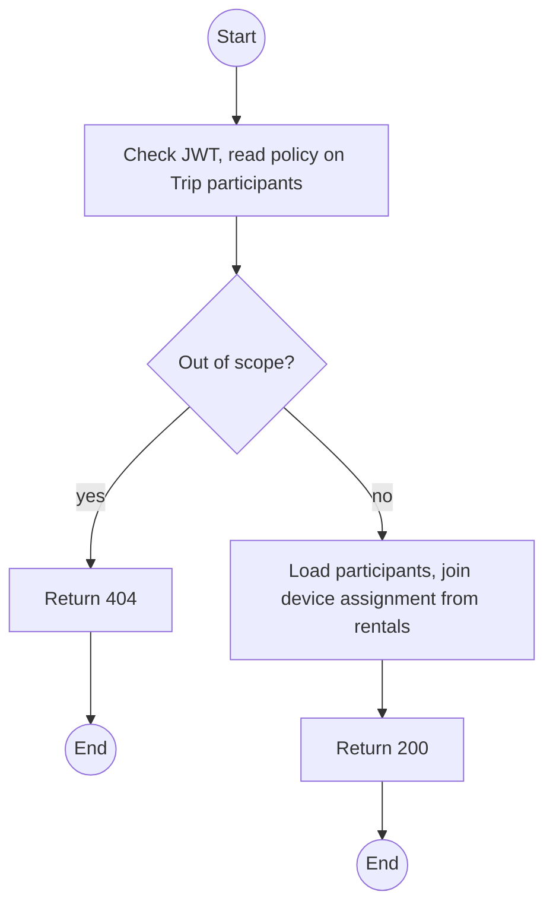
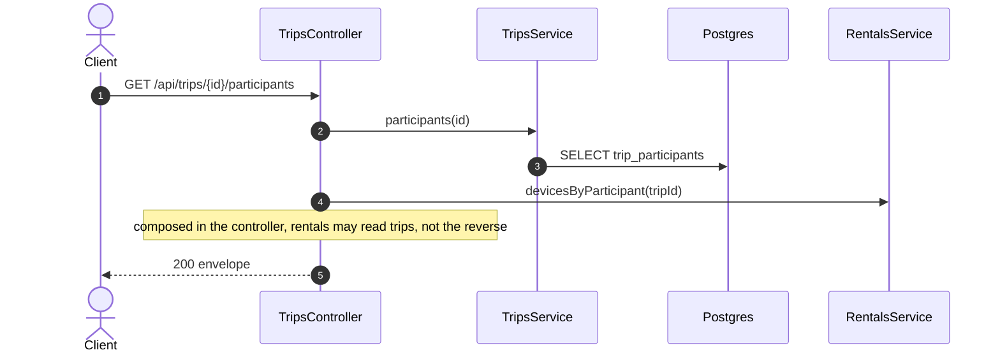

# GET /api/trips/:id/participants: Trip participants

> Module `trips`. Format: `02-templates/04-api-endpoint-template.md`, with Mermaid in place of PlantUML (D-017). Envelope: D-002.

[TOC]

---
## Overview

Participants of one trip, each linked to its booking and, once devices are handed out, to the device carried (from `rentals`). The Guide uses it as the roster and the source for reporting missing devices.

## API Specification

| API        | URL             |
| ---------- | --------------- |
| GET | /api/trips/:id/participants |
| Permission | Operator; Guide (own trip) |
| Traces | FR-TRIP-07 (new), US-040, Q69 |

### Path parameters

| Field | Description | Data Type | Examples |
| --- | --- | --- | --- |
| id | Trip id | uuid | `a1c3e5f7-2b4d-4f6a-8c0e-1a2b3c4d5e6f` |

## Request sample

No request body.

## Response sample

```json
{
  "result": [
    {
      "id": "tp-1...",
      "displayName": "Nguyen Van A",
      "phoneNumber": "0901234567",
      "bookingId": "bk-7...",
      "userId": "5b7e...",
      "device": {
        "id": "0d3f...",
        "assetTag": "TL-0042"
      }
    }
  ],
  "isSuccess": true,
  "statusCode": 200,
  "message": "Participants retrieved"
}
```

### Rules

The device join is composed by a controller in `RentalsModule` that serves this route, for the same dependency-direction reason as `/api/devices/availability`.

## Validation

<table>
    <th>Status code</th>
    <th>Description</th>
    <th>Examples</th>
    <tbody>
        <tr>
            <td>401</td>
            <td>Missing, malformed or expired access token (<code>UNAUTHENTICATED</code>)</td>
<td>

```json
{
  "result": {
    "errorCode": "UNAUTHENTICATED"
  },
  "isSuccess": false,
  "statusCode": 401,
  "message": "Authentication required."
}
```
</td>
        </tr>
        <tr>
            <td>403</td>
            <td>Authenticated, but the caller's role or policy does not allow this action (<code>FORBIDDEN</code>)</td>
<td>

```json
{
  "result": {
    "errorCode": "FORBIDDEN"
  },
  "isSuccess": false,
  "statusCode": 403,
  "message": "You do not have permission to perform this action."
}
```
</td>
        </tr>
        <tr>
            <td>404</td>
            <td>No such trip or not the Guide's (<code>NOT_FOUND</code>)</td>
<td>

```json
{
  "result": {
    "errorCode": "NOT_FOUND"
  },
  "isSuccess": false,
  "statusCode": 404,
  "message": "Trip not found."
}
```
</td>
        </tr>
    </tbody>
</table>

## Activity Diagram



## Sequence Diagram


