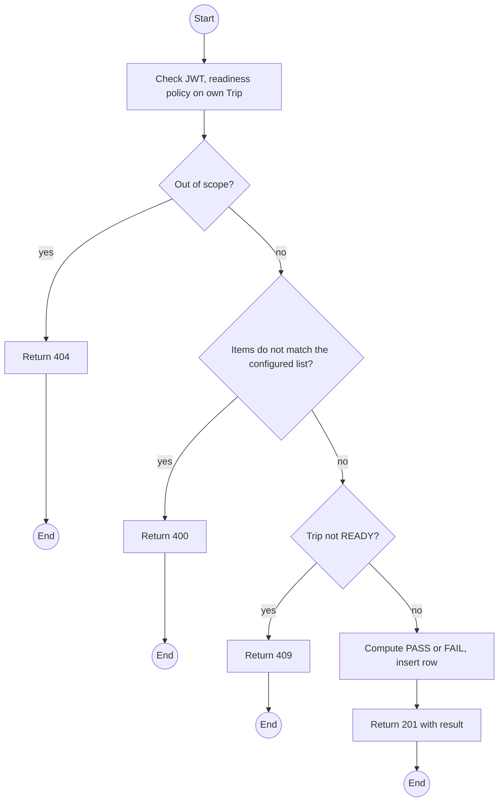
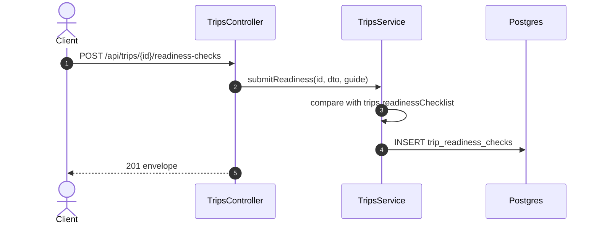

# POST /api/trips/:id/readiness-checks: Submit the readiness checklist

> Module `trips`. Format: `02-templates/04-api-endpoint-template.md`, with Mermaid in place of PlantUML (D-017). Envelope: D-002.

[TOC]

---
## Overview

The Guide ticks the checklist defined by `trips.readinessChecklist`. The result is `PASS` only if every mandatory item is checked. Each submission is a new row, so a failed check followed by a passing one leaves both on record.

## API Specification

| API        | URL             |
| ---------- | --------------- |
| POST | /api/trips/:id/readiness-checks |
| Permission | Guide assigned to the trip |
| Traces | UC-36 (new), FR-TRIP-06 (new), REQ-EVT-08, REQ-STA-04, Q73 |

### Path parameters

| Field | Description | Data Type | Examples |
| --- | --- | --- | --- |
| id | Trip id | uuid | `a1c3e5f7-2b4d-4f6a-8c0e-1a2b3c4d5e6f` |

## Request sample

```json
{
  "items": [
    {
      "key": "devices_charged",
      "checked": true
    },
    {
      "key": "gps_fix_all",
      "checked": true
    },
    {
      "key": "first_aid_kit",
      "checked": true
    },
    {
      "key": "weather_checked",
      "checked": true,
      "note": "Clear until Monday"
    },
    {
      "key": "emergency_contacts",
      "checked": true
    }
  ]
}
```

| Field | Description | Data Type | Required | Examples |
| --- | --- | --- | --- | --- |
| items | One entry per configured item | object[] | yes | n/a |
| items[].key | Item key from the parameter | string | yes | `gps_fix_all` |
| items[].checked | Done | bool | yes | `true` |
| items[].note | Optional | string | no | `Clear until Monday` |

## Response sample

```json
{
  "result": {
    "id": "rc-3...",
    "tripId": "a1c3e5f7-2b4d-4f6a-8c0e-1a2b3c4d5e6f",
    "result": "PASS",
    "missingMandatory": [],
    "createdAt": "2026-10-09T23:30:00Z"
  },
  "isSuccess": true,
  "statusCode": 201,
  "message": "Readiness checklist recorded"
}
```

## Validation

<table>
    <th>Status code</th>
    <th>Description</th>
    <th>Examples</th>
    <tbody>
        <tr>
            <td>400</td>
            <td>Unknown item key, or a configured item missing (<code>VALIDATION_FAILED</code>)</td>
<td>

```json
{
  "result": {
    "errorCode": "VALIDATION_FAILED"
  },
  "isSuccess": false,
  "statusCode": 400,
  "message": "items is missing gps_fix_all."
}
```
</td>
        </tr>
        <tr>
            <td>401</td>
            <td>Missing, malformed or expired access token (<code>UNAUTHENTICATED</code>)</td>
<td>

```json
{
  "result": {
    "errorCode": "UNAUTHENTICATED"
  },
  "isSuccess": false,
  "statusCode": 401,
  "message": "Authentication required."
}
```
</td>
        </tr>
        <tr>
            <td>403</td>
            <td>Authenticated, but the caller's role or policy does not allow this action (<code>FORBIDDEN</code>)</td>
<td>

```json
{
  "result": {
    "errorCode": "FORBIDDEN"
  },
  "isSuccess": false,
  "statusCode": 403,
  "message": "You do not have permission to perform this action."
}
```
</td>
        </tr>
        <tr>
            <td>404</td>
            <td>Trip not the Guide's (<code>NOT_FOUND</code>)</td>
<td>

```json
{
  "result": {
    "errorCode": "NOT_FOUND"
  },
  "isSuccess": false,
  "statusCode": 404,
  "message": "Trip not found."
}
```
</td>
        </tr>
        <tr>
            <td>409</td>
            <td>Trip not READY (<code>INVALID_STATE_TRANSITION</code>)</td>
<td>

```json
{
  "result": {
    "errorCode": "INVALID_STATE_TRANSITION"
  },
  "isSuccess": false,
  "statusCode": 409,
  "message": "The checklist can be submitted only while the trip is READY."
}
```
</td>
        </tr>
    </tbody>
</table>

## Activity Diagram



## Sequence Diagram


