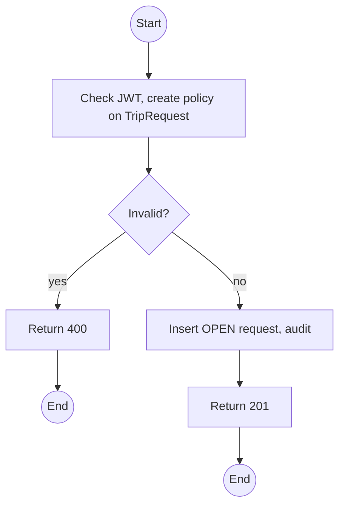
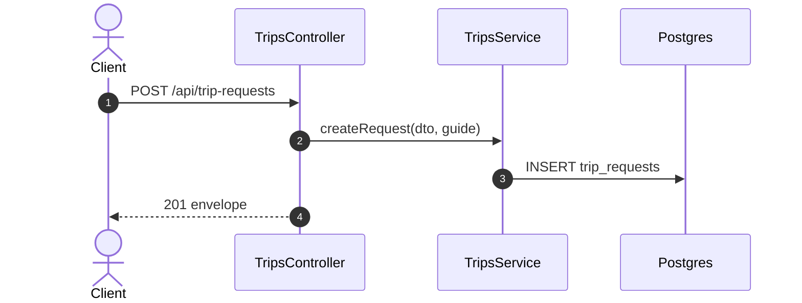

# POST /api/trip-requests: Guide requests a trip

> Module `trips`. Format: `02-templates/04-api-endpoint-template.md`, with Mermaid in place of PlantUML (D-017). Envelope: D-002.

[TOC]

---
## Overview

A Guide asks Staff to schedule a trip, for example for a group that contacted them directly. Staff accept it by creating a trip with `requestId`, or decline it.

## API Specification

| API        | URL             |
| ---------- | --------------- |
| POST | /api/trip-requests |
| Permission | Guide |
| Traces | UC-32, REQ-EVT-02, Q65 |

## Request sample

```json
{
  "packageId": "pk-01...",
  "preferredStartAt": "2026-11-07T00:00:00Z",
  "preferredEndAt": "2026-11-09T11:00:00Z",
  "groupSizeEstimate": 8,
  "notes": "Company group, 8 people, asked by phone"
}
```

| Field | Description | Data Type | Required | Examples |
| --- | --- | --- | --- | --- |
| packageId | Published package, or null for a custom request | uuid | no | `pk-01...` |
| preferredStartAt | In the future | datetime | yes | `2026-11-07T00:00:00Z` |
| preferredEndAt | After start | datetime | yes | `2026-11-09T11:00:00Z` |
| groupSizeEstimate | Positive | int | no | `8` |
| notes | Up to 1000 chars | string | no | `Company group` |

## Response sample

```json
{
  "result": {
    "id": "tr-4...",
    "status": "OPEN",
    "guideId": "g-1...",
    "packageId": "pk-01...",
    "preferredStartAt": "2026-11-07T00:00:00Z",
    "preferredEndAt": "2026-11-09T11:00:00Z"
  },
  "isSuccess": true,
  "statusCode": 201,
  "message": "Trip request submitted"
}
```

## Validation

<table>
    <th>Status code</th>
    <th>Description</th>
    <th>Examples</th>
    <tbody>
        <tr>
            <td>400</td>
            <td>Invalid dates (<code>VALIDATION_FAILED</code>)</td>
<td>

```json
{
  "result": {
    "errorCode": "VALIDATION_FAILED"
  },
  "isSuccess": false,
  "statusCode": 400,
  "message": "preferredEndAt must be later than preferredStartAt."
}
```
</td>
        </tr>
        <tr>
            <td>401</td>
            <td>Missing, malformed or expired access token (<code>UNAUTHENTICATED</code>)</td>
<td>

```json
{
  "result": {
    "errorCode": "UNAUTHENTICATED"
  },
  "isSuccess": false,
  "statusCode": 401,
  "message": "Authentication required."
}
```
</td>
        </tr>
        <tr>
            <td>403</td>
            <td>Authenticated, but the caller's role or policy does not allow this action (<code>FORBIDDEN</code>)</td>
<td>

```json
{
  "result": {
    "errorCode": "FORBIDDEN"
  },
  "isSuccess": false,
  "statusCode": 403,
  "message": "You do not have permission to perform this action."
}
```
</td>
        </tr>
    </tbody>
</table>

## Activity Diagram



## Sequence Diagram


