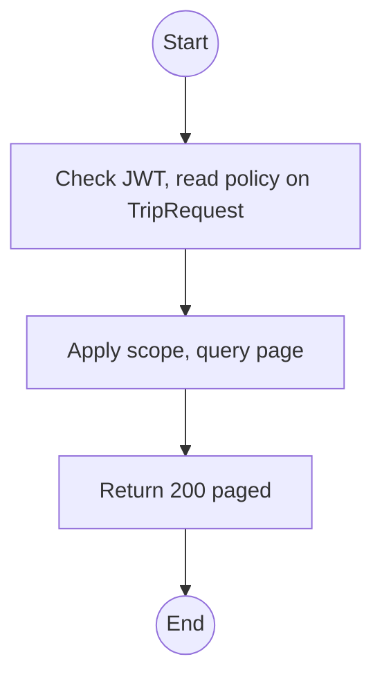
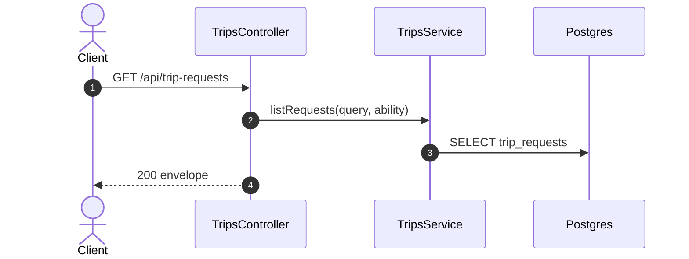

# GET /api/trip-requests: List trip requests

> Module `trips`. Format: `02-templates/04-api-endpoint-template.md`, with Mermaid in place of PlantUML (D-017). Envelope: D-002.

[TOC]

---
## Overview

Paged list of trip requests, newest first. Operators use it as a queue; Guides see their own.

## API Specification

| API        | URL             |
| ---------- | --------------- |
| GET | /api/trip-requests |
| Permission | Operator (all); Guide (own) |
| Traces | Q65 |

### Query parameters

| Field | Description | Data Type | Required | Examples |
| --- | --- | --- | --- | --- |
| status | OPEN, ACCEPTED, DECLINED | enum | no | `OPEN` |
| pageNumber | 1-based | int | no | `1` |
| pageSize | Default 20 | int | no | `20` |

## Request sample

No request body. Query string example:

```
GET /api/trip-requests?status=OPEN
```

## Response sample

```json
{
  "result": {
    "items": [
      {
        "id": "tr-4...",
        "status": "OPEN",
        "guide": {
          "id": "g-1...",
          "fullName": "Tran Minh"
        },
        "packageId": "pk-01...",
        "preferredStartAt": "2026-11-07T00:00:00Z",
        "groupSizeEstimate": 8,
        "createdAt": "2026-10-02T02:00:00Z"
      }
    ],
    "pageNumber": 1,
    "pageSize": 20,
    "totalCount": 1,
    "totalPages": 1
  },
  "isSuccess": true,
  "statusCode": 200,
  "message": "Trip requests retrieved"
}
```

## Validation

<table>
    <th>Status code</th>
    <th>Description</th>
    <th>Examples</th>
    <tbody>
        <tr>
            <td>401</td>
            <td>Missing, malformed or expired access token (<code>UNAUTHENTICATED</code>)</td>
<td>

```json
{
  "result": {
    "errorCode": "UNAUTHENTICATED"
  },
  "isSuccess": false,
  "statusCode": 401,
  "message": "Authentication required."
}
```
</td>
        </tr>
        <tr>
            <td>403</td>
            <td>Authenticated, but the caller's role or policy does not allow this action (<code>FORBIDDEN</code>)</td>
<td>

```json
{
  "result": {
    "errorCode": "FORBIDDEN"
  },
  "isSuccess": false,
  "statusCode": 403,
  "message": "You do not have permission to perform this action."
}
```
</td>
        </tr>
    </tbody>
</table>

## Activity Diagram



## Sequence Diagram


