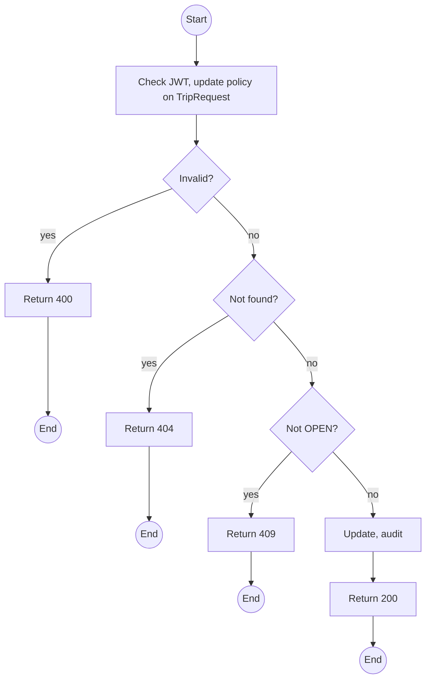
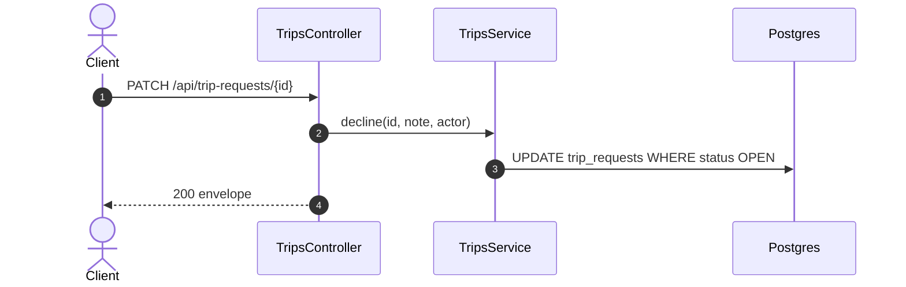

# PATCH /api/trip-requests/:id: Decline a trip request

> Module `trips`. Format: `02-templates/04-api-endpoint-template.md`, with Mermaid in place of PlantUML (D-017). Envelope: D-002.

[TOC]

---
## Overview

Declines an open request with a note. Acceptance happens by creating a trip with `requestId` (endpoint 05), which keeps the new trip and the acceptance in one transaction.

## API Specification

| API        | URL             |
| ---------- | --------------- |
| PATCH | /api/trip-requests/:id |
| Permission | Operator |
| Traces | Q65 |

### Path parameters

| Field | Description | Data Type | Examples |
| --- | --- | --- | --- |
| id | Request id | uuid | `tr-4...` |

## Request sample

```json
{
  "status": "DECLINED",
  "decisionNote": "No Guide free that weekend; suggested 14 Nov instead"
}
```

| Field | Description | Data Type | Required | Examples |
| --- | --- | --- | --- | --- |
| status | Only DECLINED here | enum | yes | `DECLINED` |
| decisionNote | Required | string | yes | `No Guide free` |

## Response sample

```json
{
  "result": {
    "id": "tr-4...",
    "status": "DECLINED",
    "decisionNote": "No Guide free that weekend; suggested 14 Nov instead"
  },
  "isSuccess": true,
  "statusCode": 200,
  "message": "Trip request declined"
}
```

## Validation

<table>
    <th>Status code</th>
    <th>Description</th>
    <th>Examples</th>
    <tbody>
        <tr>
            <td>400</td>
            <td>Note missing or status not DECLINED (<code>VALIDATION_FAILED</code>)</td>
<td>

```json
{
  "result": {
    "errorCode": "VALIDATION_FAILED"
  },
  "isSuccess": false,
  "statusCode": 400,
  "message": "decisionNote is required."
}
```
</td>
        </tr>
        <tr>
            <td>401</td>
            <td>Missing, malformed or expired access token (<code>UNAUTHENTICATED</code>)</td>
<td>

```json
{
  "result": {
    "errorCode": "UNAUTHENTICATED"
  },
  "isSuccess": false,
  "statusCode": 401,
  "message": "Authentication required."
}
```
</td>
        </tr>
        <tr>
            <td>403</td>
            <td>Authenticated, but the caller's role or policy does not allow this action (<code>FORBIDDEN</code>)</td>
<td>

```json
{
  "result": {
    "errorCode": "FORBIDDEN"
  },
  "isSuccess": false,
  "statusCode": 403,
  "message": "You do not have permission to perform this action."
}
```
</td>
        </tr>
        <tr>
            <td>404</td>
            <td>No such request (<code>NOT_FOUND</code>)</td>
<td>

```json
{
  "result": {
    "errorCode": "NOT_FOUND"
  },
  "isSuccess": false,
  "statusCode": 404,
  "message": "Trip request not found."
}
```
</td>
        </tr>
        <tr>
            <td>409</td>
            <td>Already decided (<code>INVALID_STATE_TRANSITION</code>)</td>
<td>

```json
{
  "result": {
    "errorCode": "INVALID_STATE_TRANSITION"
  },
  "isSuccess": false,
  "statusCode": 409,
  "message": "This trip request has already been decided."
}
```
</td>
        </tr>
    </tbody>
</table>

## Activity Diagram



## Sequence Diagram


