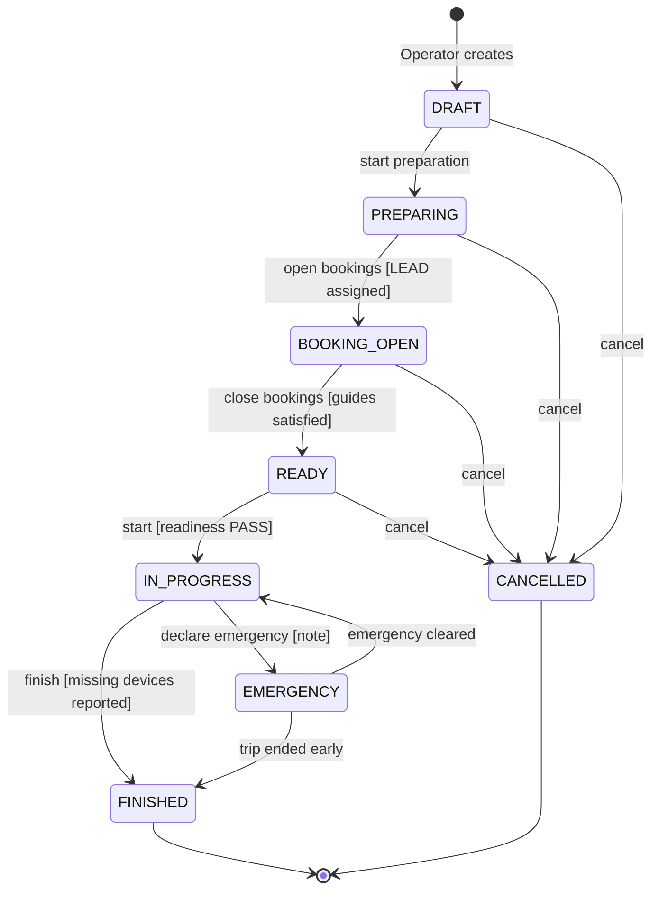
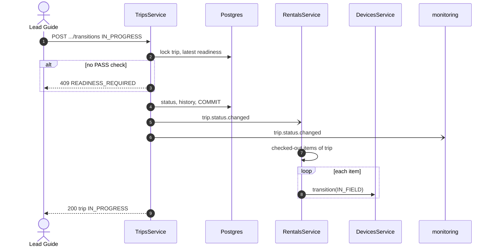
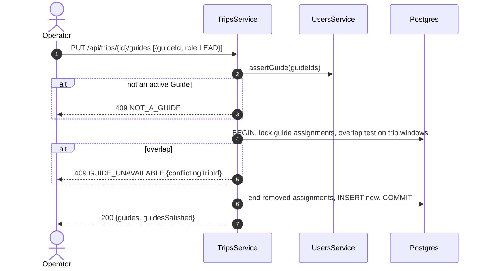

# Technical Design: trips

> Fulfills `requirements.md` in this folder. ERD slice: `specs/platform/design.md` Figure 7.

---

## 1. Domain Model & Data Schema

```prisma
enum PackageStatus  { DRAFT PUBLISHED ARCHIVED }
enum Difficulty     { EASY MODERATE HARD EXPERT }
enum TripStatus     { DRAFT PREPARING BOOKING_OPEN READY IN_PROGRESS FINISHED CANCELLED EMERGENCY }
enum GuideRole      { LEAD ASSISTANT }
enum TripRequestStatus { OPEN ACCEPTED DECLINED }
enum ReadinessResult { PASS FAIL }

model TrekPackage {
  id                   String        @id @default(uuid())
  code                 String        @unique          // TN-PD-3D
  name                 String                          // Ta Nang - Phan Dung 3 days
  summary              String
  description          String
  region               String
  durationDays         Int
  difficulty           Difficulty
  minGroupSize         Int
  maxGroupSize         Int
  acceptedVariantIds   String[]                        // empty = any variant [Q50]
  coverImageUrl        String?
  status               PackageStatus @default(DRAFT)
  createdAt            DateTime      @default(now())
  updatedAt            DateTime      @updatedAt
  @@map("trek_packages")
}

model Trip {
  id                 String     @id @default(uuid())
  code               String     @unique               // TRP-2026-1010-TNPD
  packageId          String
  title              String
  startAt            DateTime
  endAt              DateTime
  capacity           Int
  seatsTaken         Int        @default(0)            // maintained by rentals via adjustSeats()
  requiredGuideCount Int
  status             TripStatus @default(DRAFT)
  statusChangedAt    DateTime   @default(now())
  requestId          String?    @unique                // TripRequest it came from
  emergencyNote      String?
  cancelledReason    String?
  createdById        String
  createdAt          DateTime   @default(now())
  updatedAt          DateTime   @updatedAt
  @@index([status, startAt])
  @@map("trips")
}
// migration adds: CHECK (seats_taken >= 0 AND seats_taken <= capacity), CHECK (end_at > start_at)

model TripGuideAssignment {
  id           String    @id @default(uuid())
  tripId       String
  guideId      String
  role         GuideRole
  assignedById String
  assignedAt   DateTime  @default(now())
  unassignedAt DateTime?
  @@index([guideId, unassignedAt])
  @@map("trip_guide_assignments")
}
// migration adds: partial unique (trip_id, guide_id) WHERE unassigned_at IS NULL,
//                 partial unique (trip_id) WHERE role = 'LEAD' AND unassigned_at IS NULL

model TripParticipant {
  id              String   @id @default(uuid())
  tripId          String
  bookingId       String?
  userId          String?
  displayName     String
  phoneNumber     String?
  emergencyContact String?
  createdAt       DateTime @default(now())
  @@index([tripId])
  @@map("trip_participants")
}

model TripReadinessCheck {
  id        String          @id @default(uuid())
  tripId    String
  guideId   String
  items     Json            // [{ key, label, mandatory, checked, note }]
  result    ReadinessResult
  createdAt DateTime        @default(now())
  @@index([tripId, createdAt])
  @@map("trip_readiness_checks")                     // append-only; a re-check is a new row
}

model TripRequest {
  id               String            @id @default(uuid())
  guideId          String
  packageId        String?
  preferredStartAt DateTime
  preferredEndAt   DateTime
  groupSizeEstimate Int?
  notes            String?
  status           TripRequestStatus @default(OPEN)
  decidedById      String?
  decisionNote     String?
  createdAt        DateTime          @default(now())
  updatedAt        DateTime          @updatedAt
  @@map("trip_requests")
}

model TripStatusHistory {
  id         String      @id @default(uuid())
  tripId     String
  fromStatus TripStatus?
  toStatus   TripStatus
  actorId    String?
  note       String?
  createdAt  DateTime    @default(now())
  @@index([tripId, createdAt])
  @@map("trip_status_history")                        // append-only
}
```

Guide availability (REQ-STA-02) is checked in the service with a `SELECT ... FOR UPDATE` on the Guide's active assignments joined to trip windows, then an overlap test. A database exclusion constraint is not used here because the window lives on `trips`, not on the assignment row; the service check under lock is sufficient for the concurrency the NFRs describe.

---

## 2. Service / Business Logic Design

### 2.1 Trip lifecycle state machine

See **Figure 1**.



***Figure 1***: Trip lifecycle, 8 states, from Q66's `Draft, On Prepare, On Booking, On Start, Ongoing, Finished`, plus `Cancelled` and the emergency state. `EMERGENCY` is a placeholder name (Session 8 question 76).

| From | To | Who | Guard |
|---|---|---|---|
| DRAFT | PREPARING | Operator | package `PUBLISHED` |
| PREPARING | BOOKING_OPEN | Operator | a `LEAD` Guide is assigned |
| BOOKING_OPEN | READY | Operator | `guidesSatisfied`; or automatically `trips.bookingCloseHoursBeforeStart` before `startAt` (scheduler) |
| READY | IN_PROGRESS | Lead Guide, Operator | readiness `PASS` while `trips.requireReadinessBeforeStart` |
| IN_PROGRESS | FINISHED | Lead Guide, Operator | none; missing devices listed in the payload |
| IN_PROGRESS | EMERGENCY | Operator | note required |
| EMERGENCY | IN_PROGRESS | Operator | note required |
| EMERGENCY | FINISHED | Operator | note required |
| DRAFT, PREPARING, BOOKING_OPEN, READY | CANCELLED | Operator | reason required |

**Mapping to MF-01's "trip to Scheduled".** MF-01 step 7 and its postcondition name a trip state `Scheduled` that Q66 does not contain. This design reads `Scheduled` as `READY` ("On Start"): bookings closed, Guides and devices prepared, departure pending. Check-out is allowed in `BOOKING_OPEN` and `READY`, so a trip reaches the MF-01 postcondition when it is `READY` and its rentals are checked out. Confirmation requested in C-002.

### 2.2 Seats

`TripsService.adjustSeats(tripId, delta, tx)` is exported for `rentals`:

1. `SELECT capacity, seats_taken, status FROM trips WHERE id = $1 FOR UPDATE`.
2. For positive `delta`: status must be `BOOKING_OPEN` (or, for Staff and Guide bookings, `PREPARING` too), and `seatsTaken + delta ≤ capacity`, else `TRIP_FULL`.
3. Update. The check constraint is the last line of defence.

`rentals` calls it inside the booking transaction, so a booking and its seats commit or roll back together.

### 2.3 Hooks other modules implement

| Token | Implemented by | Called when |
|---|---|---|
| `SCOPE_PROVIDER` (declared by `auth`) | `trips` | every authorised request by a Guide |
| `RESCHEDULE_GUARD` (declared by `trips`) | `rentals` | trip reschedule: `canMove(tripId, newStart, newEnd, tx)` returns conflicts or moves allocations |

`RESCHEDULE_GUARD` is resolved lazily with `ModuleRef`, for the same reason `auth` resolves `SCOPE_PROVIDER` that way: `rentals` imports `trips`, so `trips` cannot import `rentals`.

### 2.4 Exported service surface

`findById`, `findPublicById`, `assertBookable(tripId, channel)`, `adjustSeats`, `guidesSatisfied(tripId)`, `tripIdsForGuide(userId)`, `activeTripIdsForGuide(userId)`, `guideIdsForTrip(tripId)`, `acceptedVariantIds(tripId)`, `window(tripId)`, `addParticipants(tripId, participants, tx)`.

### 2.5 Error catalogue

| Code | HTTP | Raised when |
|---|---|---|
| `INVALID_STATE_TRANSITION` | 409 | edge not in table, or guard failed (message names the guard) |
| `READINESS_REQUIRED` | 409 | start without a `PASS` check |
| `LEAD_GUIDE_REQUIRED` | 409 | open bookings without a Lead |
| `GUIDE_UNAVAILABLE` | 409 | overlapping assignment |
| `NOT_A_GUIDE` | 409 | assignee lacks `GUIDE` or is inactive |
| `TRIP_FULL` | 409 | seat change over capacity |
| `CAPACITY_BELOW_BOOKED` | 409 | capacity reduced under `seatsTaken` |
| `RESCHEDULE_CONFLICT` | 409 | device allocations cannot move |
| `TRIP_NOT_BOOKABLE` | 409 | booking outside `BOOKING_OPEN` |
| `PACKAGE_NOT_PUBLISHED` | 409 | trip on a draft or archived package |
| `PACKAGE_CODE_TAKEN` | 409 | uniqueness |

---

## 3. Sequence Flows

### 3.1 Trip start moves devices into the field

See **Figure 2**.



***Figure 2***: The trip owns only its own state; `rentals` knows which devices are on it and moves them. A failure moving one device is retried by the event handler and never rolls back the trip start.

### 3.2 Assign a Guide

See **Figure 3**.



***Figure 3***: Guide assignment. The overlap test runs under a lock on the Guide's assignments, so two Operators cannot book one Guide onto two overlapping trips (E01-4).

---

## 4. API Endpoints in this module

| # | Method | Route | Permission | Spec |
|---|---|---|---|---|
| 01 | GET | `/api/trek-packages` | Public (PUBLISHED); Staff (all) | `api-design/01-get-trek-packages-list.md` |
| 02 | GET | `/api/trek-packages/:id` | Public (PUBLISHED); Staff | `api-design/02-get-trek-packages-detail.md` |
| 03 | POST | `/api/trek-packages` | Operator | `api-design/03-post-trek-packages-create.md` |
| 04 | PATCH | `/api/trek-packages/:id` | Operator | `api-design/04-patch-trek-packages-update.md` |
| 05 | POST | `/api/trips` | Operator | `api-design/05-post-trips-create.md` |
| 06 | GET | `/api/trips` | Public (BOOKING_OPEN); Staff; Guide (own) | `api-design/06-get-trips-list.md` |
| 07 | GET | `/api/trips/:id` | Public (BOOKING_OPEN); Staff; Guide (own) | `api-design/07-get-trips-detail.md` |
| 08 | PATCH | `/api/trips/:id` | Operator | `api-design/08-patch-trips-update.md` |
| 09 | POST | `/api/trips/:id/transitions` | Operator; Lead Guide (start, finish) | `api-design/09-post-trips-transition.md` |
| 10 | PUT | `/api/trips/:id/guides` | Operator | `api-design/10-put-trips-guides.md` |
| 11 | GET | `/api/guides/availability` | Operator | `api-design/11-get-guides-availability.md` |
| 12 | GET | `/api/trips/:id/participants` | Operator; Guide (own) | `api-design/12-get-trips-participants.md` |
| 13 | POST | `/api/trips/:id/readiness-checks` | Guide (own) | `api-design/13-post-trips-readiness-check.md` |
| 14 | POST | `/api/trip-requests` | Guide | `api-design/14-post-trip-requests-create.md` |
| 15 | GET | `/api/trip-requests` | Operator; Guide (own) | `api-design/15-get-trip-requests-list.md` |
| 16 | PATCH | `/api/trip-requests/:id` | Operator | `api-design/16-patch-trip-requests-decide.md` |

---

## 5. Frontend impact

- Public: `pages/PackagesPage`, `pages/PackageDetailPage` (open trips with seats left, "Book" call to action).
- Staff: `pages/TripsPage` (Pattern A), `pages/TripDetailPage` (status, guides panel, participants, bookings tab from `rentals`, devices tab), `features/AssignGuidesDialog` (shows availability), `features/TripTransitionMenu`.
- Guide: `pages/MyTripsPage`, `features/ReadinessChecklist` (one step, checklist items from the parameter), `features/FinishTripDialog` (select missing devices).
